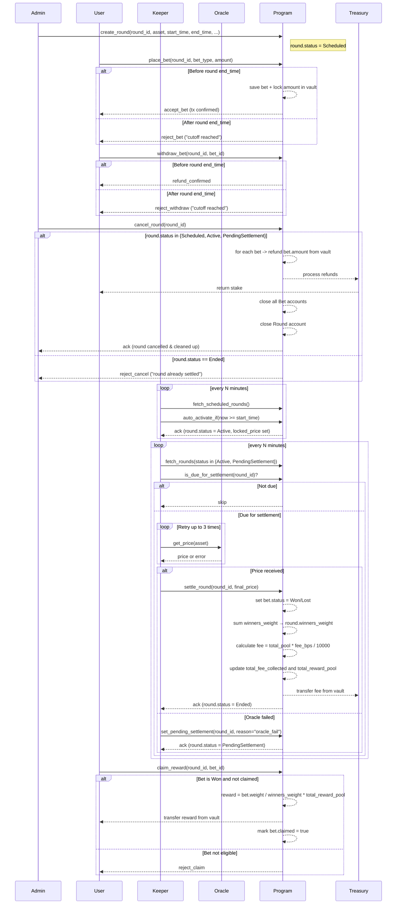
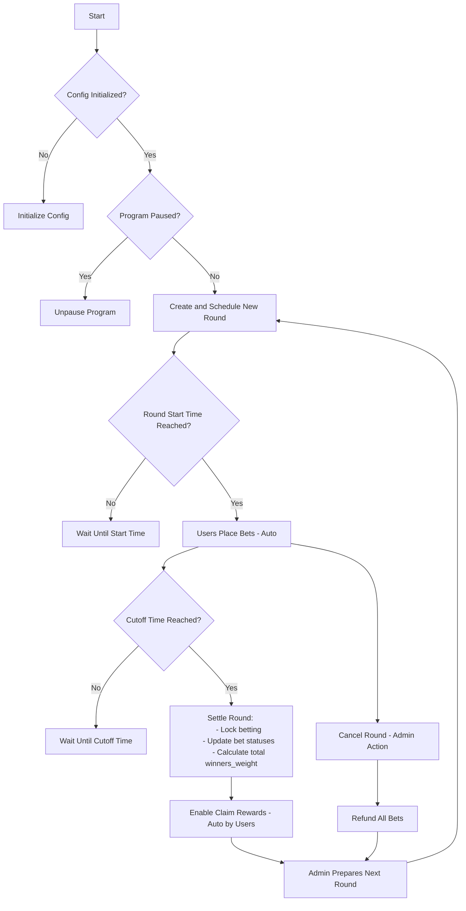
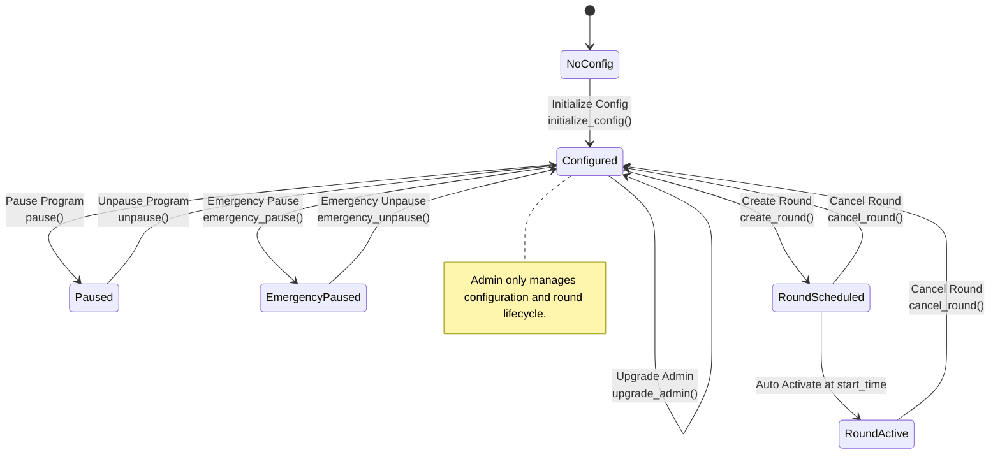
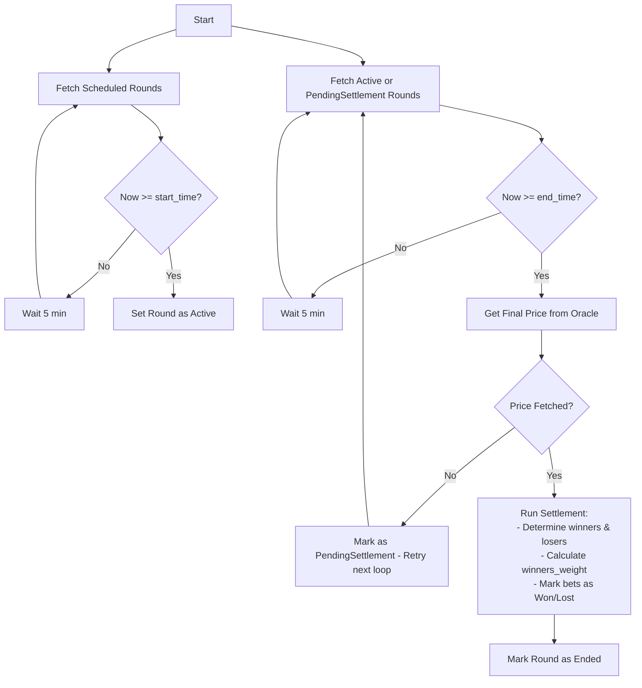
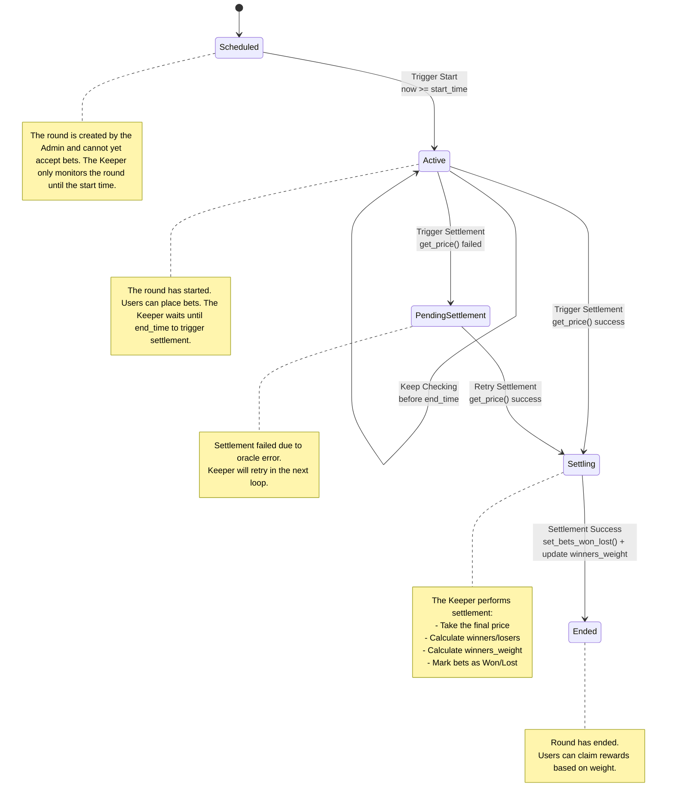
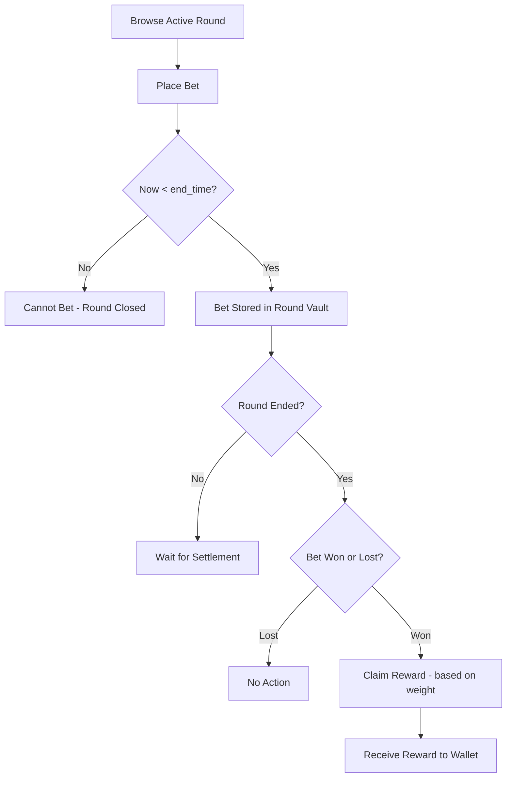
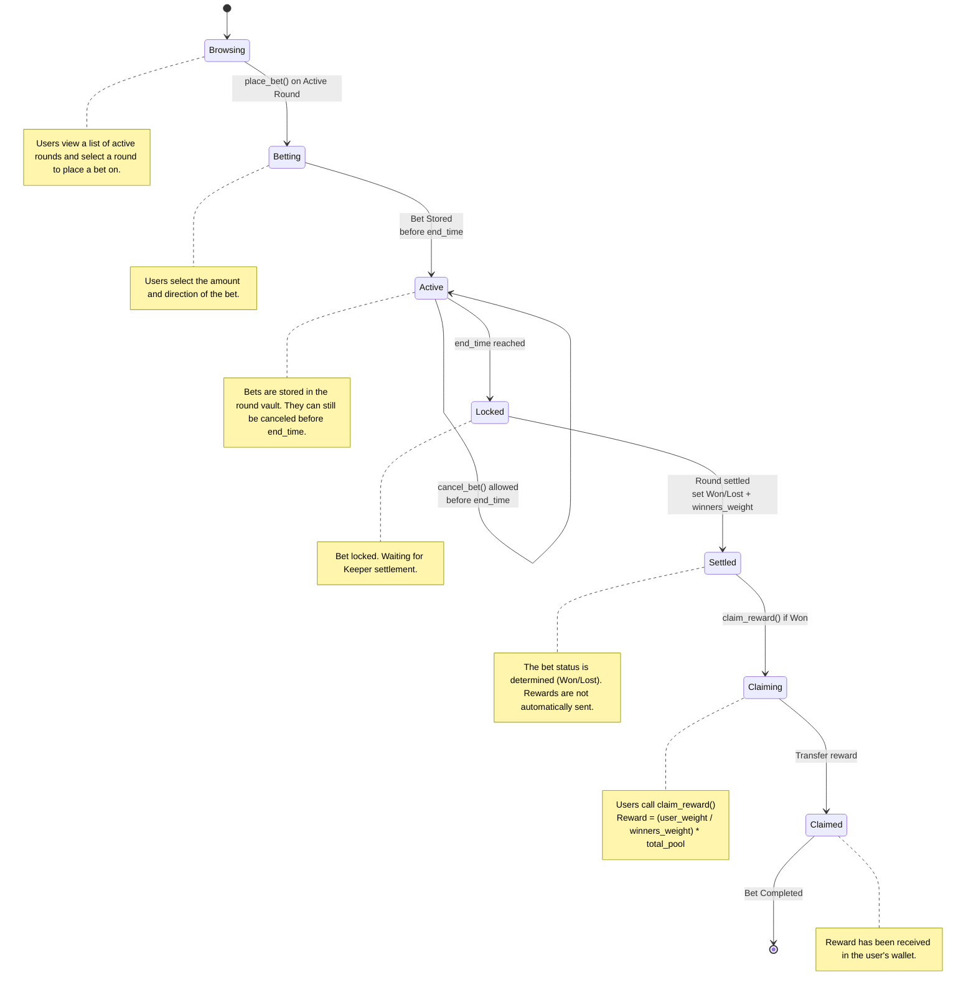

# Gold Rush Smart Contract

Gold Rush is a token-based betting smart contract that allows users to bet on the price movement of gold or specific stocks within a specific time period (called a round).

Users place bets using Gold Rush Tokens (GRT), and winners receive rewards based on the outcome of the round.

## Overview
- Each round has a start time (start_time) and a end time (end_time), during which users can place or withdraw bets before the cutoff.
- After the round ends, the Keeper triggers a settlement process to determine the winner based on the price from the Oracle.
- Rewards are not automatically distributed but are stored as a claimable amount that winners can claim manually.

## Features

### Betting System

- Users can place bets on the price movement of gold or specific stocks (e.g., up/down).
- Bets are placed using GRT tokens.
- Bets can be withdrawn as long as they have not exceeded the cutoff.

### Round Lifecycle

- Admins create new rounds with a start_time and end_time.
- After the start_time, the round automatically becomes Active and accepts bets.
- After the end_time, bets are locked and the round enters the Settlement process and the outcome is determined.

### Keeper Automation

- The Keeper is responsible for triggering:
    - Round activation when the start_time is reached.
    - Round settlement when the end_time is reacged.
- The Keeper retrieves prices from the Oracle, calculates winners, and marks claimable prizes.
- If the price is not retrieved, the round is assigned a PendingSettlement status so it can be retried.

### Price Oracle

- Retrieves real-time prices from an external source (Chainlink or other whitelisted sources).
- Price data is only used during settlement process.

### Rewards & Claims

- Rewards are calculated from the total pool of losing bets and distributed proportionally to winners.
- Rewards are not sent automatically but are stored in the bet as claimable_amount.
- Users can claim rewards after settlement, if claimable_amount > 0.

### Admin Operations

- Create a new round (with a future schedule).
- Manage system configurations (fees, oracle, etc.).
- Pause/unpause the program in an emergency.
- Cancel a round (before settlement) to return all bets.

### Emergency & Safety

- Admins can perform an emergency pause to temporarily stop all betting operations (except claims).
- If settlement fails, the round will be marked as Pending Settlement so that no additional bets are accepted and can be reprocessed.

## Flows
### Full


### Admin (High-level)


### Admin (Low-level)


### Keeper (High-level)


### Keeper (Low-level)


### User (High-level)


### User (Low-level)


## Account Designs
### Config
```rust
pub struct Config {
  // --- Authorities ---
  pub admin: Pubkey,                   // The administrator of the contract.
  pub keeper_authorities: Vec<Pubkey>, // The authority for keeper accounts allowed to keeper operations.

  // --- Token & Treasury ---
  pub token_mint: Pubkey,              // The Gold Rush Token (GRT) used for betting.
  pub treasury: Pubkey,                // The address where the fees are sent.

  // --- Fee Config ---
  pub fee_gold_price_bps: u16,         // The fee percentage charged on bets based on Gold Price.
  pub fee_stock_price_bps: u16,        // The fee percentage charged on bets based on stock price.

  // --- Betting Rules ---
  pub min_bet_amount: u64,             // The minimum bet amount.

  // --- Global State ---
  pub status: ContractStatus,          // Overall contract status (Active / Paused / EmergencyPaused)
  pub current_round_counter: u64,      // Incremental counter for new round IDs

  // --- Metadata ---
  pub version: u8,                     // The version of the contract.
  pub bump: u8,                        // A bump seed for PDA.
}

// Enum for program status flags
#[derive(AnchorSerialize, AnchorDeserialize, Clone, PartialEq, Eq)]
pub enum ContractStatus {
    Active,
    Paused,
    EmergencyPaused,
}
```

### Round

```rust
pub struct Round {
  // --- Identity ---
  pub id: u64,                   // Unique identifier for the round (incremental from config.current_round_counter).
  pub start_time: i64,           // The timestamp when round is scheduled to start.
  pub end_time: i64,             // The timestamp when round is scheduled to end.
  pub vault: Pubkey,             // The vault account holding the bets for this round.
  pub vault_bump: u8,            // A bump seed for the vault PDA.
  pub market_type: MarketType,   // The type of market (GoldPrice, StockPrice).

  // --- State ---
  pub status: RoundStatus,       // The current status of the round (Scheduled, Active, PendingSettlement, Ended).
  pub locked_price: Option<u64>, // The price when round becomes Active.
  pub final_price: Option<u64>,  // The price when round is settled.
  pub total_pool: u64,           // The total amount of GRT bet in this round.
  pub total_bets: u64,           // The total number of bets placed in this round.
  pub total_fee_collected: u64,  // The total fees collected for this round.
  pub total_reward_pool: u64,    // The total reward pool after deducting fees.
  pub winners_weight: u64,       // The total weight of winning bets (for reward calculation). Default to 0 if no winners.
  pub settled_bets: u64,         // Number of bets that have been processed (for incremental settlement)

  // --- Metadata ---
  pub created_at: i64,           // The timestamp when the round was created.
  pub settled_at: Option<i64>,   // The timestamp when the round was settled.
  pub bump: u8,                  // A bump seed for PDA.
}

// Enum for round status
#[derive(AnchorSerialize, AnchorDeserialize, Clone, PartialEq, Eq)]
pub enum RoundStatus {
    Scheduled,                  // Created but not started yet
    Active,                     // Currently accepting bets
    PendingSettlement,          // Ended but settlement failed, needs retry
    Ended,                      // Successfully settled
}

// Enum for market types
#[derive(AnchorSerialize, AnchorDeserialize, Clone, PartialEq, Eq)]
pub enum MarketType {
    GoldPrice,
    StockPrice,
}
```

### Bet
```rust
pub struct Bet {
  // --- Identify ---
  pub round: Pubkey,           // The round this bet is associated with.
  pub bettor: Pubkey,          // The address of the player placing the bet.

  // --- Bet Info ---
  pub amount: u64,            // The amount of GRT bet.
  pub direction: BetDirection,          // The type of bet (Up, Down, PercentageChangeBps).
  pub claimed: bool,          // Whether the reward has been claimed.
  pub weight: u64,            // The weight of the bet (for reward calculation).

  // --- State ---
  pub status: BetStatus,      // The status of the bet (Pending, Won, Lost).

  // --- Metadata ---
  pub created_at: i64,        // The timestamp when the bet was placed.
  pub bump: u8,               // A bump seed for PDA.
}

// Enum for bet types
#[derive(AnchorSerialize, AnchorDeserialize, Clone, PartialEq, Eq)]
pub enum BetDirection {
    Up,
    Down,
    PercentageChangeBps(i16),   // e.g., 10 for 0.1%, -25 for -0.25%
}

// Enum for bet status
#[derive(AnchorSerialize, AnchorDeserialize, Clone, PartialEq, Eq)]
pub enum BetStatus {
    Pending,
    Won,
    Lost,
}
```

---

## Fee Mechanism

The Gold Rush smart contract charges a fee on each bet to sustain the platform. The fee is collected in the same token used for betting (GRT) and is transferred to the treasury after the round is settled.

### Fee Structure

- **Gold Price Bets**: `fee_gold_price_bps` (in basis points, e.g., 50 bps = 0.5%)
- **Stock Price Bets**: `fee_stock_price_bps` (in basis points, e.g., 50 bps = 0.5%)
- **Treasury Account**: `treasury` (the account that receives collected fees)

> Note: Fee is calculated on the bet amount and deducted only at settlement, not at the time of placing a bet. This allows for refunds in case the round is cancelled.

### Fee Calculation

For each round, the total fee collected is calculated as:

$$
\text{fee} = \sum_{i=1}^{n} \text{amount}_i \times \frac{\text{fee bps}}{10000}
$$

Where:

- $n$ = total number of bets in the round  
- $\text{amount}_i$ = bet amount of the $i$-th bet  
- $\text{fee bps}$ = fee basis points depending on bet type (gold or stock)

The remaining balance after fee deduction becomes the **reward pool**:

$$
\text{total reward pool} = \text{total pool} - \text{total fee collected}
$$

- `total_pool` = sum of all bet amounts in the round  
- `total_fee_collected` = sum of all fees deducted  
- `total_reward_pool` = amount available for distribution to winning bets

### Settlement Flow for Fees

1. **Round ends**: Keeper triggers the settlement process after `end_time`.  
2. **Calculate fees**: Fee is calculated for each bet based on `fee_gold_price_bps` or `fee_stock_price_bps`.  
3. **Transfer to treasury**: `total_fee_collected` is transferred to the treasury account.  
4. **Compute reward pool**: Remaining GRT is assigned to `total_reward_pool` for winners.  

> This approach ensures fairness and transparency: users only pay fees if the round is successfully settled, and the treasury receives an accurate portion without affecting refund logic.

### Example

Suppose a round has the following bets:

| User | Bet Amount | Bet Type   | Fee (bps) |
|------|------------|------------|------------|
| A    | 10 GRT     | Gold       | 50         |
| B    | 20 GRT     | Stock      | 100        |

Calculations:

- Fee for A: \( 10 \times 0.005 = 0.05 \) GRT  
- Fee for B: \( 20 \times 0.01 = 0.2 \) GRT  

Total fee collected: \( 0.05 + 0.2 = 0.25 \) GRT  

Total reward pool: \( 10 + 20 - 0.25 = 29.75 \) GRT

---

## Reward Calculation

The Gold Rush betting system uses a **weight-based model** combined with a **self-claim mechanism** to efficiently distribute rewards after each round ends.

### Concept

Each bet has a **weight** that represents its contribution to the reward pool.
Weight depends on:

1. **Bet Amount** — Larger bets contribute more.
2. **Bet Type Factor** — Depends on the type of asset:
   - **Gold** → uses a **non-linear scaling** (small changes in gold price may still give significant weight adjustments).
   - **Stock** → uses a **linear scaling** (reward grows proportionally with the price change).
3. **Time Factor** — Bets placed earlier in the round may carry a higher weight than bets placed near the end of the round.


**General formula for a bet's weight:**

$$
\text{weight} = \text{amount} \times \text{direction factor} \times \text{time factor}
$$

Where:

- `amount` = number of GRT tokens bet (before fees)  
- `direction_factor` = multiplier based on `BetDirection` and `BetType`:
  - Stock (linear): proportional to change, e.g., Up/Down = `1.0`, PercentageChangeBps = value depending on % change  
  - Gold (non-linear): scaling factor that can amplify small % changes into larger weight multipliers  
- `time_factor` = multiplier based on how early the bet was placed (range: $0 < \text{time factor} \le 1.0$)

### Linear vs Non-Linear Factors

The system supports both **linear** and **non-linear** factor models depending on the game type.

#### 1. Direction Factor

- **Stock (Linear)**
  The factor grows **proportionally** with the chosen percentage change.
  Example:  
  - Up/Down = `1.0`
  - +5% change = `1.05`
  - +10% change = `1.10`

- **Gold (Non-Linear)**
  The factor grows **faster than linear**, emphasizing higher percentage changes.  
  Example (quadratic growth):
  - Up/Down = `1.0`
  - +5% change = `1.25` (instead of 1.05)
  - +10% change = `2.0` (instead of 1.10)

This ensures that even small gold changes may yield competitive rewards due to exponential scaling.

#### 2. Time Factor

- **Stock (Linear)**  
  Earlier bets get proportionally more weight.  
  Example (normalized by round duration):  

  $$
  \text{time factor} = 1 - \frac{\text{time elapsed}}{\text{round duration}}
  $$  

  If placed at the very start → `1.0`  
  If placed halfway → `0.5`  
  If placed at the end → close to `0.0`  

- **Gold (Non-Linear)**  
  Earlier bets are rewarded **more aggressively**.  
  Example (quadratic decay):  

  $$
  \text{time factor} = \left(1 - \frac{\text{time elapsed}}{\text{round duration}}\right)^2
  $$

  If placed at the very start → `1.0`
  If placed halfway → `0.25`
  If placed at the end → close to `0.0`

### Settlement Process

When the round ends, the **keeper** settles it:

1. The **Keeper** determines the winning bets by comparing `locked_price` and `final_price`.
2. Mark all winning bets as `Won` and sum their weights:

$$
\text{round winners weight} = \sum_{\text{all winning bets}} \text{bet weight}
$$

3. Mark all losing bets as `Lost`.
4. Calculate and transfer fees:

$$
\text{total fee collected} = \sum_{i=1}^{n} \text{amount}_i \times \frac{\text{fee bps}}{10000}
$$

5. Move `total_fee_collected` from round vault to `treasury`.
6. Update `round.total_reward_pool`:

$$
\text{round total reward pool} = \text{round total pool} - \text{round total fee collected}
$$

> **Note:** At this stage, **no rewards are sent to users yet** — only marking bet results and collecting fees.

### Self-Claim by User

When a user claims their reward:

1. Read `Bet.weight` and `round.winners_weight`.
2. Calculate the claimable reward:

$$
\text{reward} = \frac{\text{bet weight}}{\text{round winners weight}} \times \text{round total reward pool}
$$

3. Transfer the reward from the round vault to the user's account.
4. Mark `Bet.claimed = true`.

---

### Important Notes

- `round.total_reward_pool` is equal to `round.total_pool - round.total_fee_collected`.
- The reward includes the user's original stake. Losing users lose their stake, and their funds contribute to the reward pool for winners.
- If **all users win**, no one loses their stake. All winners simply receive their original stake back minus proportional fees.

---

### Example Calculation

#### Case 1: **Gold Round** (Non-Linear)

| User | Amount (GRT) | Direction | Fee (bps) | Time Factor | Direction Factor | Weight |
|------|--------------|-----------|-----------|-------------|------------------|--------|
| A    | 10           | +5%       | 50        | 1.0         | 1.25             | 12.5   |
| B    | 20           | +10%      | 50        | 0.5² = 0.25 | 2.0              | 10.0   |

- Total pool = $10 + 20 = 30$  
- Fees:  
  - A → $10 \times 0.005 = 0.05$ GRT  
  - B → $20 \times 0.005 = 0.10$ GRT  
- Total fee collected = 0.15 GRT  
- Reward pool = 29.85 GRT  
- Winners weight = 12.5 + 10.0 = 22.5  

Rewards:  
- A = $(12.5 / 22.5) \times 29.85 \approx 16.58$ GRT  
- B = $(10 / 22.5) \times 29.85 \approx 13.27$ GRT  

#### Case 2: **Stock Round** (Linear)

| User | Amount (GRT) | Direction | Fee (bps) | Time Factor | Direction Factor | Weight |
|------|--------------|-----------|-----------|-------------|------------------|--------|
| A    | 10           | +5%       | 100       | 1.0         | 1.05             | 10.5   |
| B    | 20           | +10%      | 100       | 0.5         | 1.10             | 11.0   |

- Total pool = $10 + 20 = 30$  
- Fees:  
  - A → $10 \times 0.01 = 0.10$ GRT  
  - B → $20 \times 0.01 = 0.20$ GRT  
- Total fee collected = 0.30 GRT  
- Reward pool = 29.70 GRT  
- Winners weight = 10.5 + 11.0 = 21.5  

Rewards:  
- A = $(10.5 / 21.5) \times 29.70 \approx 14.49$ GRT  
- B = $(11 / 21.5) \times 29.70 \approx 15.21$ GRT  

---

## Program Instructions

### Initialize
#### Purpose
Initializes the program for the first time. Creates a `Config` account that stores global settings such as admin, treasury, and other initial parameters.

#### Context
| Field            | Type                  | Description                               |
|------------------|-----------------------|--------------------------------------------|
| `signer`    | `Signer`              | The account that initializes the program (becomes admin if `admin` not provided). |
| `config`         | `Account<Config>` (PDA)     | PDA account to store global configuration data.         |
| `system_program` | `Program<System>`     | The system program used to create the `config` account.   |

#### Arguments
| Name            | Type      | Description                          |
|----------------|------------|-------------------------------------|
| `keeper_authorities`   | `Vec<Pubkey>` | List of authorized keeper authority account addresses
| `token_mint`   | `Pubkey`   | The address of the GRT token mint                 |
| `treasury`      | `Pubkey`   | The address of the treasury account                 |
| `fee_gold_price_bps`       | `u16`      | The fee for gold price bets in basis points (bps) |
| `fee_stock_price_bps`      | `u16`      | The fee for stock price bets in basis points (bps) |
| `min_bet_amount` | `u64`      | The minimum amount required to place a bet    |
| `min_time_factor_bps` | `u16`      | The minimum time factor in basis points (bps) (e.g., 5000 for 0.5) |
| `max_time_factor_bps` | `u16`      | The maximum time factor in basis points (bps) (e.g., 10000 for 1.0) |
| `default_time_factor_bps` | `u16`      | The default time factor in basis points (bps) (e.g., 7500 for 0.75) |

#### Validations
- Ensure `config` has not been initialized (no previous data exists)
- `fee_gold_price_bps` and `fee_stock_price_bps` must be `< 10_000` (100%)
- `initializer` must be a signer
- `keeper_authorities` must not be empty
- `min_bet_amount` must be greater than `0`
- `min_time_factor_bps`, `max_time_factor_bps`, and `default_time_factor_bps` must be between `0` and `10_000`
- `min_time_factor_bps <= max_time_factor_bps`

#### Logic
1. Create the `config` account
2. Initialize fields:
   - `admin = admin.unwrap_or(initializer.key())`
   - `keeper_authorities = keeper_authorities`
   - `token_mint = token_mint`
   - `treasury = treasury`
   - `fee_gold_price_bps = fee_gold_price_bps`
   - `fee_stock_price_bps = fee_stock_price_bps`
   - `min_bet_amount = min_bet_amount`
3. Set default fields:
   - `status = Active`
   - `current_round_counter = 0`
   - `version = 1`
   - `bump = bump`

#### Emits / Side Effects
- Creates a new `Config` account at PDA `["config"]`
- Stores global configuration and admin data

#### Errors
| Code                   | Meaning                                    |
|---------------------------|--------------------------------------------|
| `AlreadyInitialized`        | If `config` has already been created |
| `InvalidFee`                 | If any `fee_*_bps >= 10000`           |
| `InvalidMinBetAmount`        | If `min_bet_amount == 0`               |
| `NoKeeperAuthorities`        | If `keeper_authorities` is empty       |

---

### Admin: Update Config

#### Purpose
Allows the admin to update global configuration settings stored in the `Config` account, such as fee parameters, keeper authorities, treasury address, and minimum bet amount.

---

#### Context
| Field             | Type                  | Description                                      |
|--------------------|-----------------------|---------------------------------------------------|
| `admin`              | `Signer`               | The current admin authorized to update the config. |
| `config`             | `Account<Config>` (PDA)      | PDA account to store global configuration data.         |

---

#### Arguments
| Name                     | Type             | Description                                        |
|----------------------------|-------------------|-------------------------------------------------------|
| `new_admin`                | `Option<Pubkey>`    | (Optional) New admin address to replace the current admin. |
| `keeper_authorities`       | `Option<Vec<Pubkey>>` | (Optional) New list of keeper authority addresses. |
| `token_mint`                | `Option<Pubkey>`    | (Optional) New token mint address. |
| `treasury`                  | `Option<Pubkey>`    | (Optional) New treasury account address. |
| `fee_gold_price_bps`        | `Option<u16>`         | (Optional) New fee for gold price bets (bps). |
| `fee_stock_price_bps`       | `Option<u16>`         | (Optional) New fee for stock price bets (bps). |
| `min_bet_amount`             | `Option<u64>`         | (Optional) New minimum bet amount. |

---

#### Validations
- `admin` must be the current admin stored in `config.admin`
- `fee_gold_price_bps` and `fee_stock_price_bps` (if provided) must be `< 10_000` (100%)
- `keeper_authorities` (if provided) must not be empty
- `min_bet_amount` (if provided) must be `> 0`

---

#### Logic
1. Check that `admin.key() == config.admin`
2. For each provided argument (`Option<T>`), if `Some(value)` then update the corresponding field in `config`:
   - `admin = new_admin`
   - `keeper_authorities = keeper_authorities`
   - `token_mint = token_mint`
   - `treasury = treasury`
   - `fee_gold_price_bps = fee_gold_price_bps`
   - `fee_stock_price_bps = fee_stock_price_bps`
   - `min_bet_amount = min_bet_amount`

---

#### Emits / Side Effects
- Updates the `Config` account with new global settings

---

#### Errors
| Code                      | Meaning                                      |
|-------------------------------|----------------------------------------------|
| `Unauthorized`                  | If the caller is not the current `config.admin` |
| `InvalidFee`                     | If any provided `fee_*_bps >= 10000` |
| `InvalidMinBetAmount`            | If provided `min_bet_amount == 0` |
| `NoKeeperAuthorities`            | If provided `keeper_authorities` is empty |


### Admin: Pause Program

#### Purpose
Allows the admin to **pause** the entire program by updating the `Config.status` field.  
When paused, new rounds cannot be created and bets cannot be placed.

---

#### Context
| Field       | Type                | Description                                       |
|-------------|---------------------|---------------------------------------------------|
| `admin`     | `Signer`             | The current admin authorized to pause the program. |
| `config`    | `Account<Config>` (PDA)    | PDA account to store global configuration data.                  |

---

#### Arguments
_None_

---

#### Validations
- `admin` must be the current admin stored in `config.admin`
- `config.status` must currently be `Active`

---

#### Logic
1. Check that `admin.key() == config.admin`
2. Set `config.status = Paused`

---

#### Emits / Side Effects
- Updates `Config.status` to `Paused`
- Halts critical user actions (create round, place bet)

---

#### Errors
| Code             | Meaning                                            |
|-------------------|-----------------------------------------------------|
| `Unauthorized`      | If the caller is not the current `config.admin`     |
| `AlreadyPaused`     | If the config is already in `Paused` state           |

---

### Admin: Unpause Program

#### Purpose
Allows the admin to **resume** the program by updating the `Config.status` field back to `Active`.  
After unpausing, normal operations (creating rounds, placing bets) can continue.

#### Context
| Field       | Type                | Description                                          |
|-------------|---------------------|---------------------------------------------------------|
| `admin`     | `Signer`             | The current admin authorized to unpause the program.     |
| `config`    | `Account<Config>` (PDA)    | The global configuration account.                         |

#### Arguments
_None_

#### Validations
- `admin` must be the current admin stored in `config.admin`
- `config.status` must currently be `Paused`

#### Logic
1. Check that `admin.key() == config.admin`
2. Set `config.status = Active`

#### Emits / Side Effects
- Updates `Config.status` to `Active`
- Resumes normal operations

#### Errors
| Code             | Meaning                                             |
|-------------------|------------------------------------------------------|
| `Unauthorized`      | If the caller is not the current `config.admin`       |
| `AlreadyActive`     | If the config is already in `Active` state               |

### Admin: Emergency Pause
Pauses emergency deposit and place bet operations. Only the admin can perform this action.

### Admin: Emergency Unpause
Unpauses emergency deposit and place bet operations. Only the admin can perform this action.

### Admin: Create Round

#### Purpose
This instruction is used by the Admin to create and schedule a new round.
The created round will automatically become active when the start time is reached, and will automatically close (lock) when the end time is reached.
Users can only place bets while the round is in Active status.

#### Context
| Account             | Type                       | Description                                      |
|----------------------|------------------------------|---------------------------------------------------|
| `signer` | `Signer` | The authorized admin who creates a new round. |
| `config` | `Account<Config>` (PDA) | PDA account to store global configuration data. |
| `round` | `Account<Round>` (PDA) | The new round account to be initialized. |
| `vault` | `AccountInfo` (PDA) | The vault account to hold bets for this round. |
| `system_program` | `Program<System>` | Solana's built-in system program. |
| `token_program` | `Program<Token>` | Solana's SPL Token program. |

#### Arguments
| Name               | Type         | Description                                  |
|----------------------|---------------|-----------------------------------------------|
| `asset` | `[u8; 8]` | The asset being bet on |
| `start_time` | `i64` (unix timestamp) | Round start time |
| `end_time` | `i64` (unix timestamp) | Round end time |
| `market_type` | `MarketType` | The type of market (GoldPrice, StockPrice) |

#### Validations
- `config.status == Active`
- Caller = `config.admin`
- `start_time < end_time`
- `start_time > current_timestamp` (cannot create rounds in the past)

#### Logic
1. Create round `vault` account to hold bets
2. Initialize `round` fields:
   - `round_id = config.current_round_counter + 1`
   - `asset = asset`
   - `start_time = start_time`
   - `end_time = end_time`
   - `market_type = market_type`
   - `vault = vault.key()`
   - `status = Scheduled`
   - `created_at = Clock::now()`
3. Increment `config.current_round_counter` by 1

## Emits / Side Effects
- Create a new `Round` account on the blockchain
- Record round information into the program state

## Errors
| Code                         | Meaning                                            |
|--------------------------------|-------------------------------------------------------|
| `Unauthorized`                       | If the caller is not the official keeper |
| `InvalidTimestamps`                  | If `start_time` or `end_time` is invalid |
| `RoundAlreadyExists`                 | If the PDA for `round_id` has already been created |

---

### Admin: Cancel Round
Cancels an active or scheduled round and refunds all bets. Only the admin can perform this action

---

### Keeper: Start Round

#### Purpose
This instruction is executed by the Keeper to start a round that was previously in the Scheduled state.
When called, the round becomes Active, allowing users to place bets (place_bet()).

#### Context
| Field         | Type                  | Description                                |
|-------------------|-----------------------|----------------------------------------------|
| `signer` | `Signer` | The keeper authorized to trigger the start of the round. |
| `config` | `Account<Config>` (PDA) | PDA account to store global configuration data. |
| `round` | `Account<Round>` (PDA) | The round currently in `Scheduled` status. |

#### Arguments
| Name            | Type       | Description                            |
|----------------|-------------|--------------------------------------------|
| `asset_price` | `u64` | The price of the asset being staked. |

#### Validations
- `config.status == Active`
- `keeper` must be in `config.keeper_authorities`
- `round.status == Scheduled`
- `Clock::now() >= round.start_time`
- `asset_price > 0`

#### Logic
1. Change `round.status` to `Active`
2. Set `round.locked_price = asset_price`

#### Emits / Side Effects
- Change `Round` status from `Scheduled` → `Active`
- Indicate that users can now start placing bets (`place_bet()`) on this round

## Errors
| Code                  | Meaning                                             |
|-----------------------------|---------------------------------------------------|
| `ProgramPaused` | If `config.status != Active` |
| `UnauthorizedKeeper` | If `signer` is not part of `config.keeper_authorities` |
| `InvalidRoundStatus` | If `round.status` is not `Scheduled` |
| `RoundNotReady` | If `Clock::now() < round.start_time` |
| `InvalidAssetPrice` | If `asset_price == 0` |

---

### Keeper: Settle Round

#### Purpose
This instruction is executed by the Keeper to settle a round that has reached its end_time.
The settlement process includes:
- Retrieving the final price (`final_price`) from the oracle
- Determining the winner and loser
- Calculating the `winners_weight`
- Changing the status of each bet to `Won`, `Lost`, or `Draw`
- Collecting fees for the treasury

Upon successful settlement, the round status changes to **Ended**.

#### Context
| Field         | Type                    | Description                                         |
|-------------------|----------------------------|----------------------------------------------------------|
| `signer` | `Signer` | The keeper authorized to execute settlements. |
| `config` | `Account<Config>` (PDA) | Stores global configuration data (status, fee bps, keeper list, treasury). |
| `round` | `Account<Round>` (PDA) | The round to be settled. |
| `round_vault` | `Account<TokenAccount>` (PDA) | The token vault for the round. |
| `treasury` | `UncheckedAccount` | The treasury pubkey specified in config. |
| `treasury_token_account` | `Account<TokenAccount>` (ATA) | The treasury ATA for receiving fees. |
| `mint` | `Account<Mint>` | Mint token used for betting. |
| `token_program` | `Program<Token>` | SPL Token program. |
| `associated_token_program` | `Program<AssociatedToken>` | Program to create an ATA treasury if it doesn't already exist. |
| `system_program` | `Program<System>` | System program. |

#### Arguments
| Name         | Type      | Description                                      |
|---------------|---------------|-------------------------------------------------|
| **asset_price** | `u64` | The final asset price used for settlement. |

## Validations
- `signer` must be in `config.keeper_authorities`
- `config.status == Active`
- `round.status` must be `Active` or `PendingSettlement`
- `Clock::now() >= round.end_time`
- `remaining_accounts.len() <= MAX_BETS_SETTLE`

## Logic
1. If `asset_price == 0`:
    - Change `round.status = PendingSettlement`
    - Return (keeper will retry later)
2. If `asset_price > 0`:
    - Set `round.final_price = asset_price`
    - Calculate the price difference: `asset_price - round.locked_price`
    - For each bet in `remaining_accounts`:
      - Validate the PDA bet
      - Determine the bet result with `is_bet_winner`
        - **True** → `bet.status = Won`
        - **False** → `bet.status = Lost`
        - **Draw** → `bet.status = Draw`
      - Add `winners_weight` if winning
      - Save the bet status changes
    - Calculate the fee based on `config.fee_*_bps`
    - Transfer the fee from `round_vault` to `treasury_token_account` using the PDA signer
    - Update the round:
      - `round.winners_weight = winners_weight` 
      - `round.total_fee_collected = fee_amount` 
      - `round.final_price = asset_price` 
      - `round.status = Ended` 
      - `round.settled_at = Clock::now()`

## Emits / Side Effects
- All bets change status from `Pending` → `Won` / `Lost` / `Draw`
- `round.status` changes to `Ended`
- `round.final_price`, `round.winners_weight`, and `round.total_fee_collected` are saved

## Errors
| Code                        | Meaning                                                 |
|--------------------------------|-------------------------------------------------------------|
| `UnauthorizedKeeper` | If `signer` is not part of `config.keeper_authorities` |
| `InvalidRoundStatus` | If `round.status` is not `Active` or `PendingSettlement` |
| `RoundNotReady` | If `Clock::now() < round.end_time` |
| `ProgramPaused` | If `config.status != Active` |
| `InvalidTreasuryAuthority` | If `treasury` does not match config |
| `InvalidBetAccount` | If PDA bet does not match |
| `Overflow` | If an overflow occurred during calculation |
| `InvalidBettorsLength` | If the number of bets > `MAX_BETS_SETTLE`

---

### User: Place Bet
#### Purpose
This instruction allows the User to place a bet (`place_bet`) on an active round that is still open (`now < end_time`).
Bets placed are stored in the Round Vault and can be canceled before the `end_time`.

#### Context
| Field         | Type                    | Description                                         |
|-------------------|----------------------------|----------------------------------------------------------|
| `signer` | `Signer` | The address of the player placing the bet. |
| `config` | `Account<Config>` (PDA) | PDA account to store global configuration data. |
| `round` | `Account<Round>` (PDA) | The round to be settled. |
| `bet` | `Account<Bet>` (PDA) | The bet account to be initialized. Only one bet can be placed per round. |
| `round_vault` | `AccountInfo` (PDA) | The vault account holding bets for this round. |
| `bettor_token_account` | `Account<TokenAccount>` | The token account of the bettor to transfer GRT from. |

#### Arguments
| Name         | Type      | Description                                      |
|---------------|---------------|-------------------------------------------------|
| `amount` | `u64` | The number of tokens wagered. |
| `direction` | `enum` | `BetDirection` enum |

#### Validations
- `config.status == Active`
- `round.status == Active`
- `Clock::now() < round.end_time`
- `amount >= config.min_bet_amount`

#### Logic
1. Transfer `amount` of GRT from `bettor_token_account` to `round_vault`
2. Initialize `bet` fields:
    - Set `bet.user = signer.key()`
    - Set `bet.round = round.key()`
    - Set `bet.amount = amount`
    - Set `bet.direction = direction`
    - Set `bet.status = Pending`
    - Set `bet.claimed = false`
    - Set `bet.created_at = Clock::now()`
    - Calculate and set `bet.weight` based on:

$$
\text{weight} = \text{amount} \times \text{direction factor} \times \text{time factor}
$$

4. Update `round` fields:
    - Increment `round.total_pool` by `amount`
    - Increment `round.total_bets` by `1`

#### Emits / Side Effects
- Bet placed and stored in `round.vault`

#### Errors
| Code                        | Meaning                                                 |
|--------------------------------|-------------------------------------------------------------|
| `RoundNotActive` | If `round.status` is not `Active` |
| `RoundEnded` | If `Clock::now() >= round.end_time` |
| `BetBelowMinimum` | If `amount < config.min_bet_amount` |
| `ProgramPaused` | If `config.status != Active` |

---

### User: Withdraw Bet
#### Purpose
This instruction allows the User to **cancel/withdraw their bet** (`withdraw_bet`) from an active round before the round's `end_time` is reached. The bet's funds are refunded back to the User, and the bet account is closed.

#### Context
| Field         | Type                    | Description                                         |
|-------------------|----------------------------|----------------------------------------------------------|
| `bettor` | `Signer` | The address of the player placing the bet. |
| `config` | `Account<Config>` (PDA) | PDA account to store global configuration data. |
| `round` | `Account<Round>` (PDA) | The round to be settled. |
| `bet` | `Account<Bet>` (PDA) | The bet account previously initialized for this round. |
| `round_vault` | `AccountInfo` (PDA) | The vault account holding bets for this round. |
| `bettor_token_account` | `Account<TokenAccount>` | The token account of the bettor to transfer GRT from. |

#### Arguments
_None_

#### Validations
- `Clock::now() < round.end_time`
- `config.status == Active`
- `round.status == Active`
- `bet.user == bettor.key()`
- `bet.status == Pending`
- `round_vault` matches `round.vault`

#### Logic
1. Transfer `bet.amount` of GRT from `round_vault` back to `bettor_token_account`
2. Close `bet` account and send rent to `bettor`
3. Update `round` fields:
    - Decrement `round.total_pool` by `amount`
    - Decrement `round.total_bets` by `1`

#### Emits / Side Effects
- Bet is canceled and removed from the round pool
- Funds are refunded back to the user

#### Errors
| Code                        | Meaning                                                 |
|--------------------------------|-------------------------------------------------------------|
| `Unauthorized` | If `bet.user != bettor.key()` |
| `RoundNotActive` | If `round.status` is not `Active` |
| `RoundEnded` | If `Clock::now() >= round.end_time` |
| `ProgramPaused` | If `config.status != Active` |
| `InvalidBetStatus` | If `bet.status` is not `Pending` |

---

### User: Claim Reward
#### Purpose
This instruction allows the User to claim their reward (`claim_reward`) if their bet has won after the round is settled. The reward amount is based on the ratio of the user's bet weight to the total winners' weight in the round.

#### Context
| Field         | Type                    | Description                                         |
|-------------------|----------------------------|----------------------------------------------------------|
| `bettor` | `Signer` | The address of the player placing the bet. |
| `config` | `Account<Config>` (PDA) | PDA account to store global configuration data. |
| `round` | `Account<Round>` (PDA) | The round to be settled. |
| `bet` | `Account<Bet>` (PDA) | The bet account previously initialized for this round. |
| `round_vault` | `AccountInfo` (PDA) | The vault account holding bets for this round. |
| `bettor_token_account` | `Account<TokenAccount>` | The token account of the bettor to transfer GRT from. |
| `mint` | `Account<Mint>` | Mint token used for betting. |
| `token_program` | `Program<Token>` | SPL Token program. |
| `system_program` | `Program<System>` | System program. |

#### Arguments
_None_

#### Validations
- `config.status == Active` or `EmergencyPaused`
- `round.status == Ended`
- `bet.user == bettor.key()`
- `bet.status == Won`
- `bet.claimed == false`
- `round_vault` matches `round.vault`

#### Logic
1. Calculate reward amount based on:

$$
\text{reward} = \frac{\text{bet weight}}{\text{round winners weight}} \times \text{round total reward pool}
$$

3. Transfer reward `amount` of GRT from `round_vault` to `bettor_token_account`
4. Update `bet` fields:
    - Set `bet.claimed = true`

#### Emits / Side Effects
- Reward transferred from the round vault to the user's wallet
- Bet is marked as claimed

#### Errors
| Code                        | Meaning                                                 |
|--------------------------------|-------------------------------------------------------------|
| `Unauthorized` | If `bet.user != bettor.key()` |
| `RoundNotEnded` | If `round.status != Ended` |
| `BetNotWon` | If `bet.status != Won` |
| `AlreadyClaimed` | If `bet.claimed == true` |
---

## PDA Seeds Strategy

This program uses Program Derived Addresses (PDA) to create deterministic and predictable accounts. Here's the seed strategy used:

### Config Account
- **Seeds**: `["config"]`
- **Purpose**: Stores global program configuration such as admin, treasury, fee settings, and program status
- **Unique**: Yes, only one config account per program
- **Example**: Program ID + ["config"] → Config PDA

### Round Account  
- **Seeds**: `["round", round_id]`
- **Purpose**: Stores round betting information such as asset, start/end time, status, total pool, etc.
- **Unique**: No, one account can multiple-bet per round_id
- **Parameters**:
  - `round_id`: u64 converted to bytes (little-endian)
- **Example**: Program ID + ["round", 1u64.to_le_bytes()] → Round PDA for round 1

### Vault Account
- **Seeds**: `["vault", round]`  
- **Purpose**: Token account that stores all GRT tokens from bets in a single round
- **Unique**: Yes, one vault per round
- **Parameters**:
  - `round`: Public key of the round account (32 bytes)
- **Example**: Program ID + ["vault", round.key().to_bytes().as_ref()] → Vault PDA for round 1

### Bet Account
- **Seeds**: `["bet", round, bet_index]`
- **Purpose**: Stores individual user bet information for a specific round
- **Unique**: Yes, one bet per user per round
- **Parameters**:
  - `round`: Public key of the round account (32 bytes)
  - `bet_index`: u64 converted to bytes (little-endian) to allow multiple bets per user per round
- **Example**: Program ID + ["bet", round.key().to_bytes().as_ref(), &bet_index.to_le_bytes()] → Bet PDA for user in round 1

### Rust Implementation

```rust
// Config PDA
let (config_pda, config_bump) = Pubkey::find_program_address(
    &[b"config"],
    program_id
);
// Round PDA
let (round_pda, round_bump) = Pubkey::find_program_address(
    &[b"round", &round_id.to_le_bytes()],
    program_id
);

// Vault PDA
let (vault_pda, vault_bump) = Pubkey::find_program_address(
    &[b"vault", round.key().to_bytes().as_ref()],
    program_id
);

// Bet PDA
let (bet_pda, bet_bump) = Pubkey::find_program_address(
    &[b"bet", round.key().as_ref(), &bet_index.to_le_bytes()],
    program_id
);
```

---

## Error Codes

The following is a complete list of error codes used in the Gold Rush program:

### General Program Errors (0x1000 - 0x1999)

| Code | Hex | Name | Description |
|------|-----|------|-------------|
| 4096 | 0x1000 | `AlreadyInitialized` | Config has already been initialized |
| 4097 | 0x1001 | `Unauthorized` | Action not allowed for this account |
| 4098 | 0x1002 | `ProgramPaused` | Program is currently in paused status |
| 4099 | 0x1003 | `EmergencyPaused` | Program is currently in emergency paused status |
| 4100 | 0x1004 | `AlreadyPaused` | Program is already in paused status |
| 4101 | 0x1005 | `AlreadyActive` | Program is already in active status |

### Configuration Errors (0x2000 - 0x2999)

| Code | Hex | Name | Description |
|------|-----|------|-------------|
| 8192 | 0x2000 | `InvalidFee` | Fee basis points >= 10000 (100%) |
| 8193 | 0x2001 | `InvalidMinBetAmount` | Minimum bet amount is 0 or invalid |
| 8194 | 0x2002 | `NoKeeperAuthorities` | Keeper authorities list is empty |
| 8195 | 0x2003 | `UnauthorizedKeeper` | Keeper is not in the authorized keepers list |

### Round Management Errors (0x3000 - 0x3999)

| Code | Hex | Name | Description |
|------|-----|------|-------------|
| 12288 | 0x3000 | `InvalidTimestamps` | start_time >= end_time or time is in the past |
| 12289 | 0x3001 | `RoundAlreadyExists` | Round with this ID already exists |
| 12290 | 0x3002 | `InvalidRoundStatus` | Round status is not suitable for this action |
| 12291 | 0x3003 | `RoundNotReady` | Round is not ready to be activated (time has not arrived) |
| 12292 | 0x3004 | `RoundNotActive` | Round is not in Active status |
| 12293 | 0x3005 | `RoundEnded` | Round has ended, cannot bet/withdraw |
| 12294 | 0x3006 | `RoundNotEnded` | Round has not ended yet for settlement/claim |
| 12295 | 0x3007 | `RoundNotReadyForSettlement` | Round is not ready to be settled |
| 12296 | 0x3008 | `InvalidAssetPrice` | Asset price is 0 or invalid |

### Betting Errors (0x4000 - 0x4999)

| Code | Hex | Name | Description |
|------|-----|------|-------------|
| 16384 | 0x4000 | `BetBelowMinimum` | Bet amount is below the specified minimum |
| 16385 | 0x4001 | `InvalidBetStatus` | Bet status is not suitable for this action |
| 16386 | 0x4002 | `BetNotWon` | Bet did not win, cannot claim reward |
| 16387 | 0x4003 | `AlreadyClaimed` | Reward has already been claimed |
| 16388 | 0x4004 | `NoBetsPlaced` | No bets were placed in this round |

### Settlement & Claim Errors (0x5000 - 0x5999)

| Code | Hex | Name | Description |
|------|-----|------|-------------|
| 20480 | 0x5000 | `OracleError` | Error retrieving data from oracle |
| 20481 | 0x5001 | `SettlementFailed` | Settlement process failed |
| 20482 | 0x5002 | `InsufficientVaultBalance` | Vault balance is insufficient for payment |
| 20483 | 0x5003 | `RewardCalculationError` | Error in reward calculation |

### Account & Token Errors (0x6000 - 0x6999)

| Code | Hex | Name | Description |
|------|-----|------|-------------|
| 24576 | 0x6000 | `InvalidTokenAccount` | Token account is not valid |
| 24577 | 0x6001 | `InsufficientBalance` | User balance is insufficient for bet |
| 24578 | 0x6002 | `InvalidMint` | Token mint does not match configuration |
| 24579 | 0x6003 | `TokenTransferFailed` | Token transfer failed |

### Custom Error Implementation

```rust
use anchor_lang::prelude::*;

#[error_code]
pub enum GoldRushError {
    // General Program Errors (0x1000 - 0x1999)
    #[msg("Config has already been initialized")]
    AlreadyInitialized = 0x1000,
    
    #[msg("Unauthorized action for this account")]
    Unauthorized = 0x1001,
    
    #[msg("Program is currently paused")]
    ProgramPaused = 0x1002,
    
    #[msg("Program is in emergency pause state")]
    EmergencyPaused = 0x1003,
    
    #[msg("Program is already paused")]
    AlreadyPaused = 0x1004,
    
    #[msg("Program is already active")]
    AlreadyActive = 0x1005,

    // Configuration Errors (0x2000 - 0x2999)
    #[msg("Fee basis points must be less than 10000")]
    InvalidFee = 0x2000,
    
    #[msg("Minimum bet amount must be greater than 0")]
    InvalidMinBetAmount = 0x2001,
    
    #[msg("Keeper authorities list cannot be empty")]
    NoKeeperAuthorities = 0x2002,
    
    #[msg("Keeper is not authorized")]
    UnauthorizedKeeper = 0x2003,

    // Round Management Errors (0x3000 - 0x3999)
    #[msg("Invalid timestamps: start_time must be less than end_time and in the future")]
    InvalidTimestamps = 0x3000,
    
    #[msg("Round with this ID already exists")]
    RoundAlreadyExists = 0x3001,
    
    #[msg("Invalid round status for this action")]
    InvalidRoundStatus = 0x3002,
    
    #[msg("Round is not ready to be activated yet")]
    RoundNotReady = 0x3003,
    
    #[msg("Round is not in Active status")]
    RoundNotActive = 0x3004,
    
    #[msg("Round has ended, no more bets or withdrawals allowed")]
    RoundEnded = 0x3005,
    
    #[msg("Round has not ended yet")]
    RoundNotEnded = 0x3006,
    
    #[msg("Round is not ready for settlement")]
    RoundNotReadyForSettlement = 0x3007,
    
    #[msg("Asset price must be greater than 0")]
    InvalidAssetPrice = 0x3008,

    // Betting Errors (0x4000 - 0x4999)
    #[msg("Bet amount is below minimum required")]
    BetBelowMinimum = 0x4000,
    
    #[msg("Invalid bet status for this action")]
    InvalidBetStatus = 0x4001,
    
    #[msg("Bet did not win, cannot claim reward")]
    BetNotWon = 0x4002,
    
    #[msg("Reward has already been claimed")]
    AlreadyClaimed = 0x4003,
    
    #[msg("No bets have been placed in this round")]
    NoBetsPlaced = 0x4004,

    // Settlement & Claim Errors (0x5000 - 0x5999)
    #[msg("Error retrieving price from oracle")]
    OracleError = 0x5000,
    
    #[msg("Settlement process failed")]
    SettlementFailed = 0x5001,
    
    #[msg("Vault has insufficient balance for this operation")]
    InsufficientVaultBalance = 0x5002,
    
    #[msg("Error calculating reward amount")]
    RewardCalculationError = 0x5003,

    // Account & Token Errors (0x6000 - 0x6999)
    #[msg("Invalid token account")]
    InvalidTokenAccount = 0x6000,
    
    #[msg("Insufficient balance for this bet")]
    InsufficientBalance = 0x6001,
    
    #[msg("Token mint does not match program configuration")]
    InvalidMint = 0x6002,
    
    #[msg("Token transfer operation failed")]
    TokenTransferFailed = 0x6003,
}
```
