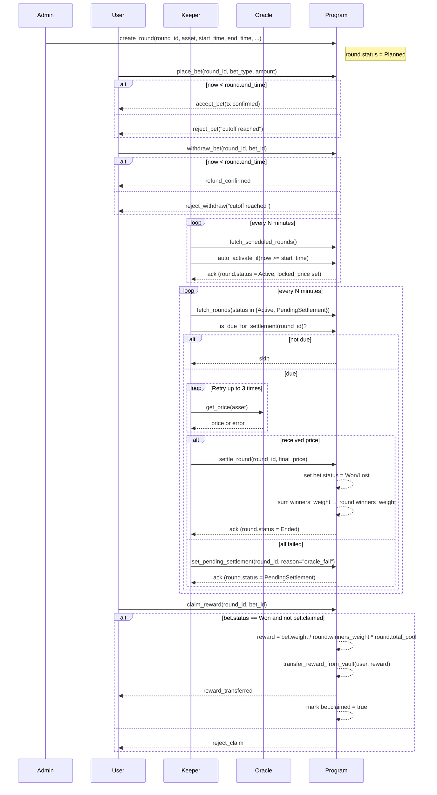
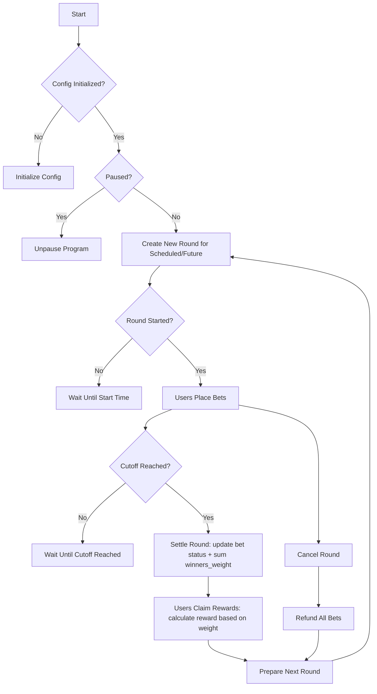
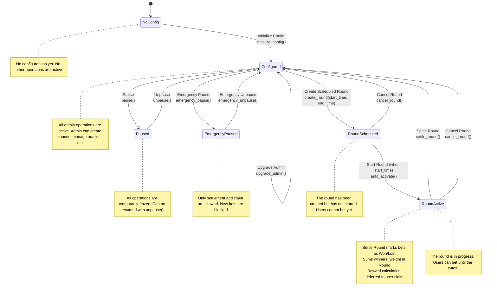
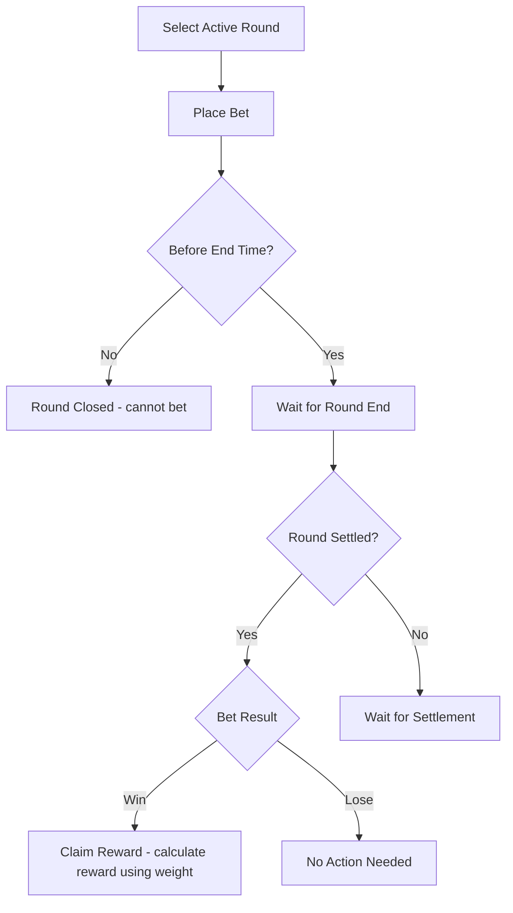
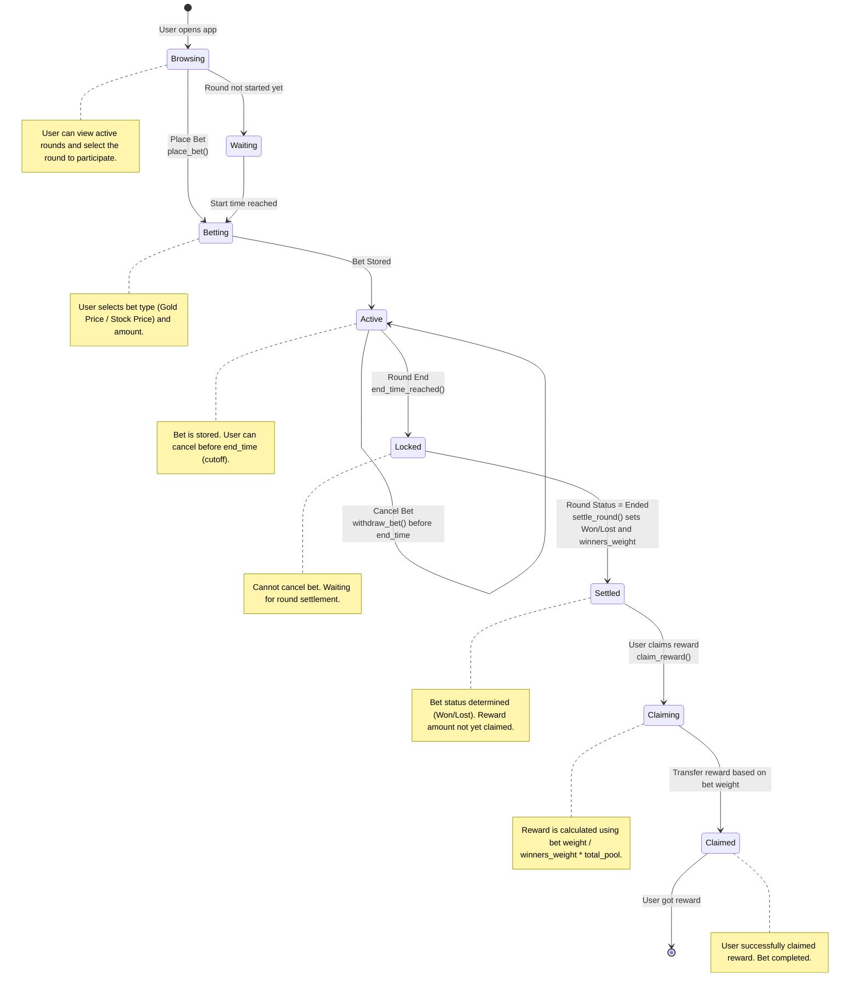
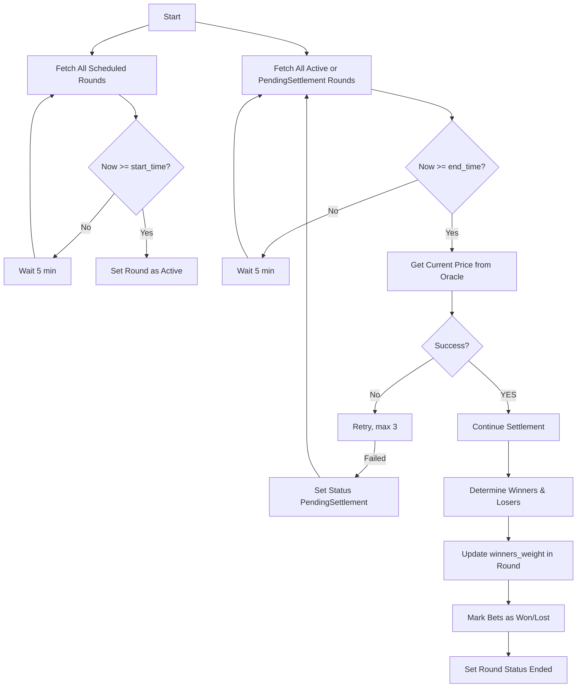
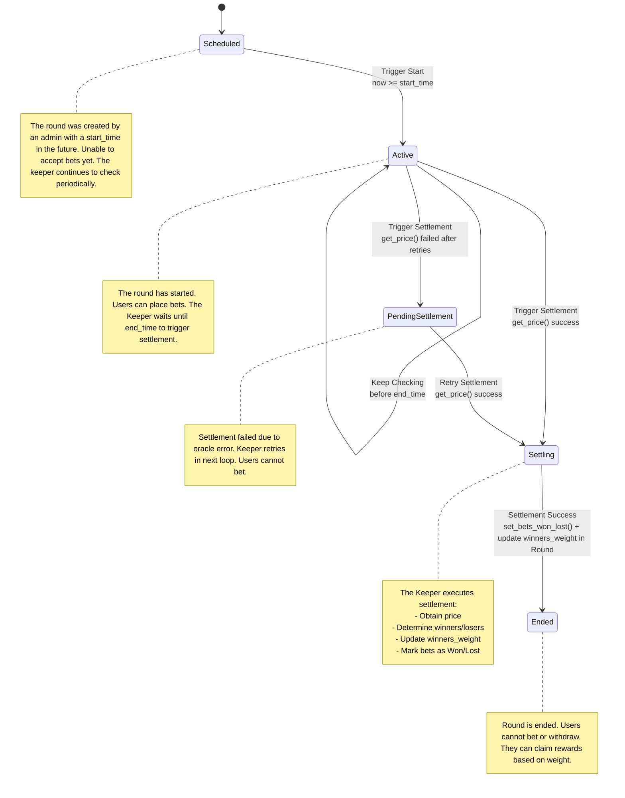

# Gold Rush Smart Contract

Gold Rush is a token-based betting smart contract that allows users to bet on the price movement of gold or specific stocks within a specific time period (called a round).

Users place bets using Gold Rush Tokens (GRT), and winners receive rewards based on the outcome of the round.

## Overview
- Each round has a start time (start_time) and a end time (end_time), during which users can place or withdraw bets before the cutoff.
- After the round ends, the Keeper triggers a settlement process to determine the winner based on the price from the Oracle.
- Rewards are not automatically distributed but are stored as a claimable amount that winners can claim manually.

## Features

### Betting System

- Users can place bets on the price movement of gold or specific stocks (e.g., up/down).
- Bets are placed using GRT tokens.
- Bets can be withdrawn as long as they have not exceeded the cutoff.

### Round Lifecycle

- Admins create new rounds with a start_time and end_time.
- After the start_time, the round automatically becomes Active and accepts bets.
- After the end_time, bets are locked and the round enters the Settlement process and the outcome is determined.

### Keeper Automation

- The Keeper is responsible for triggering:
    - Round activation when the start_time is reached.
    - Round settlement when the end_time is reacged.
- The Keeper retrieves prices from the Oracle, calculates winners, and marks claimable prizes.
- If the price is not retrieved, the round is assigned a PendingSettlement status so it can be retried.

### Price Oracle

- Retrieves real-time prices from an external source (Chainlink or other whitelisted sources).
- Price data is only used during settlement process.

### Rewards & Claims

- Rewards are calculated from the total pool of losing bets and distributed proportionally to winners.
- Rewards are not sent automatically but are stored in the bet as claimable_amount.
- Users can claim rewards after settlement, if claimable_amount > 0.

### Admin Operations

- Create a new round (with a future schedule).
- Manage system configurations (fees, oracle, etc.).
- Pause/unpause the program in an emergency.
- Cancel a round (before settlement) to return all bets.

### Emergency & Safety

- Admins can perform an emergency pause to temporarily stop all betting operations (except claims).
- If settlement fails, the round will be marked as Pending Settlement so that no additional bets are accepted and can be reprocessed.

## Flows
### Full


### Admin (High-level)


### Admin (Low-level)


### User (High-level)


### User (Low-level)


### Keeper (High-level)


### Keeper (Low-level)


## Account Designs
### Config
```rust
pub struct Config {
  // --- Authorities ---
  pub admin: Pubkey,                   // The administrator of the contract.
  pub settlement_authority: Pubkey,    // The authority responsible for settling rounds.
  pub keeper_authorities: Vec<Pubkey>, // The authority for keeper/oracle accounts allowed to keeper operations.

  // --- Token & Treasury ---
  pub token_mint: Pubkey,              // The Gold Rush Token (GRT) used for betting.
  pub treasury: Pubkey,                // The address where the fees are sent.

  // --- Fee Config ---
  pub fee_gold_price_bps: u16,         // The fee percentage charged on bets based on Gold Price.
  pub fee_stock_price_bps: u16,        // The fee percentage charged on bets based on stock price.

  // --- Betting Rules ---
  pub min_bet_amount: u64,             // The minimum bet amount.

  // --- Global State ---
  pub status: ContractStatus,          // Overall contract status (Active / Paused / EmergencyPaused)
  pub current_round_counter: u64,      // Incremental counter for new round IDs

  // --- Metadata ---
  pub version: u8,                     // The version of the contract.
  pub bump: u8,                        // A bump seed for PDA.
}

// Enum for program status flags
#[derive(AnchorSerialize, AnchorDeserialize, Clone, PartialEq, Eq)]
pub enum ContractStatus {
    Active,
    Paused,
    EmergencyPaused,
}
```

### Round

```rust
pub struct Round {
  // --- Identity ---
  pub id: u64,                   // Unique identifier for the round (incremental from config.current_round_counter).
  pub asset: Pubkey,             // The asset being bet on (e.g., Gold, Stock).
  pub start_time: i64,           // The timestampt when round is scheduled to start.
  pub end_time: i64,             // The timestamp when round is scheduled to end.
  pub vault: Pubkey,             // The vault account holding the bets for this round.

  // --- State ---
  pub status: RoundStatus,       // The current status of the round (Planned, Active, PendingSettlement, Ended).
  pub locked_price: Option<u64>, // The price when round becomes Active.
  pub final_price: Option<u64>,  // The price when round is settled.
  pub total_pool: u64,           // The total amount of GRT bet in this round.
  pub total_bets: u64,           // The total number of bets placed in this round.
  pub total_fee_collected: u64,  // The total fees collected for this round.
  pub total_reward_pool: u64,    // The total reward pool after deducting fees.
  pub winners_weight: u64,       // The total weight of winning bets (for reward calculation). Default to 0 if no winners.

  // --- Metadata ---
  pub created_at: i64,           // The timestamp when the round was created.
  pub settled_at: Option<i64>,   // The timestamp when the round was settled.
  pub bump: u8,                  // A bump seed for PDA.
}

// Enum for round status
#[derive(AnchorSerialize, AnchorDeserialize, Clone, PartialEq, Eq)]
pub enum RoundStatus {
    Planned,                    // Created but not started yet
    Active,                     // Currently accepting bets
    PendingSettlement,          // Ended but settlement failed, needs retry
    Ended,                      // Successfully settled
}
```

### Bet
```rust
pub struct Bet {
  // --- Identify ---
  pub round: Pubkey,           // The round this bet is associated with.
  pub bettor: Pubkey,          // The address of the player placing the bet.

  // --- Bet Info ---
  pub amount: u64,            // The amount of GRT bet.
  pub side: BetSide,          // The type of bet (Up, Down, PercentageChange).
  pub claimed: bool,          // Whether the reward has been claimed.
  pub weight: u64,            // The weight of the bet (for reward calculation).

  // --- State ---
  pub status: BetStatus,      // The status of the bet (Pending, Won, Lost).

  // --- Metadata ---
  pub created_at: i64,        // The timestamp when the bet was placed.
  pub bump: u8,               // A bump seed for PDA.
}

// Enum for bet types
#[derive(AnchorSerialize, AnchorDeserialize, Clone, PartialEq, Eq)]
pub enum BetSide {
    Up,
    Down,
    PercentageChange(i16),   // e.g., 10 for 0.1%, -25 for -0.25%
}

// Enum for bet status
#[derive(AnchorSerialize, AnchorDeserialize, Clone, PartialEq, Eq)]
pub enum BetStatus {
    Pending,
    Won,
    Lost,
}
```

---

## Fee Mechanism

The Gold Rush smart contract charges a fee on each bet to sustain the platform. The fee is collected in the same token used for betting (GRT) and is transferred to the treasury after the round is settled.

### Fee Structure

- **Gold Price Bets**: `fee_gold_price_bps` (in basis points, e.g., 50 bps = 0.5%)
- **Stock Price Bets**: `fee_stock_price_bps` (in basis points, e.g., 50 bps = 0.5%)
- **Treasury Account**: `treasury` (the account that receives collected fees)

> Note: Fee is calculated on the bet amount and deducted only at settlement, not at the time of placing a bet. This allows for refunds in case the round is cancelled.

### Fee Calculation

For each round, the total fee collected is calculated as:

$$
\text{fee} = \sum_{i=1}^{n} \text{amount}_i \times \frac{\text{fee\_bps}}{10000}
$$

Where:

- $n$ = total number of bets in the round  
- $\text{amount}_i$ = bet amount of the $i$-th bet  
- $\text{fee\_bps}$ = fee basis points depending on bet type (gold or stock)

The remaining balance after fee deduction becomes the **reward pool**:

$$
\text{total\_reward\_pool} = \text{total\_pool} - \text{total\_fee\_collected}
$$

- `total_pool` = sum of all bet amounts in the round  
- `total_fee_collected` = sum of all fees deducted  
- `total_reward_pool` = amount available for distribution to winning bets

### Settlement Flow for Fees

1. **Round ends**: Keeper triggers the settlement process after `end_time`.  
2. **Calculate fees**: Fee is calculated for each bet based on `fee_gold_price_bps` or `fee_stock_price_bps`.  
3. **Transfer to treasury**: `total_fee_collected` is transferred to the treasury account.  
4. **Compute reward pool**: Remaining GRT is assigned to `total_reward_pool` for winners.  

> This approach ensures fairness and transparency: users only pay fees if the round is successfully settled, and the treasury receives an accurate portion without affecting refund logic.

### Example

Suppose a round has the following bets:

| User | Bet Amount | Bet Type   | Fee (bps) |
|------|------------|------------|------------|
| A    | 10 GRT     | Gold       | 50         |
| B    | 20 GRT     | Stock      | 100        |

Calculations:

- Fee for A: \( 10 \times 0.005 = 0.05 \) GRT  
- Fee for B: \( 20 \times 0.01 = 0.2 \) GRT  

Total fee collected: \( 0.05 + 0.2 = 0.25 \) GRT  

Total reward pool: \( 10 + 20 - 0.25 = 29.75 \) GRT

---

## Reward Calculation

This section explains the reward calculation logic used in the Gold Rush betting system.  
The system uses a **weight-based model** combined with a **self-claim mechanism** to optimize on-chain operations, especially when there are thousands of bets per round.

### Concept

Each bet has a **weight** that represents its contribution to the total reward pool.  
The weight is influenced by:

1. **Bet Amount**: Larger bets contribute more.
2. **Bet Type Factor**: Bets on `PercentageChange` may carry a higher factor than simple `Up/Down` bets.
3. **Time Factor**: Bets placed earlier in the round may carry a higher weight than bets placed near the end of the round.

The general formula for a bet's weight:

$$
\text{weight} = \text{amount} \times \text{side\_factor} \times \text{time\_factor}
$$

Where:

- `amount` = number of GRT tokens bet
- `side_factor` = multiplier based on `BetSide`
  - Up/Down: `1.0`
  - PercentageChange: `>1.0` depending on the magnitude of percentage
- `time_factor` = multiplier based on how early the bet was placed (range: $0 < \text{time\_factor} \le 1.0$)

---

### Settlement

During settlement:

1. The **Keeper** determines the winning bets by comparing `locked_price` and `final_price`.
2. For all winning bets:
   - Mark `Bet.status = Won`
   - Sum their weights into `round.winners_weight`:

$$
\text{round.winners\_weight} = \sum_{\text{all winning bets}} \text{bet.weight}
$$

3. For losing bets:
   - Mark `Bet.status = Lost`
   - Weight is ignored for reward calculation.

> **Note:** No reward amount is calculated yet. Only weights are updated. This avoids looping all bets during settlement, optimizing on-chain efficiency.

---

### Self-Claim by User

When a user claims their reward:

1. Read `Bet.weight` and `round.winners_weight`.
2. Calculate the claimable reward:

$$
\text{reward} = \frac{\text{bet.weight}}{\text{round.winners\_weight}} \times \text{round.total\_pool}
$$

3. Transfer the reward from the round vault to the user's account.
4. Mark `Bet.claimed = true`.

> This approach ensures:
> - **No heavy loops** during settlement
> - Reward is calculated **on-demand**
> - Users can **preview rewards** before claiming if needed (optional off-chain)

---

### Example Calculation

| User | Amount (GRT) | Bet Type | Time Factor | Weight |
|------|--------------|----------|------------|--------|
| A    | 10           | Up       | 1.0        | 10     |
| B    | 10           | Percentage | 1.2      | 12     |

- Total weight of winners: \( 10 + 12 = 22 \)  
- Total pool: 20 GRT  

$$
\text{Reward A} = \frac{10}{22} \times 20 \approx 9.09\text{ GRT}
$$
$$
\text{Reward B} = \frac{12}{22} \times 20 \approx 10.91\text{ GRT}
$$

---

### Summary

- Settlement **only sets status** (Won/Lost) and updates `winners_weight`.
- Reward calculation is deferred to **self-claim**, ensuring efficiency.
- Weight incorporates **amount**, **bet type**, and **time factor**.
- The model is flexible and can be adjusted for new bet types or reward rules.

---


## Program Instructions
### Initialize
Initializes the Gold Rush smart contract with the necessary configurations.

### Admin: Update Config
Updates the configuration settings of the contract. Only the admin can perform this action.

### Admin: Pause
Pauses all operations in the contract. Only the admin can perform this action.

### Admin: Unpause
Unpauses all operations in the contract. Only the admin can perform this action.

### Admin: Emergency Pause
Pauses emergency deposit and place bet operations. Only the admin can perform this action.

### Admin: Emergency Unpause
Unpauses emergency deposit and place bet operations. Only the admin can perform this action.

### Admin: Create Round
Creates a new betting round with specified parameters. Only the admin can perform this action.

### Admin: Cancel Round
Cancels an active or scheduled round and refunds all bets. Only the admin can perform this action

### Keeper: Start Round
Starts a scheduled round when the start_time is reached. Only the keeper authority can perform this action.

### Keeper: Settle Round
Settles a round by determining winners and losers based on the final price from the Oracle. Only the keeper can perform this action.

### User: Place Bet
Allows a player to place a bet on the current round. Players can choose between Up, Down, or Percentage Change bet types.

### User: Withdraw Bet
Allows players to withdraw their bets before the round ends.

### User: Claim Reward
Allows players to claim their rewards after the round has been settled.

## PDA Seeds Strategy