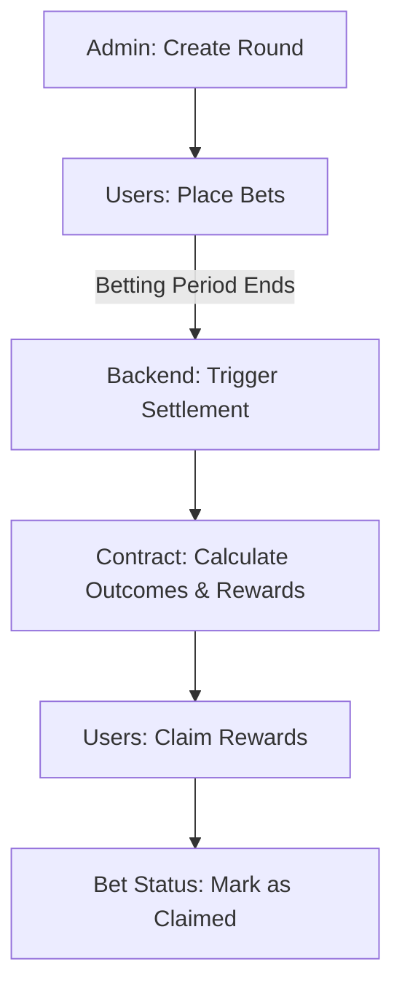
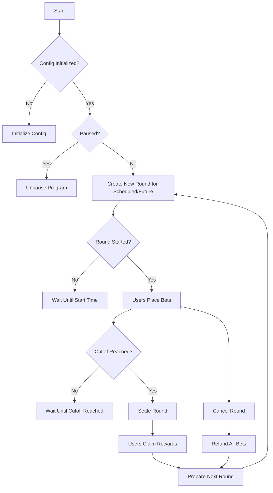
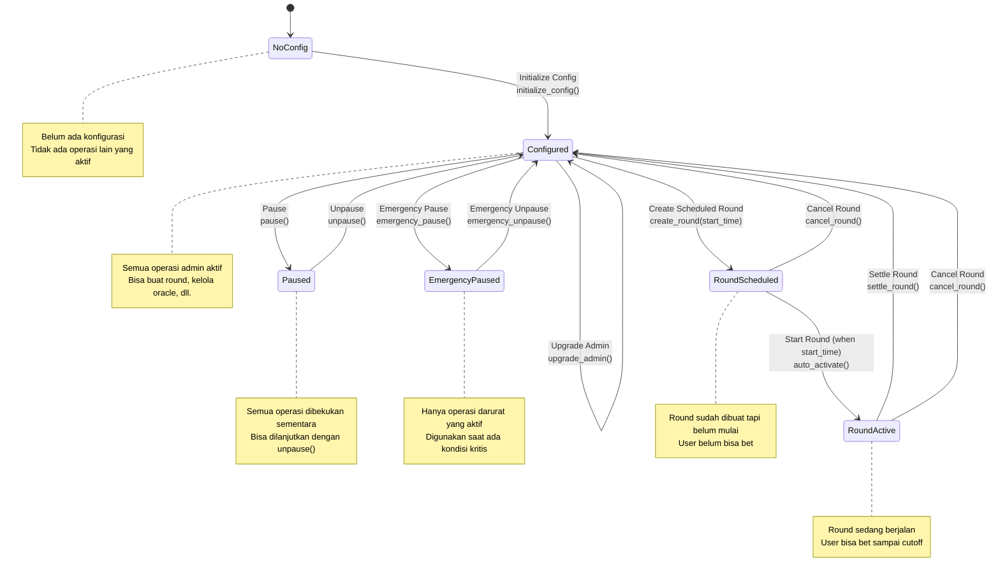
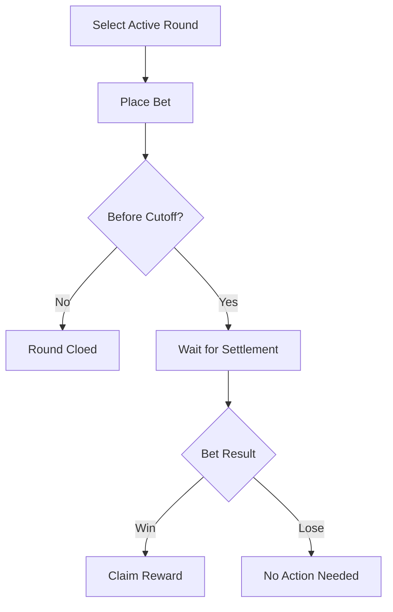
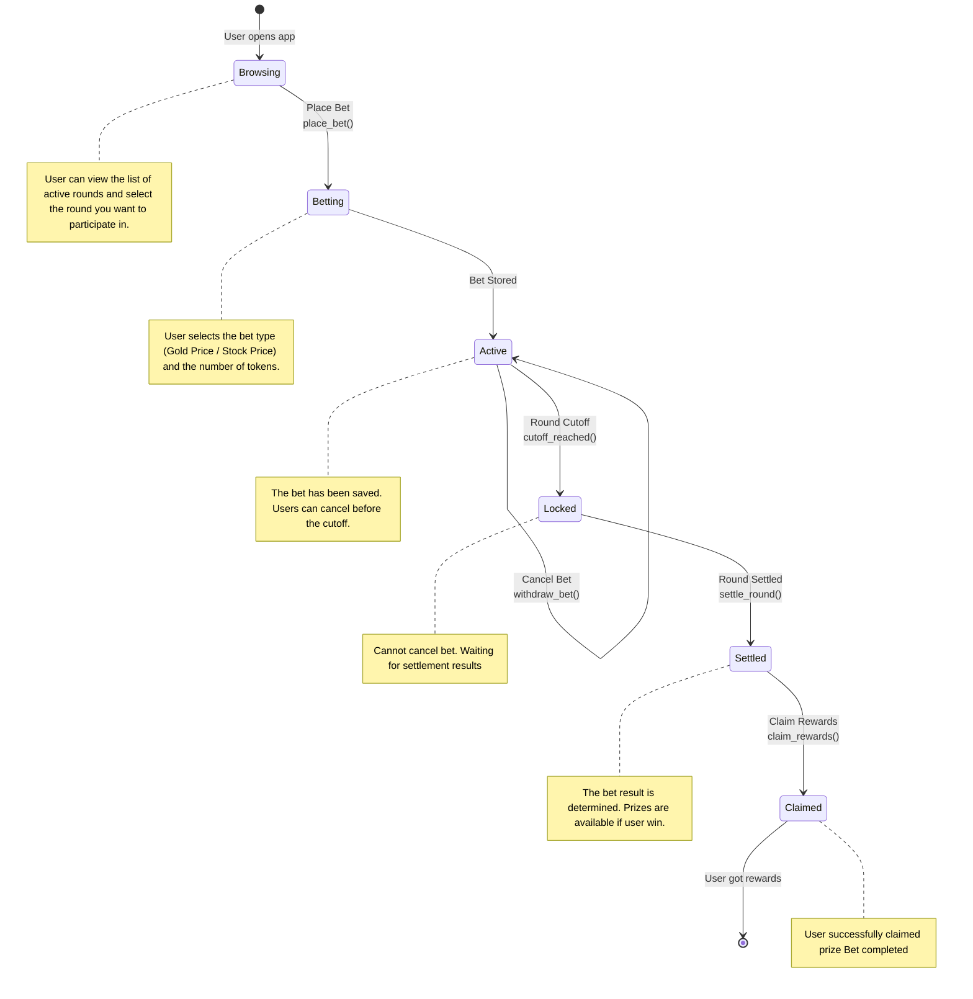

# Gold Rush Smart Contract

A betting smart contract for a game called "Gold Rush". Users can bets based on Gold Price movements or the company's stock price and win rewards based on the outcome. Users can place bets using Gold Rush Token (GRT). Multiple bet types are supported, including betting going Up/Down and percentage changes.

## Features
- *Betting*: Players can place bets on the price movement of Gold or a specific stock with Gold Rush Token (GRT).
- *Price Feeds*: Integrates with Chainlink oracles to fetch real-time price data.
- *Rewards*: Winners receive rewards based on their bets.
- *Admin Fee*: Fee charged on each bet to sustain the platform.
- *Rounds*: The game operates in weekly rounds.
- *Claim Rewards*: Players can claim their rewards after the round ends. The rewards are calculated based on the total pool, individual bets, and bet types. The percentage change bets have more larger rewards.
- *Emergency Withdraw*: Players can withdraw their bets in case of emergencies.

## Flows
### Normal

### Admin (High-level)

### Admin Lifecycle (Low-level)

### User (High-level)

### User (Low-level)

## Account Designs
### Config
- `admin`: The administrator of the contract.
- `token`: The Gold Rush Token (GRT) used for betting.
- `fee_gold_price`: The fee percentage charged on bets based on Gold Price.
- `fee_stock_price`: The fee percentage charged on bets based on stock price.
- `min_bet`: The minimum bet amount.
- `round_duration`: The duration of each betting round.
- `paused`: A boolean to pause all operations in the contract.
- `emergency_paused`: A boolean to pause emergency deposit and place bet.
- `current_round`: The current betting round number.
- `settlement_authority`: The authority responsible for settling rounds.
- `version`: The version of the contract.
- `oracle`: The Chainlink oracle address for fetching price data.
- `job_id`: The job ID for the Chainlink oracle.
- `oracle_whitelist`: A list of whitelisted oracle addresses.
- `treasury`: The address where the fees are sent.
- `bump`: A bump seed for PDA.

### Round
- `round`: The round number.
- `total_up_stake`: Total amount staked on Up bets.
- `total_down_stake`: Total amount staked on Down bets.
- `total_pct_stake`: Total amount staked on Percentage Change bets.
- `cutoff_time`: The time when betting closes for the round.
- `status`: The status of the round (e.g., Active, Ended).
- `bump`: A bump seed for PDA.

### Bet
- `bettor`: The address of the player placing the bet.
- `round`: The round number for which the bet is placed.
- `bet_type`: The type of bet (e.g., Up, Down, Percentage Change).
- `amount`: The amount of GRT bet.
- `status`: The status of the bet (e.g., Pending, Won, Lost).
- `odds`: The odds associated with the bet type.
- `timestamp`: The timestamp when the bet was placed.
- `claimable_amount`: The amount that can be claimed as a reward.
- `claimed`: A boolean indicating if the reward has been claimed.
- `bump`: A bump seed for PDA.

### Vault
- `mint`: The mint address of the Gold Rush Token (GRT).
- `total_staked`: The total amount of GRT staked in the vault.
- `round`: The round number associated with the vault.
- `bump`: A bump seed for PDA.

### PriceFeed
- `price`: The current price fetched from the oracle.
- `timestamp`: The timestamp of the last price update.
- `slot`: The slot number of the last price update.
- `bump`: A bump seed for PDA.

## Program Instructions
### Initialize
Initializes the Gold Rush smart contract with the necessary configurations.

### UpdateConfig
Updates the configuration settings of the contract. Only the admin can perform this action.

### Pause
Pauses all operations in the contract. Only the admin can perform this action.

### Unpause
Unpauses all operations in the contract. Only the admin can perform this action.

### EmergencyPause
Pauses emergency deposit and place bet operations. Only the admin can perform this action.

### EmergencyUnpause
Unpauses emergency deposit and place bet operations. Only the admin can perform this action.

### SetOracle
Sets the Chainlink oracle address for fetching price data. Only the admin can perform this action.

### AddOracleToWhitelist
Adds an oracle address to the whitelist. Only the admin can perform this action.

### RemoveOracleFromWhitelist
Removes an oracle address from the whitelist. Only the admin can perform this action.

### StartRound
Starts a new betting round. Only the admin can perform this action.

### PlaceBet
Allows a player to place a bet on the current round. Players can choose between Up, Down, or Percentage Change bet types.

### SettleRound
Settles the current round by fetching the final price from the oracle and determining the outcome of the bets. Only the settlement authority can perform this action.

### ClaimReward
Allows players to claim their rewards after the round has been settled.

### EmergencyWithdraw
Allows players to withdraw their bets in case of emergencies.

### DepositToVault
Allows players to deposit GRT into the vault for staking.

### WithdrawFromVault
Allows players to withdraw their staked GRT from the vault.

### FetchPrice
Fetches the current price from the Chainlink oracle.

### FulfillPrice
Handles the response from the Chainlink oracle and updates the price feed.
