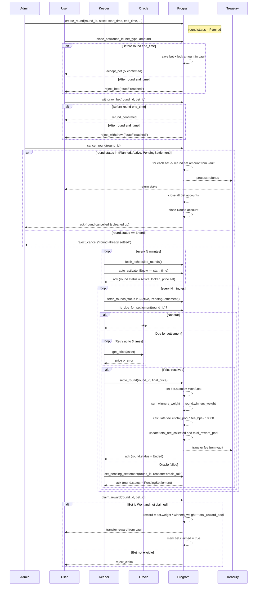
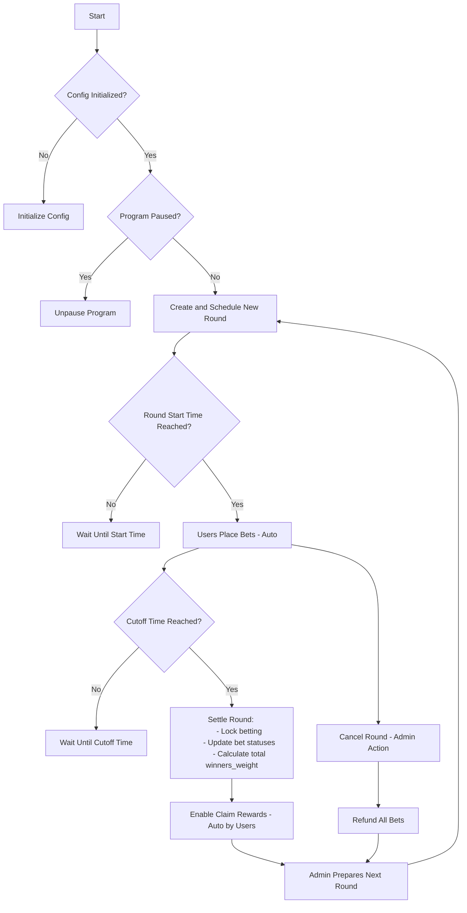
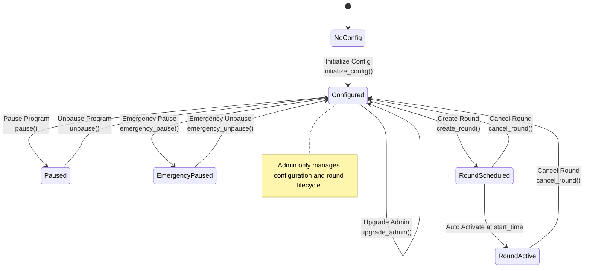
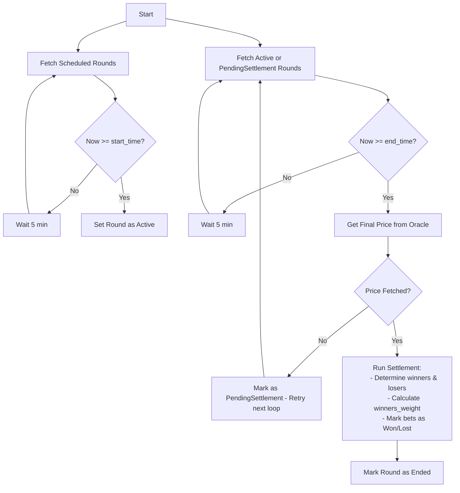
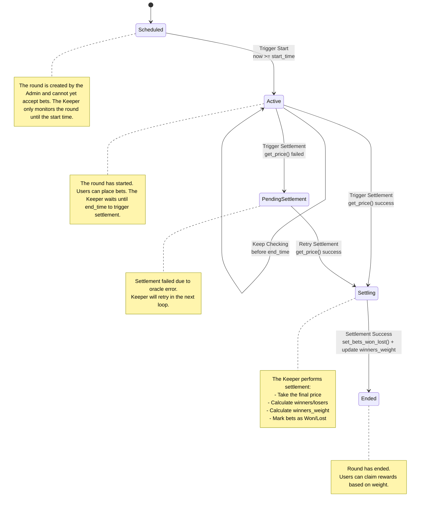
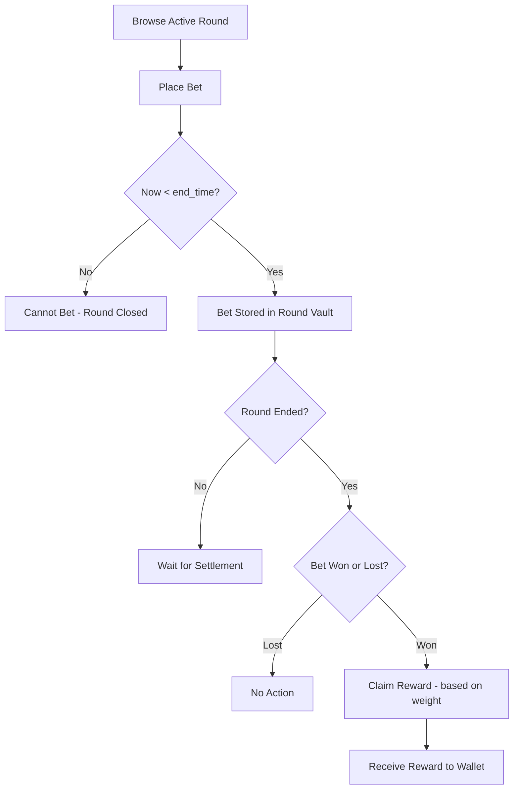
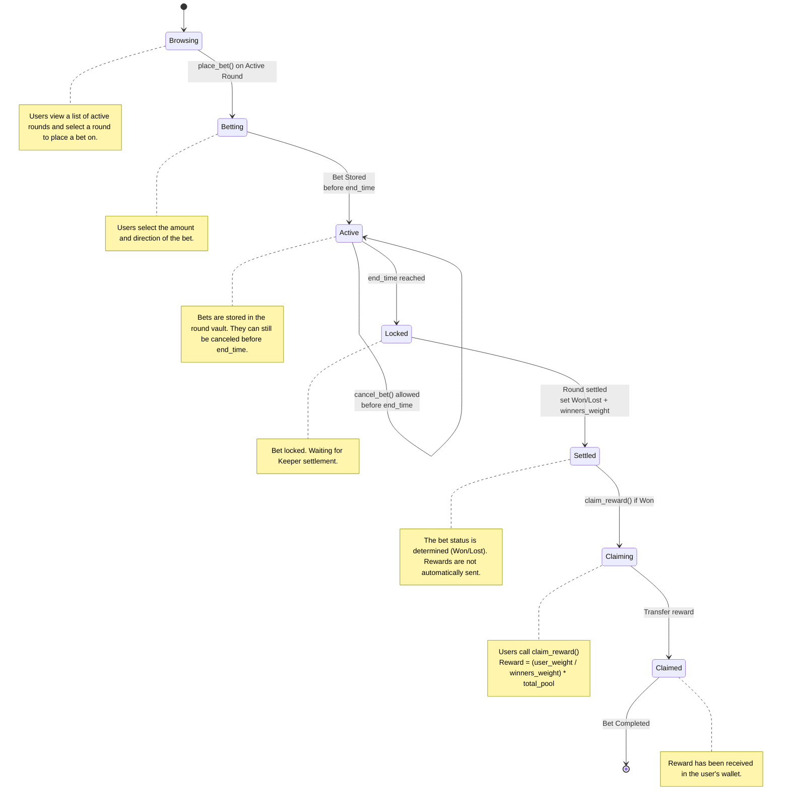

# Gold Rush Smart Contract

Gold Rush is a token-based betting smart contract that allows users to bet on the price movement of gold or specific stocks within a specific time period (called a round).

Users place bets using Gold Rush Tokens (GRT), and winners receive rewards based on the outcome of the round.

## Overview
- Each round has a start time (start_time) and a end time (end_time), during which users can place or withdraw bets before the cutoff.
- After the round ends, the Keeper triggers a settlement process to determine the winner based on the price from the Oracle.
- Rewards are not automatically distributed but are stored as a claimable amount that winners can claim manually.

## Features

### Betting System

- Users can place bets on the price movement of gold or specific stocks (e.g., up/down).
- Bets are placed using GRT tokens.
- Bets can be withdrawn as long as they have not exceeded the cutoff.

### Round Lifecycle

- Admins create new rounds with a start_time and end_time.
- After the start_time, the round automatically becomes Active and accepts bets.
- After the end_time, bets are locked and the round enters the Settlement process and the outcome is determined.

### Keeper Automation

- The Keeper is responsible for triggering:
    - Round activation when the start_time is reached.
    - Round settlement when the end_time is reacged.
- The Keeper retrieves prices from the Oracle, calculates winners, and marks claimable prizes.
- If the price is not retrieved, the round is assigned a PendingSettlement status so it can be retried.

### Price Oracle

- Retrieves real-time prices from an external source (Chainlink or other whitelisted sources).
- Price data is only used during settlement process.

### Rewards & Claims

- Rewards are calculated from the total pool of losing bets and distributed proportionally to winners.
- Rewards are not sent automatically but are stored in the bet as claimable_amount.
- Users can claim rewards after settlement, if claimable_amount > 0.

### Admin Operations

- Create a new round (with a future schedule).
- Manage system configurations (fees, oracle, etc.).
- Pause/unpause the program in an emergency.
- Cancel a round (before settlement) to return all bets.

### Emergency & Safety

- Admins can perform an emergency pause to temporarily stop all betting operations (except claims).
- If settlement fails, the round will be marked as Pending Settlement so that no additional bets are accepted and can be reprocessed.

## Flows
### Full


### Admin (High-level)


### Admin (Low-level)


### Keeper (High-level)


### Keeper (Low-level)


### User (High-level)


### User (Low-level)


## Account Designs
### Config
```rust
pub struct Config {
  // --- Authorities ---
  pub admin: Pubkey,                   // The administrator of the contract.
  pub settlement_authority: Pubkey,    // The authority responsible for settling rounds.
  pub keeper_authorities: Vec<Pubkey>, // The authority for keeper/oracle accounts allowed to keeper operations.

  // --- Token & Treasury ---
  pub token_mint: Pubkey,              // The Gold Rush Token (GRT) used for betting.
  pub treasury: Pubkey,                // The address where the fees are sent.

  // --- Fee Config ---
  pub fee_gold_price_bps: u16,         // The fee percentage charged on bets based on Gold Price.
  pub fee_stock_price_bps: u16,        // The fee percentage charged on bets based on stock price.

  // --- Betting Rules ---
  pub min_bet_amount: u64,             // The minimum bet amount.

  // --- Global State ---
  pub status: ContractStatus,          // Overall contract status (Active / Paused / EmergencyPaused)
  pub current_round_counter: u64,      // Incremental counter for new round IDs

  // --- Metadata ---
  pub version: u8,                     // The version of the contract.
  pub bump: u8,                        // A bump seed for PDA.
}

// Enum for program status flags
#[derive(AnchorSerialize, AnchorDeserialize, Clone, PartialEq, Eq)]
pub enum ContractStatus {
    Active,
    Paused,
    EmergencyPaused,
}
```

### Round

```rust
pub struct Round {
  // --- Identity ---
  pub id: u64,                   // Unique identifier for the round (incremental from config.current_round_counter).
  pub asset: [u8; 8],             // The asset being bet on (e.g., Gold, Stock) as a fixed-size byte array.
  pub start_time: i64,           // The timestamp when round is scheduled to start.
  pub end_time: i64,             // The timestamp when round is scheduled to end.
  pub vault: Pubkey,             // The vault account holding the bets for this round.

  // --- State ---
  pub status: RoundStatus,       // The current status of the round (Planned, Active, PendingSettlement, Ended).
  pub locked_price: Option<u64>, // The price when round becomes Active.
  pub final_price: Option<u64>,  // The price when round is settled.
  pub total_pool: u64,           // The total amount of GRT bet in this round.
  pub total_bets: u64,           // The total number of bets placed in this round.
  pub total_fee_collected: u64,  // The total fees collected for this round.
  pub total_reward_pool: u64,    // The total reward pool after deducting fees.
  pub winners_weight: u64,       // The total weight of winning bets (for reward calculation). Default to 0 if no winners.

  // --- Metadata ---
  pub created_at: i64,           // The timestamp when the round was created.
  pub settled_at: Option<i64>,   // The timestamp when the round was settled.
  pub bump: u8,                  // A bump seed for PDA.
}

// Enum for round status
#[derive(AnchorSerialize, AnchorDeserialize, Clone, PartialEq, Eq)]
pub enum RoundStatus {
    Planned,                    // Created but not started yet
    Active,                     // Currently accepting bets
    PendingSettlement,          // Ended but settlement failed, needs retry
    Ended,                      // Successfully settled
}
```

### Bet
```rust
pub struct Bet {
  // --- Identify ---
  pub round: Pubkey,           // The round this bet is associated with.
  pub bettor: Pubkey,          // The address of the player placing the bet.

  // --- Bet Info ---
  pub amount: u64,            // The amount of GRT bet.
  pub side: BetSide,          // The type of bet (Up, Down, PercentageChange).
  pub claimed: bool,          // Whether the reward has been claimed.
  pub weight: u64,            // The weight of the bet (for reward calculation).

  // --- State ---
  pub status: BetStatus,      // The status of the bet (Pending, Won, Lost).

  // --- Metadata ---
  pub created_at: i64,        // The timestamp when the bet was placed.
  pub bump: u8,               // A bump seed for PDA.
}

// Enum for bet types
#[derive(AnchorSerialize, AnchorDeserialize, Clone, PartialEq, Eq)]
pub enum BetSide {
    Up,
    Down,
    PercentageChange(i16),   // e.g., 10 for 0.1%, -25 for -0.25%
}

// Enum for bet status
#[derive(AnchorSerialize, AnchorDeserialize, Clone, PartialEq, Eq)]
pub enum BetStatus {
    Pending,
    Won,
    Lost,
}
```

---

## Fee Mechanism

The Gold Rush smart contract charges a fee on each bet to sustain the platform. The fee is collected in the same token used for betting (GRT) and is transferred to the treasury after the round is settled.

### Fee Structure

- **Gold Price Bets**: `fee_gold_price_bps` (in basis points, e.g., 50 bps = 0.5%)
- **Stock Price Bets**: `fee_stock_price_bps` (in basis points, e.g., 50 bps = 0.5%)
- **Treasury Account**: `treasury` (the account that receives collected fees)

> Note: Fee is calculated on the bet amount and deducted only at settlement, not at the time of placing a bet. This allows for refunds in case the round is cancelled.

### Fee Calculation

For each round, the total fee collected is calculated as:

$$
\text{fee} = \sum_{i=1}^{n} \text{amount}_i \times \frac{\text{fee\_bps}}{10000}
$$

Where:

- $n$ = total number of bets in the round  
- $\text{amount}_i$ = bet amount of the $i$-th bet  
- $\text{fee\_bps}$ = fee basis points depending on bet type (gold or stock)

The remaining balance after fee deduction becomes the **reward pool**:

$$
\text{total\_reward\_pool} = \text{total\_pool} - \text{total\_fee\_collected}
$$

- `total_pool` = sum of all bet amounts in the round  
- `total_fee_collected` = sum of all fees deducted  
- `total_reward_pool` = amount available for distribution to winning bets

### Settlement Flow for Fees

1. **Round ends**: Keeper triggers the settlement process after `end_time`.  
2. **Calculate fees**: Fee is calculated for each bet based on `fee_gold_price_bps` or `fee_stock_price_bps`.  
3. **Transfer to treasury**: `total_fee_collected` is transferred to the treasury account.  
4. **Compute reward pool**: Remaining GRT is assigned to `total_reward_pool` for winners.  

> This approach ensures fairness and transparency: users only pay fees if the round is successfully settled, and the treasury receives an accurate portion without affecting refund logic.

### Example

Suppose a round has the following bets:

| User | Bet Amount | Bet Type   | Fee (bps) |
|------|------------|------------|------------|
| A    | 10 GRT     | Gold       | 50         |
| B    | 20 GRT     | Stock      | 100        |

Calculations:

- Fee for A: \( 10 \times 0.005 = 0.05 \) GRT  
- Fee for B: \( 20 \times 0.01 = 0.2 \) GRT  

Total fee collected: \( 0.05 + 0.2 = 0.25 \) GRT  

Total reward pool: \( 10 + 20 - 0.25 = 29.75 \) GRT

---

## Reward Calculation

The Gold Rush betting system uses a **weight-based model** combined with a **self-claim mechanism** to efficiently distribute rewards after each round ends.

### Concept

Each bet has a **weight** that represents its contribution to the reward pool.
Weight depends on:

1. **Bet Amount** — Larger bets contribute more.
2. **Bet Type Factor** — Bets on `PercentageChange` may carry a higher factor than simple `Up/Down` bets.
3. **Time Factor** — Bets placed earlier in the round may carry a higher weight than bets placed near the end of the round.

**General formula for a bet's weight:**

$$
\text{weight} = \text{amount} \times \text{side\_factor} \times \text{time\_factor}
$$

Where:

- `amount` = number of GRT tokens bet (before fees)
- `side_factor` = multiplier based on `BetSide`
  - Up/Down: `1.0`
  - PercentageChange: `>1.0` depending on the magnitude of percentage
- `time_factor` = multiplier based on how early the bet was placed (range: $0 < \text{time\_factor} \le 1.0$)

### Settlement Process

When the round ends, the **keeper** settles it:

1. The **Keeper** determines the winning bets by comparing `locked_price` and `final_price`.
2. Mark all winning bets as `Won` and sum their weights:

$$
\text{round.winners\_weight} = \sum_{\text{all winning bets}} \text{bet.weight}
$$

3. Mark all losing bets as `Lost`.
4. Calculate and transfer fees:

$$
\text{total\_fee\_collected} = \sum_{i=1}^{n} \text{amount}_i \times \frac{\text{fee\_bps}}{10000}
$$

5. Move `total_fee_collected` from round vault to `treasury`.
6. Update `round.total_reward_pool`:
$$
\text{round.total\_reward\_pool} = \text{round.total\_pool} - \text{round.total\_fee\_collected}
$$

> **Note:** At this stage, **no rewards are sent to users yet** — only marking bet results and collecting fees.

### Self-Claim by User

When a user claims their reward:

1. Read `Bet.weight` and `round.winners_weight`.
2. Calculate the claimable reward:

$$
\text{reward} = \frac{\text{bet.weight}}{\text{round.winners\_weight}} \times \text{round.total\_reward\_pool}
$$

3. Transfer the reward from the round vault to the user's account.
4. Mark `Bet.claimed = true`.

---

### Important Notes

- `round.total_reward_pool` is equal to `round.total_pool - round.total_fee_collected`.
- The reward includes the user's original stake. Losing users lose their stake, and their funds contribute to the reward pool for winners.
- If **all users win**, no one loses their stake. All winners simply receive their original stake back minus proportional fees.

---

### Example Calculation

| User | Amount (GRT) | Bet Type | Fee (bps)   | Time Factor | Weight |
|------|--------------|----------|-------------|-------------|--------|
| A    | 10           | Gold     | 50          |    1.0      | 10     |
| B    | 20           | Stock    | 100         |    1.0      | 20     |

- Total pool: $10 + 20 = 30$
- Fees:
  - A → $10 \times 0.005 = 0.05$ GRT
  - B → $20 \times 0.01 = 0.2$ GRT
- Total fee collected = $0.05 + 0.2 = 0.25$ GRT
- Total reward pool = $30 - 0.25 = 29.75$ GRT
- Suppose both A and B win:
  - `round.winners_weight = 10 + 20 = 30`

Then:

$$
\text{Reward A} = \frac{10}{30} \times 29.75 \approx 9.92\text{ GRT}
$$
$$
\text{Reward B} = \frac{20}{30} \times 29.75 \approx 19.83\text{ GRT}
$$

Total = 29.75 GRT distributed, and 0.25 GRT sent to the treasury.

---


## Program Instructions
### Initialize
#### Purpose
Initializes the program for the first time. Creates a `Config` account that stores global settings such as admin, treasury, and other initial parameters.

#### Context
| Field            | Type                  | Description                               |
|------------------|-----------------------|--------------------------------------------|
| `initializer`    | `Signer`              | The account that initializes the program (becomes admin if `admin` not provided). |
| `config`         | `Account<Config>`     | PDA account to store global configuration data.         |
| `system_program` | `Program<System>`     | The system program used to create the `config` account.   |

#### Arguments
| Name            | Type      | Description                          |
|----------------|------------|-------------------------------------|
| `settlement_authority` | `Pubkey`   | The initial address of the admin account |
| `keeper_authorities`   | `Vec<Pubkey>` | List of authorized keeper authority account addresses
| `token_mint`   | `Pubkey`   | The address of the GRT token mint                 |
| `treasury`      | `Pubkey`   | The address of the treasury account                 |
| `fee_gold_price_bps`       | `u16`      | The fee for gold price bets in basis points (bps) |
| `fee_stock_price_bps`      | `u16`      | The fee for stock price bets in basis points (bps) |
| `min_bet_amount` | `u64`      | The minimum amount required to place a bet    |

#### Validations
- Ensure `config` has not been initialized (no previous data exists)
- `fee_gold_price_bps` and `fee_stock_price_bps` must be `< 10_000` (100%)
- `initializer` must be a signer
- `keeper_authorities` must not be empty
- `min_bet_amount` must be greater than `0`

#### Logic
1. Derive PDA for `config` using seeds `["config"]`
2. Create the `config` account
3. Initialize fields:
   - `admin = admin.unwrap_or(initializer.key())`
   - `settlement_authority = settlement_authority`
   - `keeper_authorities = keeper_authorities`
   - `token_mint = token_mint`
   - `treasury = treasury`
   - `fee_gold_price_bps = fee_gold_price_bps`
   - `fee_stock_price_bps = fee_stock_price_bps`
   - `min_bet_amount = min_bet_amount`
4. Set default fields:
   - `status = Active`
   - `current_round_counter = 0`
   - `version = 1`
   - `bump = bump`

#### Emits / Side Effects
- Creates a new `Config` account at PDA `["config"]`
- Stores global configuration and admin data

#### Errors
| Code                   | Meaning                                    |
|---------------------------|--------------------------------------------|
| `AlreadyInitialized`        | If `config` has already been created |
| `InvalidFee`                 | If any `fee_*_bps >= 10000`           |
| `InvalidMinBetAmount`        | If `min_bet_amount == 0`               |
| `NoKeeperAuthorities`        | If `keeper_authorities` is empty       |

---

### Admin: Update Config

#### Purpose
Allows the admin to update global configuration settings stored in the `Config` account, such as fee parameters, keeper authorities, treasury address, and minimum bet amount.

---

#### Context
| Field             | Type                  | Description                                      |
|--------------------|-----------------------|---------------------------------------------------|
| `admin`              | `Signer`               | The current admin authorized to update the config. |
| `config`             | `Account<Config>`      | The existing global configuration account.         |

---

#### Arguments
| Name                     | Type             | Description                                        |
|----------------------------|-------------------|-------------------------------------------------------|
| `new_admin`                | `Option<Pubkey>`    | (Optional) New admin address to replace the current admin. |
| `settlement_authority`     | `Option<Pubkey>`    | (Optional) New settlement authority address. |
| `keeper_authorities`       | `Option<Vec<Pubkey>>` | (Optional) New list of keeper authority addresses. |
| `token_mint`                | `Option<Pubkey>`    | (Optional) New token mint address. |
| `treasury`                  | `Option<Pubkey>`    | (Optional) New treasury account address. |
| `fee_gold_price_bps`        | `Option<u16>`         | (Optional) New fee for gold price bets (bps). |
| `fee_stock_price_bps`       | `Option<u16>`         | (Optional) New fee for stock price bets (bps). |
| `min_bet_amount`             | `Option<u64>`         | (Optional) New minimum bet amount. |

---

#### Validations
- `admin` must be the current admin stored in `config.admin`
- `fee_gold_price_bps` and `fee_stock_price_bps` (if provided) must be `< 10_000` (100%)
- `keeper_authorities` (if provided) must not be empty
- `min_bet_amount` (if provided) must be `> 0`

---

#### Logic
1. Check that `admin.key() == config.admin`
2. For each provided argument (`Option<T>`), if `Some(value)` then update the corresponding field in `config`:
   - `admin = new_admin`
   - `settlement_authority = settlement_authority`
   - `keeper_authorities = keeper_authorities`
   - `token_mint = token_mint`
   - `treasury = treasury`
   - `fee_gold_price_bps = fee_gold_price_bps`
   - `fee_stock_price_bps = fee_stock_price_bps`
   - `min_bet_amount = min_bet_amount`

---

#### Emits / Side Effects
- Updates the `Config` account with new global settings

---

#### Errors
| Code                      | Meaning                                      |
|-------------------------------|----------------------------------------------|
| `Unauthorized`                  | If the caller is not the current `config.admin` |
| `InvalidFee`                     | If any provided `fee_*_bps >= 10000` |
| `InvalidMinBetAmount`            | If provided `min_bet_amount == 0` |
| `NoKeeperAuthorities`            | If provided `keeper_authorities` is empty |


### Admin: Pause Program

#### Purpose
Allows the admin to **pause** the entire program by updating the `Config.status` field.  
When paused, new rounds cannot be created and bets cannot be placed.

---

#### Context
| Field       | Type                | Description                                       |
|-------------|---------------------|---------------------------------------------------|
| `admin`     | `Signer`             | The current admin authorized to pause the program. |
| `config`    | `Account<Config>`    | The global configuration account.                  |

---

#### Arguments
_None_

---

#### Validations
- `admin` must be the current admin stored in `config.admin`
- `config.status` must currently be `Active`

---

#### Logic
1. Check that `admin.key() == config.admin`
2. Set `config.status = Paused`

---

#### Emits / Side Effects
- Updates `Config.status` to `Paused`
- Halts critical user actions (create round, place bet)

---

#### Errors
| Code             | Meaning                                            |
|-------------------|-----------------------------------------------------|
| `Unauthorized`      | If the caller is not the current `config.admin`     |
| `AlreadyPaused`     | If the config is already in `Paused` state           |

---

### Admin: Unpause Program

#### Purpose
Allows the admin to **resume** the program by updating the `Config.status` field back to `Active`.  
After unpausing, normal operations (creating rounds, placing bets) can continue.

---

#### Context
| Field       | Type                | Description                                          |
|-------------|---------------------|---------------------------------------------------------|
| `admin`     | `Signer`             | The current admin authorized to unpause the program.     |
| `config`    | `Account<Config>`    | The global configuration account.                         |

---

#### Arguments
_None_

---

#### Validations
- `admin` must be the current admin stored in `config.admin`
- `config.status` must currently be `Paused`

---

#### Logic
1. Check that `admin.key() == config.admin`
2. Set `config.status = Active`

---

#### Emits / Side Effects
- Updates `Config.status` to `Active`
- Resumes normal operations

---

#### Errors
| Code             | Meaning                                             |
|-------------------|------------------------------------------------------|
| `Unauthorized`      | If the caller is not the current `config.admin`       |
| `AlreadyActive`     | If the config is already in `Active` state               |

### Admin: Emergency Pause
Pauses emergency deposit and place bet operations. Only the admin can perform this action.

### Admin: Emergency Unpause
Unpauses emergency deposit and place bet operations. Only the admin can perform this action.

### Admin: Create Round

#### Purpose
This instruction is used by the Admin to create and schedule a new round.
The created round will automatically become active when the start time is reached, and will automatically close (lock) when the end time is reached.
Users can only place bets while the round is in Active status.

#### Context
| Account             | Type                       | Description                                      |
|----------------------|------------------------------|---------------------------------------------------|
| `keeper` | `Signer` | The authorized keeper who creates a new round. |
| `config` | `Account<Config>` | The global configuration account, storing common parameters and a list of keepers. |
| `round` | `Account<Round>` (PDA) | The new round account to be initialized. |
| `vault` | `AccountInfo` (PDA) | The vault account to hold bets for this round. |
| `system_program` | `Program<System>` | Solana's built-in system program. |

---

#### Arguments
| Name               | Type         | Description                                  |
|----------------------|---------------|-----------------------------------------------|
| `asset` | `[u8; 8]` | The asset being bet on |
| `start_time` | `i64` (unix timestamp) | Round start time |
| `end_time` | `i64` (unix timestamp) | Round end time |

---

#### Validations
- `start_time < end_time`
- `start_time > current_timestamp` (cannot create rounds in the past)
- Caller = `config.admin`

---

#### Logic
1. Derive PDA for `round` using seeds `["round", round_id]` where `round_id = config.current_round_counter + 1` 
2. Create round `vault` account to hold bets
3. Initialize `round` fields:
   - `round_id = config.current_round_counter + 1`
   - `asset = asset`
   - `start_time = start_time`
   - `end_time = end_time`
   - `status = Planned`
   - `locked_price = 0`
   - `final_price = None`
   - `total_pool = 0`
   - `total_bets = 0`
   - `total_fee_collected = 0`
   - `total_reward_pool = 0`
   - `winners_weight = 0`
   - `created_at = Clock::now()`
   - `settled_at = None`
4. Increment `config.current_round_counter` by 1
---

## Emits / Side Effects
- Create a new `Round` account on the blockchain
- Record round information into the program state

---

## Errors
| Code                         | Meaning                                            |
|--------------------------------|-------------------------------------------------------|
| `Unauthorized`                       | If the caller is not the official keeper |
| `InvalidTimestamps`                  | If `start_time` or `end_time` is invalid |
| `RoundAlreadyExists`                 | If the PDA for `round_id` has already been created |

### Admin: Cancel Round
Cancels an active or scheduled round and refunds all bets. Only the admin can perform this action

### Keeper: Start Round

#### Purpose
This instruction is executed by the Keeper to start a round that was previously in the Planned state.
When called, the round becomes Active, allowing users to place bets (place_bet()).

---

#### Context
| Field         | Type                  | Description                                |
|-------------------|-----------------------|----------------------------------------------|
| `keeper` | `Signer` | The keeper authorized to trigger the start of the round. |
| `config` | `Account<Config>` | The global config that stores the list of keepers. |
| `round` | `Account<Round>` | The round currently in `Scheduled` status. |

---

#### Arguments
| Name            | Type       | Description                            |
|----------------|-------------|--------------------------------------------|
| `asset_price` | `u64` | The price of the asset being staked. |

---

#### Validations
- `keeper` must be in `config.keeper_authorities`
- `round.status == Planned`
- `Clock::now() >= round.start_time`
- `config.status == Active`
- `asset_price > 0`

---

#### Logic
1. Change `round.status` to `Active`
2. Set `round.settled_at = Clock::now()`
3. Set `round.locked_price = asset_price`

---

#### Emits / Side Effects
- Change `Round` status from `Planned` → `Active`
- Indicate that users can now start placing bets (`place_bet()`) on this round

---

## Errors
| Code                  | Meaning                                             |
|-----------------------------|---------------------------------------------------|
| `UnauthorizedKeeper` | If `keeper` is not part of `config.keeper_authorities` |
| `InvalidRoundStatus` | If `round.status` is not `Planned` |
| `RoundNotReady` | If `Clock::now() < round.start_time` |
| `ProgramPaused` | If `config.status != Active` |
| `InvalidAssetPrice` | If `asset_price == 0` |

### Keeper: Settle Round

#### Purpose
This instruction is executed by the Keeper to perform settlement on a round that has reached its end_time.
The settlement process retrieves the final price from the oracle, determines the winner and loser, calculates the winners_weight, and marks all bets as either Won or Lost.
After successful settlement, the round status changes to Ended.

#### Context
| Field         | Type                    | Description                                         |
|-------------------|----------------------------|----------------------------------------------------------|
| `keeper` | `Signer` | The keeper authorized to trigger settlement. |
| `config` | `Account<Config>` | Global config that stores the list of keepers. |
| `round` | `Account<Round>` | The round to be settled. |
| `bet_list` | `Vec<Account<Bet>>` | All bets associated with this round. |

---

#### Arguments
| Name         | Type      | Description                                      |
|---------------|---------------|-------------------------------------------------|
| **asset_price**      | `u64`                   | The price of the asset being settled. |

---

## Validations
- `keeper` must be present in `config.keeper_authorities`
- `round.status` must be `Active` or `PendingSettlement`
- `Clock::now() >= round.end_time`
- `config.status == Active`
- `bet_list` cannot be empty

---

## Logic
1. if `final_price` is not provided (0) set `round.status = PendingSettlement` and return (keeper will retry later).
2. Otherwise, proceed with settlement:
    - Set `round.final_price = final_price`
    - Calculate the result of each `bet`:
      - If the prediction is correct → `bet.status = Won`
      - If the prediction is incorrect → `bet.status = Lost`
    - Calculate and set `winners_weight` based on the total number of tokens won
    - Calculate total fees and set to `round.total_fee_collected`
    - Transfer `round.total_fee_collected` from `round.vault` to `config.treasury`
    - Set `round.total_reward_pool = round.total_pool - round.total_fee_collected`
    - Change `round.status = Ended`
    - Set `round.settled_at = Clock::now()`.

---

## Emits / Side Effects
- Change all `bets` from `Pending` to `Won` or `Lost`
- Change `round.status` to `Ended`
- Save `final_price` and `winners_weight` in `round`

---

## Errors
| Code                        | Meaning                                                 |
|--------------------------------|-------------------------------------------------------------|
| `UnauthorizedKeeper` | If `keeper` is not part of `config.keeper_authorities` |
| `InvalidRoundStatus` | If `round.status` is not `Active` or `PendingSettlement` |
| `RoundNotReadyForSettlement` | If `Clock::now() < round.end_time` |
| `ProgramPaused` | If `config.status != Active` |
| `EmergencyPaused` | If `config.emergency_paused == true` |
| `NoBetsPlaced` | If `bet_list` is empty |

---

### User: Place Bet
Allows a player to place a bet on the current round. Players can choose between Up, Down, or Percentage Change bet types.

### User: Withdraw Bet
Allows players to withdraw their bets before the round ends.

### User: Claim Reward
Allows players to claim their rewards after the round has been settled.

## PDA Seeds Strategy
- **Config**: `["config"]`