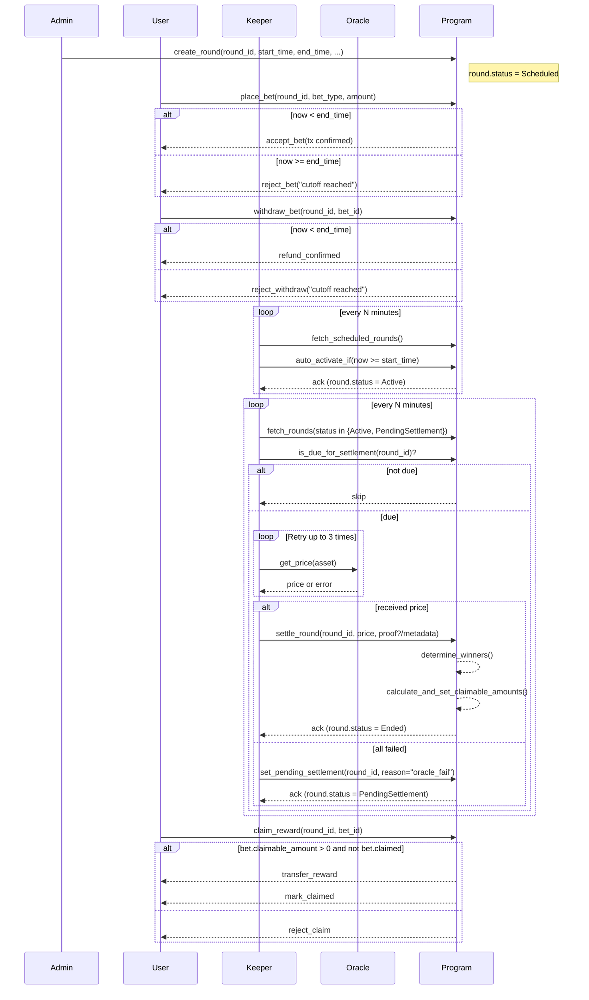
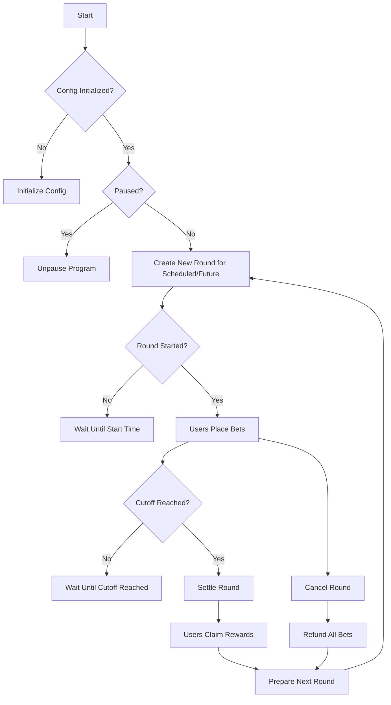
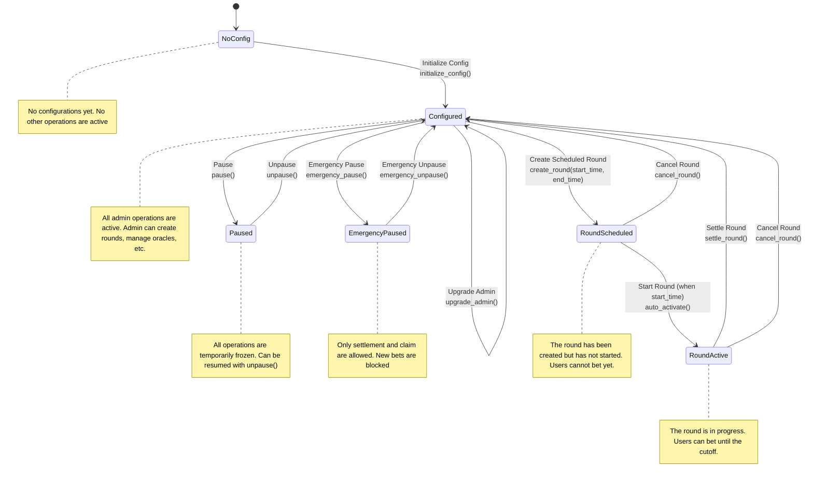
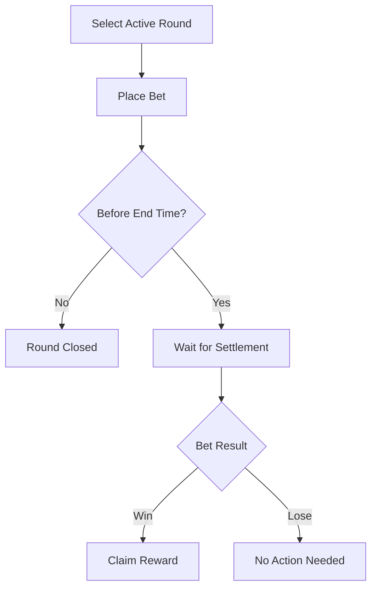
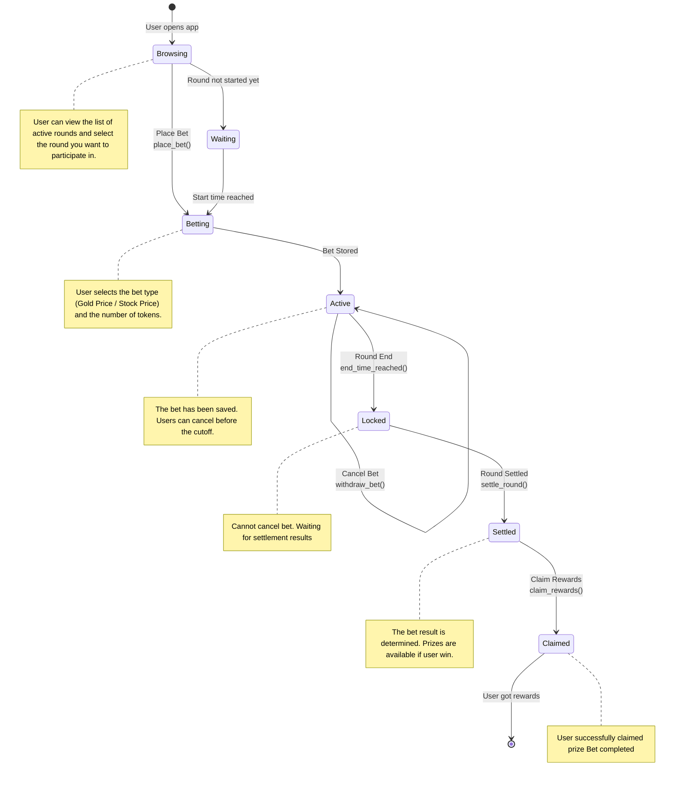
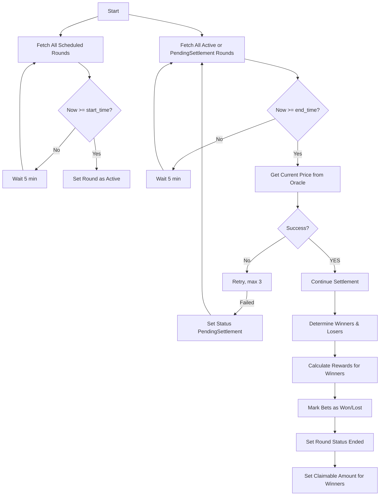
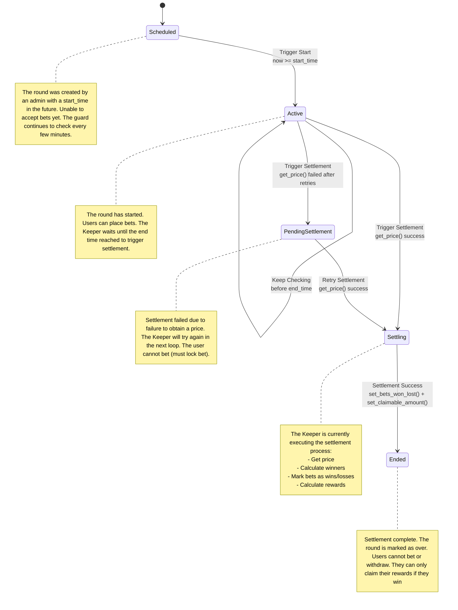

# Gold Rush Smart Contract

Gold Rush is a token-based betting smart contract that allows users to bet on the price movement of gold or specific stocks within a specific time period (called a round).

Users place bets using Gold Rush Tokens (GRT), and winners receive rewards based on the outcome of the round.

## Overview
- Each round has a start time (start_time) and a end time (end_time), during which users can place or withdraw bets before the cutoff.
- After the round ends, the Keeper triggers a settlement process to determine the winner based on the price from the Oracle.
- Rewards are not automatically distributed but are stored as a claimable amount that winners can claim manually.

## Features

### Betting System

- Users can place bets on the price movement of gold or specific stocks (e.g., up/down).
- Bets are placed using GRT tokens.
- Bets can be withdrawn as long as they have not exceeded the cutoff.

### Round Lifecycle

- Admins create new rounds with a start_time and end_time.
- After the start_time, the round automatically becomes Active and accepts bets.
- After the end_time, bets are locked and the round enters the Settlement process and the outcome is determined.

### Keeper Automation

- The Keeper is responsible for triggering:
    - Round activation when the start_time is reached.
    - Round settlement when the end_time is reacged.
- The Keeper retrieves prices from the Oracle, calculates winners, and marks claimable prizes.
- If the price is not retrieved, the round is assigned a PendingSettlement status so it can be retried.

### Price Oracle

- Retrieves real-time prices from an external source (Chainlink or other whitelisted sources).
- Price data is only used during settlement process.

### Rewards & Claims

- Rewards are calculated from the total pool of losing bets and distributed proportionally to winners.
- Rewards are not sent automatically but are stored in the bet as claimable_amount.
- Users can claim rewards after settlement, if claimable_amount > 0.

### Admin Operations

- Create a new round (with a future schedule).
- Manage system configurations (fees, oracle, etc.).
- Pause/unpause the program in an emergency.
- Cancel a round (before settlement) to return all bets.

### Emergency & Safety

- Admins can perform an emergency pause to temporarily stop all betting operations (except claims).
- If settlement fails, the round will be marked as Pending Settlement so that no additional bets are accepted and can be reprocessed.

## Flows
### Full

### Admin (High-level)

### Admin (Low-level)

### User (High-level)

### User (Low-level)

### Keeper (High-level)

### Keeper (Low-level)

## Account Designs
### Config
- `admin`: The administrator of the contract.
- `token`: The Gold Rush Token (GRT) used for betting.
- `fee_gold_price`: The fee percentage charged on bets based on Gold Price.
- `fee_stock_price`: The fee percentage charged on bets based on stock price.
- `min_bet`: The minimum bet amount.
- `round_duration`: The duration of each betting round.
- `paused`: A boolean to pause all operations in the contract.
- `emergency_paused`: A boolean to pause emergency deposit and place bet.
- `current_round`: The current betting round number.
- `settlement_authority`: The authority responsible for settling rounds.
- `version`: The version of the contract.
- `oracle`: The Chainlink oracle address for fetching price data.
- `job_id`: The job ID for the Chainlink oracle.
- `oracle_whitelist`: A list of whitelisted oracle addresses.
- `treasury`: The address where the fees are sent.
- `bump`: A bump seed for PDA.

### Round
- `round`: The round number.
- `total_up_stake`: Total amount staked on Up bets.
- `total_down_stake`: Total amount staked on Down bets.
- `total_pct_stake`: Total amount staked on Percentage Change bets.
- `cutoff_time`: The time when betting closes for the round.
- `status`: The status of the round (Future, Active, PendingSettlement, Ended).
- `bump`: A bump seed for PDA.

### Bet
- `bettor`: The address of the player placing the bet.
- `round`: The round number for which the bet is placed.
- `bet_type`: The type of bet (e.g., Up, Down, Percentage Change).
- `amount`: The amount of GRT bet.
- `status`: The status of the bet (e.g., Pending, Won, Lost).
- `odds`: The odds associated with the bet type.
- `timestamp`: The timestamp when the bet was placed.
- `claimable_amount`: The amount that can be claimed as a reward.
- `claimed`: A boolean indicating if the reward has been claimed.
- `bump`: A bump seed for PDA.

### Vault
- `mint`: The mint address of the Gold Rush Token (GRT).
- `total_staked`: The total amount of GRT staked in the vault.
- `round`: The round number associated with the vault.
- `bump`: A bump seed for PDA.

### PriceFeed
- `price`: The current price fetched from the oracle.
- `timestamp`: The timestamp of the last price update.
- `slot`: The slot number of the last price update.
- `bump`: A bump seed for PDA.

## Program Instructions
### Initialize
Initializes the Gold Rush smart contract with the necessary configurations.

### UpdateConfig
Updates the configuration settings of the contract. Only the admin can perform this action.

### Pause
Pauses all operations in the contract. Only the admin can perform this action.

### Unpause
Unpauses all operations in the contract. Only the admin can perform this action.

### EmergencyPause
Pauses emergency deposit and place bet operations. Only the admin can perform this action.

### EmergencyUnpause
Unpauses emergency deposit and place bet operations. Only the admin can perform this action.

### SetOracle
Sets the Chainlink oracle address for fetching price data. Only the admin can perform this action.

### AddOracleToWhitelist
Adds an oracle address to the whitelist. Only the admin can perform this action.

### RemoveOracleFromWhitelist
Removes an oracle address from the whitelist. Only the admin can perform this action.

### StartRound
Starts a new betting round. Only the admin can perform this action.

### PlaceBet
Allows a player to place a bet on the current round. Players can choose between Up, Down, or Percentage Change bet types.

### SettleRound
Settles the current round by fetching the final price from the oracle and determining the outcome of the bets. Only the settlement authority can perform this action.

### ClaimReward
Allows players to claim their rewards after the round has been settled.

### EmergencyWithdraw
Allows players to withdraw their bets in case of emergencies.

### DepositToVault
Allows players to deposit GRT into the vault for staking.

### WithdrawFromVault
Allows players to withdraw their staked GRT from the vault.

### FetchPrice
Fetches the current price from the Chainlink oracle.

### FulfillPrice
Handles the response from the Chainlink oracle and updates the price feed.
