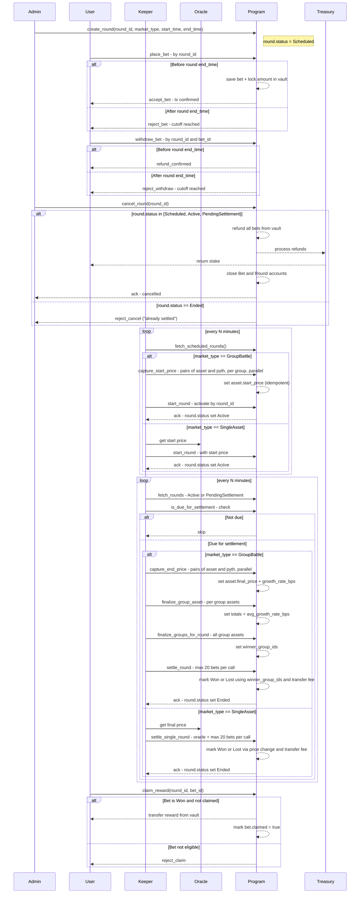
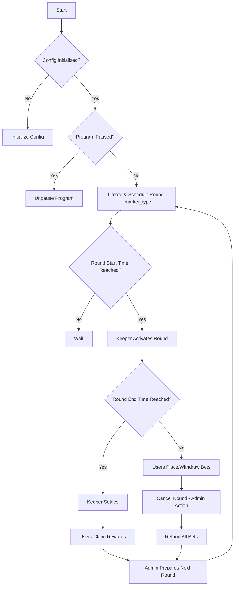
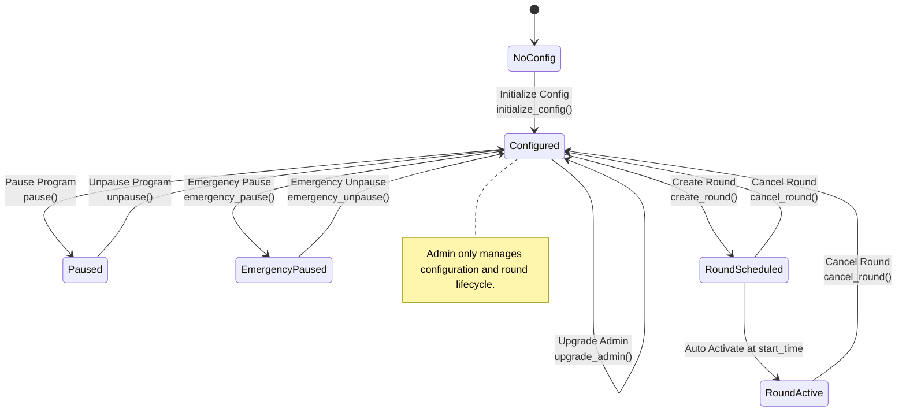
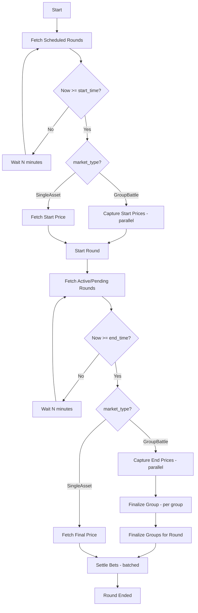
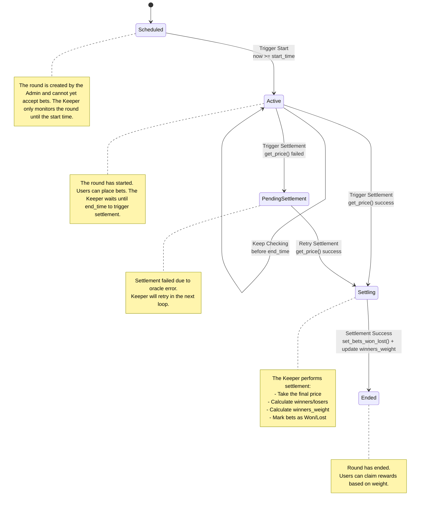
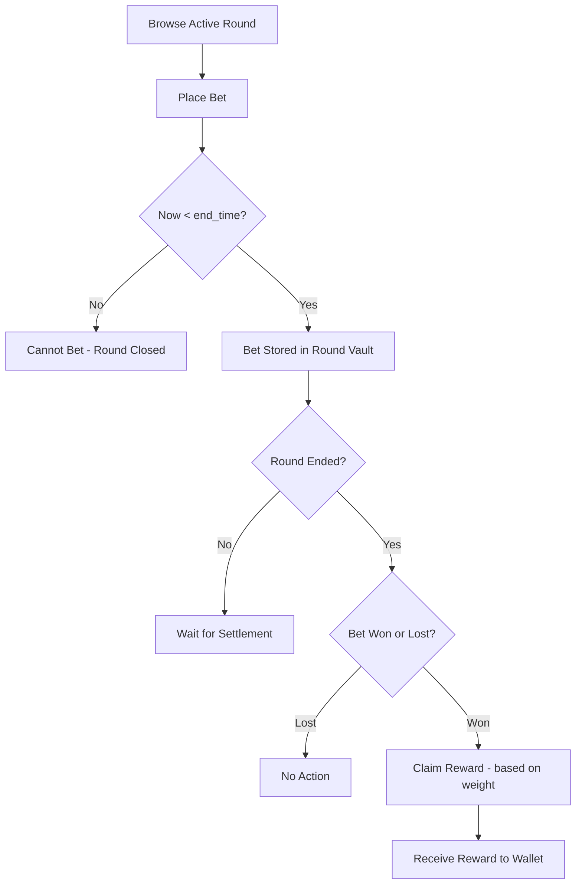
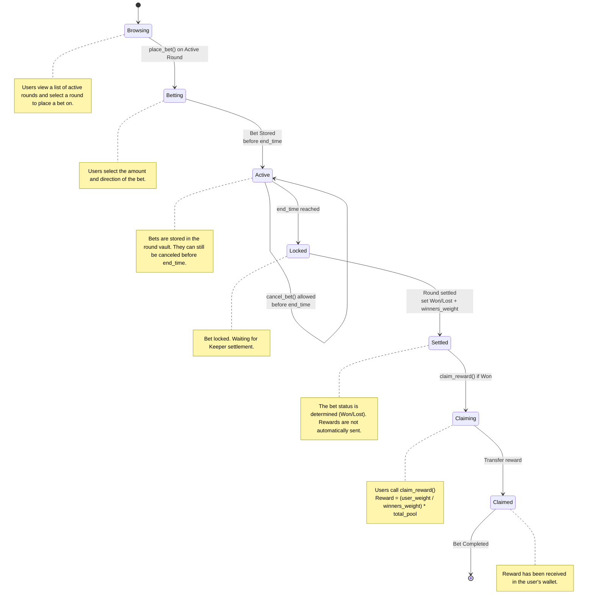

# Gold Rush Smart Contract

Gold Rush is a token-based betting smart contract supporting two game modes:
- Single-Asset: bet on the price movement of a single asset (e.g., gold or a stock) within a round window.
- Group Battle: bet on which asset group achieves the highest average gain across its constituent assets within a round.

Users place bets using Gold Rush Tokens (GRT), and winners receive rewards based on the outcome of the round.

## Overview
- Each round has a start time (start_time) and an end time (end_time). Users can place or withdraw bets before the cutoff.
- The program supports Single-Asset and Group Battle rounds:
  - Single-Asset: winners depend on the sign of price change between start and end.
  - Group Battle: winners depend on the groups with the highest average growth (avg_growth_rate_bps) computed from multiple assets.
- After the round ends, the Keeper triggers settlement to determine winners and finalize rewards.
- Rewards are not automatically distributed; they are claimable by winners after settlement.

## Features

### Betting System

- Users can place bets on:
  - Single-Asset rounds (Up/Down/PercentageChange against a single price), or
  - Group Battle rounds (Up/Down/PercentageChange against a group’s average gain).
- Bets are placed using GRT tokens.
- Bets can be withdrawn as long as they have not exceeded the cutoff.

### Round Lifecycle

- Admins create new rounds with a start_time and end_time.
- After the start_time, the round becomes Active and accepts bets.
- After the end_time, bets are locked and the round enters Settlement to determine outcomes.

### Keeper Automation

- The Keeper is responsible for triggering:
    - Round activation when the start_time is reached.
    - Round settlement when the end_time is reached.
- For Group Battle, the Keeper captures start/end prices for multiple assets, finalizes per-group averages, selects winner groups, then settles bets.
- If oracle data is unavailable, the round is marked PendingSettlement and retried later.

### Price Oracle

- Retrieves prices via whitelisted on-chain oracles (e.g., Pyth). For Group Battle, multiple price accounts are read per instruction via remaining accounts.
- Price data is used to capture start/end prices and to compute winners during settlement.

### Rewards & Claims

- Rewards are calculated from the total pool minus fees and distributed proportionally to winners by weight.
- Winners are determined by:
  - Single-Asset: price change sign between start and end.
  - Group Battle: groups with max avg_growth_rate_bps; bets win if they chose a winning group and the direction matches the group’s growth sign (or percentage sign for PercentageChange bets).
- Rewards are not sent automatically; they are stored as claimable amounts that winners can claim after settlement.

### Admin Operations

- Create a new round (with a future schedule).
- Insert GroupAsset(s) and Asset(s) for Group Battle rounds.
- Manage system configurations (fees, keeper authorities, token mint, treasury, factors).
- Pause/unpause and emergency pause/unpause the program.
- Cancel a round (before settlement) to refund all bets.

### Emergency & Safety

- Admins can perform an emergency pause to temporarily stop all betting operations (except claims).
- If settlement fails, the round will be marked as Pending Settlement so that no additional bets are accepted and can be reprocessed.

## Flows
### Full


### Admin (High-level)


### Admin (Low-level)


### Keeper (High-level)


### Keeper (Low-level)


### User (High-level)


### User (Low-level)


## Account Designs
### Config
```rust
pub struct Config {
  // --- Authorities ---
  pub admin: Pubkey,                   // The administrator of the contract.
  pub keeper_authorities: Vec<Pubkey>, // Keeper authorities allowed to perform keeper operations.

  // --- Token & Treasury ---
  pub token_mint: Pubkey,              // The Gold Rush Token (GRT) used for betting.
  pub treasury: Pubkey,                // The address where the fees are sent.

  // --- Fee Config ---
  pub fee_single_asset_bps: u16,       // The fee percentage charged on bets based on Single Asset.
  pub fee_group_battle_bps: u16,       // The fee percentage charged on bets based on Group Battle.

  // --- Betting Rules ---
  pub min_bet_amount: u64,             // The minimum bet amount.
  pub bet_cutoff_window_secs: i64,     // Window before end_time when betting closes.

  // --- Reward Calculations ---
  pub min_time_factor_bps: u16,        // Minimum time factor in bps.
  pub max_time_factor_bps: u16,        // Maximum time factor in bps.
  pub default_direction_factor_bps: u16, // Default direction factor in bps.

  // --- Global State ---
  pub status: ContractStatus,          // Overall contract status (Active / Paused / EmergencyPaused)
  pub current_round_counter: u64,      // Incremental counter for new round IDs

  // --- Metadata ---
  pub version: u8,                     // The version of the contract.
  pub bump: u8,                        // A bump seed for PDA.
}

#[derive(AnchorSerialize, AnchorDeserialize, Clone, PartialEq, Eq)]
pub enum ContractStatus {
    Active,
    Paused,
    EmergencyPaused,
}
```

### Round

```rust
pub struct Round {
  // --- Identity ---
  pub id: u64,                   // Unique identifier for the round (incremental from config.current_round_counter).
  pub start_time: i64,           // The timestamp when round is scheduled to start.
  pub end_time: i64,             // The timestamp when round is scheduled to end.
  pub bet_cutoff_time: i64,      // Time after which placing/withdrawing bets is disallowed.
  pub vault: Pubkey,             // The vault account holding the bets for this round.
  pub vault_bump: u8,            // A bump seed for the vault PDA.
  pub market_type: MarketType,   // The type of market (GoldPrice, StockPrice).

  // --- State ---
  pub status: RoundStatus,       // The current status of the round (Scheduled, Active, Cancelling, PendingSettlement, Ended).
  pub start_price: Option<u64>,  // Only for single-asset markets.
  pub final_price: Option<u64>,  // Only for single-asset markets.
  pub total_pool: u64,           // The total amount of GRT bet in this round.
  pub total_bets: u64,           // The total number of bets placed in this round.
  pub total_fee_collected: u64,  // The total fees collected for this round.
  pub total_reward_pool: u64,    // The total reward pool after deducting fees.
  pub winners_weight: u64,       // The total weight of winning bets (for reward calculation). Default to 0 if no winners.
  pub settled_bets: u64,         // Number of bets that have been processed (for incremental settlement)
  pub winner_group_ids: Vec<u64>, // IDs of groups that won the round.
  pub total_groups: u64,         // Total number of groups created in this round.
  pub started_group_assets: u64, // Number of group assets with captured start price.

  // --- Metadata ---
  pub created_at: i64,           // The timestamp when the round was created.
  pub settled_at: Option<i64>,   // The timestamp when the round was settled.
  pub bump: u8,                  // A bump seed for PDA.
}

#[derive(AnchorSerialize, AnchorDeserialize, Clone, PartialEq, Eq)]
pub enum RoundStatus {
    Scheduled,
    Active,
    Cancelling,            // Ongoing cancellation; betting/withdrawing is blocked
    PendingSettlement,
    Ended,
}

#[derive(AnchorSerialize, AnchorDeserialize, Clone, PartialEq, Eq)]
pub enum MarketType {
    GoldPrice,
    StockPrice,
}
```

### Bet
```rust
pub struct Bet {
  // --- Identify ---
  pub id: u64,               // Unique bet identifier within the round.
  pub round: Pubkey,         // The round this bet is associated with.
  pub bettor: Pubkey,        // The address of the player placing the bet.
  pub group: Option<Pubkey>, // The group this bet is associated with for Group Battle.

  // --- Bet Info ---
  pub amount: u64,           // The amount of GRT bet.
  pub asset: Pubkey,         // The asset this bet is associated with.
  pub direction: BetDirection, // The bet type (Up, Down, PercentageChangeBps).
  pub claimed: bool,         // Whether the reward has been claimed.
  pub weight: u64,           // The weight of the bet (for reward calculation).

  // --- State ---
  pub status: BetStatus,     // The status of the bet (Pending, Won, Lost).

  // --- Metadata ---
  pub created_at: i64,       // The timestamp when the bet was placed.
  pub bump: u8,              // A bump seed for PDA.
}

#[derive(AnchorSerialize, AnchorDeserialize, Clone, PartialEq, Eq)]
pub enum BetDirection {
    Up,
    Down,
    PercentageChangeBps(i16),
}

#[derive(AnchorSerialize, AnchorDeserialize, Clone, PartialEq, Eq)]
pub enum BetStatus {
    Pending,
    Won,
    Lost,
}
```

### Asset
```rust
pub struct Asset {
  // --- Identity ---
  pub id: u64,
  pub group: Pubkey,
  pub round: Pubkey,
  pub price_feed_account: Pubkey,

  // --- State ---
  pub symbol: [u8; 8],
  pub start_price: Option<u64>,
  pub final_price: Option<u64>,
  pub growth_rate_bps: Option<i64>,

  // --- Metadata ---
  pub created_at: i64,
  pub settled_at: Option<i64>,
  pub bump: u8,
}
```

### GroupAsset
```rust
pub struct GroupAsset {
  // --- Identity ---
  pub id: u64,
  pub round: Pubkey,

  // --- State ---
  pub symbol: [u8; 8],
  pub total_assets: u64,
  pub total_final_price: u64,
  pub total_growth_rate_bps: i64,
  pub settled_assets: u64,
  pub avg_growth_rate_bps: Option<i64>,

  // --- Metadata ---
  pub created_at: i64,
  pub bump: u8,
}
```

---

## Fee Mechanism

The Gold Rush smart contract charges a fee on each bet to sustain the platform. The fee is collected in the same token used for betting (GRT) and is transferred to the treasury after the round is settled.

### Fee Structure

- **Single Asset Bets**: `fee_single_asset_bps` (in basis points, e.g., 50 bps = 0.5%)
- **Group Battle Bets**: `fee_group_battle_bps` (in basis points, e.g., 50 bps = 0.5%)
- **Treasury Account**: `treasury` (the account that receives collected fees)

> Note: Fee is calculated on the bet amount and deducted only at settlement, not at the time of placing a bet. This allows for refunds in case the round is cancelled.

### Fee Calculation

For each round, the total fee collected is calculated as:

$$
\text{fee} = \sum_{i=1}^{n} \text{amount}_i \times \frac{\text{fee bps}}{10000}
$$

Where:

- $n$ = total number of bets in the round  
- $\text{amount}_i$ = bet amount of the $i$-th bet  
- $\text{fee bps}$ = fee basis points depending on bet type (gold or stock)

The remaining balance after fee deduction becomes the **reward pool**:

$$
\text{total reward pool} = \text{total pool} - \text{total fee collected}
$$

- `total_pool` = sum of all bet amounts in the round  
- `total_fee_collected` = sum of all fees deducted  
- `total_reward_pool` = amount available for distribution to winning bets

### Settlement Flow for Fees

1. **Round ends**: Keeper triggers the settlement process after `end_time`.  
2. **Calculate fees**: Fee is calculated for each bet based on `fee_single_asset_bps` or `fee_group_battle_bps`.  
3. **Transfer to treasury**: `total_fee_collected` is transferred to the treasury account.  
4. **Compute reward pool**: Remaining GRT is assigned to `total_reward_pool` for winners.  

> This approach ensures fairness and transparency: users only pay fees if the round is successfully settled, and the treasury receives an accurate portion without affecting refund logic.

### Example

Suppose a round has the following bets:

| User | Bet Amount | Bet Type   | Fee (bps) |
|------|------------|------------|------------|
| A    | 10 GRT     | Gold       | 50         |
| B    | 20 GRT     | Stock      | 100        |

Calculations:

- Fee for A: \( 10 \times 0.005 = 0.05 \) GRT  
- Fee for B: \( 20 \times 0.01 = 0.2 \) GRT  

Total fee collected: \( 0.05 + 0.2 = 0.25 \) GRT  

Total reward pool: \( 10 + 20 - 0.25 = 29.75 \) GRT

---

## Reward Calculation

The Gold Rush betting system uses a **weight-based model** combined with a **self-claim mechanism** to efficiently distribute rewards after each round ends.

### Concept

Each bet has a **weight** that represents its contribution to the reward pool.
Weight depends on:

1. **Bet Amount** — Larger bets contribute more.
2. **Bet Type Factor** — Depends on the market type:
   - **Gold** → uses **non-linear scaling**.
   - **Stock & Group Battle** → use **linear scaling**.
3. **Time Factor** — Bets placed earlier in the round may carry a higher weight than bets placed near the end of the round.


**General formula for a bet's weight:**

$$
\text{weight} = \text{amount} \times \text{direction factor} \times \text{time factor}
$$

Where:

- `amount` = number of GRT tokens bet (before fees)  
- `direction_factor` = multiplier based on `BetDirection` and market type:
  - Linear markets (Stock & Group Battle): proportional to the chosen percentage; Up/Down uses the default factor; PercentageChangeBps adds a linear increment.
  - Gold (non-linear): factor grows faster than linear.
- `time_factor` = multiplier based on how early the bet was placed (range: $0 < \text{time factor} \le 1.0$)

### Linear vs Non-Linear Factors

The system supports both **linear** and **non-linear** factor models depending on the market type.

#### 1. Direction Factor

- **Stock & Group Battle (Linear)**
  The factor grows **proportionally** with the chosen percentage.
  Example:  
  - Up/Down = `1.0`
  - +5% = `1.05`
  - +10% = `1.10`

- **Gold (Non-Linear)**
  The factor grows **faster than linear**, emphasizing higher percentage changes.  
  Example (quadratic growth):
  - Up/Down = `1.0`
  - +5% change = `1.25` (instead of 1.05)
  - +10% change = `2.0` (instead of 1.10)

This ensures that even small gold changes may yield competitive rewards due to exponential scaling.

#### 2. Time Factor

- **Stock (Linear)**  
  Earlier bets get proportionally more weight.  
  Example (normalized by round duration):  

  $$
  \text{time factor} = 1 - \frac{\text{time elapsed}}{\text{round duration}}
  $$  

  If placed at the very start → `1.0`  
  If placed halfway → `0.5`  
  If placed at the end → close to `0.0`  

- **Gold (Non-Linear)**  
  Earlier bets are rewarded **more aggressively**.  
  Example (quadratic decay):  

  $$
  \text{time factor} = \left(1 - \frac{\text{time elapsed}}{\text{round duration}}\right)^2
  $$

  If placed at the very start → `1.0`
  If placed halfway → `0.25`
  If placed at the end → close to `0.0`

### Settlement Process

When the round ends, the **keeper** settles it:

1) Single-Asset:
   - Compute price change: `final_price - start_price`.
   - For each bet, determine win/loss based on `BetDirection` vs the sign of the change.
   - Mark `Won/Lost/Draw` and accumulate `winners_weight`.

2) Group Battle:
   - Compute `avg_growth_rate_bps` per `GroupAsset` during the finalize step.
   - Determine `winner_group_ids` = groups with the highest average growth (can be >1 in ties).
   - For each bet: if `bet.group` is in `winner_group_ids`, define `effective_change = avg_growth_rate_bps` for that group and evaluate `BetDirection` against the sign of `effective_change`:
     - Up → win if `effective_change > 0`
     - Down → win if `effective_change < 0`
     - PercentageChangeBps(x) → win if `sign(x) == sign(effective_change)`
   - Mark `Won/Lost/Draw` and accumulate `winners_weight`.

After determining winners, continue with the following calculations:

$$
\text{round winners weight} = \sum_{\text{all winning bets}} \text{bet weight}
$$

3. Mark all losing bets as `Lost`.
4. Calculate and transfer fees:

$$
\text{total fee collected} = \sum_{i=1}^{n} \text{amount}_i \times \frac{\text{fee bps}}{10000}
$$

5. Move `total_fee_collected` from the round vault to `treasury`.
6. Update `round.total_reward_pool`:

$$
\text{round total reward pool} = \text{round total pool} - \text{round total fee collected}
$$

> Note: At this stage, no rewards are sent yet — only marking bet results and collecting fees.

### Self-Claim by User

When a user claims their reward:

1. Read `Bet.weight` and `round.winners_weight`.
2. Calculate the claimable reward:

$$
\text{reward} = \frac{\text{bet weight}}{\text{round winners weight}} \times \text{round total reward pool}
$$

3. Transfer the reward from the round vault to the user's account.
4. Mark `Bet.claimed = true`.

---

### Important Notes

- `round.total_reward_pool` is equal to `round.total_pool - round.total_fee_collected`.
- The reward includes the user's original stake. Losing users lose their stake, and their funds contribute to the reward pool for winners.
- If **all users win**, no one loses their stake. All winners simply receive their original stake back minus proportional fees.

---

### Example Calculation

#### Case 1: Gold Round - Non-Linear

| User | Amount (GRT) | Direction | Fee (bps) | Time Factor | Direction Factor | Weight |
|------|--------------|-----------|-----------|-------------|------------------|--------|
| A    | 10           | +5%       | 50        | 1.0         | 1.25             | 12.5   |
| B    | 20           | +10%      | 50        | 0.5² = 0.25 | 2.0              | 10.0   |

- Total pool = $10 + 20 = 30$  
- Fees:  
  - A → $10 \times 0.005 = 0.05$ GRT  
  - B → $20 \times 0.005 = 0.10$ GRT  
- Total fee collected = 0.15 GRT  
- Reward pool = 29.85 GRT  
- Winners weight = 12.5 + 10.0 = 22.5  

Rewards:  
- A = $(12.5 / 22.5) \times 29.85 \approx 16.58$ GRT  
- B = $(10 / 22.5) \times 29.85 \approx 13.27$ GRT  

#### Case 2: Stock Round - Linear

| User | Amount (GRT) | Direction | Fee (bps) | Time Factor | Direction Factor | Weight |
|------|--------------|-----------|-----------|-------------|------------------|--------|
| A    | 10           | +5%       | 100       | 1.0         | 1.05             | 10.5   |
| B    | 20           | +10%      | 100       | 0.5         | 1.10             | 11.0   |

- Total pool = $10 + 20 = 30$  
- Fees:  
  - A → $10 \times 0.01 = 0.10$ GRT  
  - B → $20 \times 0.01 = 0.20$ GRT  
- Total fee collected = 0.30 GRT  
- Reward pool = 29.70 GRT  
- Winners weight = 10.5 + 11.0 = 21.5  

Rewards:  
- A = $(10.5 / 21.5) \times 29.70 \approx 14.49$ GRT  
- B = $(11 / 21.5) \times 29.70 \approx 15.21$ GRT  

#### Case 3: Group Battle - Linear

Suppose there are 2 groups, average growth after finalize:
- Group 1: +6% → `avg_growth_rate_bps = +600`
- Group 2: +4% → `avg_growth_rate_bps = +400`
Winner groups: `[Group 1]`.

| User | Amount (GRT) | Direction | Chosen Group | Direction Factor | Weight |
|------|--------------|-----------|--------------|------------------|--------|
| A    | 10           | Up        | Group 1      | 1.0              | 10.0   |
| B    | 20           | +5%       | Group 1      | 1.05             | 21.0   |

- Winners: A and B (both chose the winning group).  
- Total pool = 30 GRT. Assume fee bps = 100 → total fee = 0.30 GRT.  
- Reward pool = 29.70 GRT.  
- Winners weight = 10.0 + 21.0 = 31.0.  
- Rewards:
  - A = $(10.0 / 31.0) \times 29.70 \approx 9.58$ GRT  
  - B = $(21.0 / 31.0) \times 29.70 \approx 20.12$ GRT  

---

## Program Instructions

### Initialize
#### Purpose
Initializes the program for the first time. Creates a `Config` account that stores global settings such as admin, treasury, and other initial parameters.

#### Context
| Field            | Type                  | Description                               |
|------------------|-----------------------|--------------------------------------------|
| `signer`    | `Signer`              | The account that initializes the program (becomes admin if `admin` not provided). |
| `config`         | `Account<Config>` (PDA)     | PDA account to store global configuration data.         |
| `system_program` | `Program<System>`     | The system program used to create the `config` account.   |

#### Remaining Accounts
_None_

#### Arguments
| Name                     | Type           | Description                          |
|-------------------------|----------------|-------------------------------------|
| `keeper_authorities`    | `Vec<Pubkey>`  | List of authorized keeper authority account addresses |
| `token_mint`            | `Pubkey`       | The address of the GRT token mint |
| `treasury`              | `Pubkey`       | The address of the treasury account |
| `fee_single_asset_bps`  | `u16`          | The fee for single asset bets in basis points (bps) |
| `fee_group_battle_bps`  | `u16`          | The fee for group battle bets in basis points (bps) |
| `min_bet_amount`        | `u64`          | The minimum amount required to place a bet |
| `bet_cutoff_window_secs`| `i64`          | Window (in seconds) before `end_time` when betting closes |
| `min_time_factor_bps`   | `u16`          | The minimum time factor in bps (e.g., 5000 for 0.5) |
| `max_time_factor_bps`   | `u16`          | The maximum time factor in bps (e.g., 10000 for 1.0) |
| `default_time_factor_bps` | `u16`        | The default time factor in bps (e.g., 7500 for 0.75) |

#### Validations
- Ensure `config` has not been initialized (no previous data exists)
- `fee_single_asset_bps` and `fee_group_battle_bps` must be `< 10_000` (100%)
- `initializer` must be a signer
- `keeper_authorities` must not be empty
- `min_bet_amount` must be greater than `0`
- `bet_cutoff_window_secs >= 0`
- `min_time_factor_bps`, `max_time_factor_bps`, and `default_time_factor_bps` must be between `0` and `10_000`
- `min_time_factor_bps <= max_time_factor_bps`

#### Logic
1. Create the `config` account
2. Initialize fields:
   - `admin = admin.unwrap_or(initializer.key())`
   - `keeper_authorities = keeper_authorities`
   - `token_mint = token_mint`
   - `treasury = treasury`
   - `fee_single_asset_bps = fee_single_asset_bps`
   - `fee_group_battle_bps = fee_group_battle_bps`
   - `min_bet_amount = min_bet_amount`
   - `bet_cutoff_window_secs = bet_cutoff_window_secs`
3. Set default fields:
   - `status = Active`
   - `current_round_counter = 0`
   - `version = 1`
   - `bump = bump`

#### Emits / Side Effects
- Creates a new `Config` account at PDA `["config"]`
- Stores global configuration and admin data

#### Errors
| Code                   | Meaning                                    |
|---------------------------|--------------------------------------------|
| `AlreadyInitialized`        | If `config` has already been created |
| `InvalidFee`                 | If any `fee_*_bps >= 10000`           |
| `InvalidMinBetAmount`        | If `min_bet_amount == 0`               |
| `NoKeeperAuthorities`        | If `keeper_authorities` is empty       |

---

### Admin: Update Config

#### Purpose
Allows the admin to update global configuration settings stored in the `Config` account, such as fee parameters, keeper authorities, treasury address, and minimum bet amount.

#### Context
| Field             | Type                  | Description                                      |
|--------------------|-----------------------|---------------------------------------------------|
| `admin`              | `Signer`               | The current admin authorized to update the config. |
| `config`             | `Account<Config>` (PDA)      | PDA account to store global configuration data.         |

#### Remaining Accounts
_None_

#### Arguments
| Name                     | Type             | Description                                        |
|----------------------------|-------------------|-------------------------------------------------------|
| `new_admin`                | `Option<Pubkey>`    | (Optional) New admin address to replace the current admin. |
| `keeper_authorities`       | `Option<Vec<Pubkey>>` | (Optional) New list of keeper authority addresses. |
| `token_mint`                | `Option<Pubkey>`    | (Optional) New token mint address. |
| `treasury`                  | `Option<Pubkey>`    | (Optional) New treasury account address. |
| `fee_single_asset_bps`        | `Option<u16>`         | (Optional) New fee for single asset bets (bps). |
| `fee_group_battle_bps`       | `Option<u16>`         | (Optional) New fee for group battle bets (bps). |
| `min_bet_amount`             | `Option<u64>`         | (Optional) New minimum bet amount. |

#### Validations
- `admin` must be the current admin stored in `config.admin`
- `fee_single_asset_bps` and `fee_group_battle_bps` (if provided) must be `< 10_000` (100%)
- `keeper_authorities` (if provided) must not be empty
- `min_bet_amount` (if provided) must be `> 0`

#### Logic
1. Check that `admin.key() == config.admin`
2. For each provided argument (`Option<T>`), if `Some(value)` then update the corresponding field in `config`:
   - `admin = new_admin`
   - `keeper_authorities = keeper_authorities`
   - `token_mint = token_mint`
   - `treasury = treasury`
   - `fee_single_asset_bps = fee_single_asset_bps`
   - `fee_group_battle_bps = fee_group_battle_bps`
   - `min_bet_amount = min_bet_amount`

#### Emits / Side Effects
- Updates the `Config` account with new global settings

#### Errors
| Code                      | Meaning                                      |
|-------------------------------|----------------------------------------------|
| `Unauthorized`                  | If the caller is not the current `config.admin` |
| `InvalidFee`                     | If any provided `fee_*_bps >= 10000` |
| `InvalidMinBetAmount`            | If provided `min_bet_amount == 0` |
| `NoKeeperAuthorities`            | If provided `keeper_authorities` is empty |

---

### Admin: Pause Program

#### Purpose
Allows the admin to **pause** the entire program by updating the `Config.status` field.  
When paused, new rounds cannot be created and bets cannot be placed.

#### Context
| Field       | Type                | Description                                       |
|-------------|---------------------|---------------------------------------------------|
| `admin`     | `Signer`             | The current admin authorized to pause the program. |
| `config`    | `Account<Config>` (PDA)    | PDA account to store global configuration data.                  |

#### Remaining Accounts
- First account: `price_oracle_account` (readonly) — the oracle (e.g., Pyth) used to fetch the final price.
- Next N accounts: `Bet` PDAs (writable) — batched bets to settle in this call.

#### Validations
- `admin` must be the current admin stored in `config.admin`
- `config.status` must currently be `Active`

#### Logic
1. Check that `admin.key() == config.admin`
2. Set `config.status = Paused`

#### Emits / Side Effects
- Updates `Config.status` to `Paused`
- Halts critical user actions (create round, place bet)

#### Errors
| Code             | Meaning                                            |
|-------------------|-----------------------------------------------------|
| `Unauthorized`      | If the caller is not the current `config.admin`     |
| `AlreadyPaused`     | If the config is already in `Paused` state           |

---

### Admin: Unpause Program

#### Purpose
Allows the admin to **resume** the program by updating the `Config.status` field back to `Active`.  
After unpausing, normal operations (creating rounds, placing bets) can continue.

#### Context
| Field       | Type                | Description                                          |
|-------------|---------------------|---------------------------------------------------------|
| `admin`     | `Signer`             | The current admin authorized to unpause the program.     |
| `config`    | `Account<Config>` (PDA)    | The global configuration                |

#### Remaining Accounts
_None_account.          

#### Arguments
_None_

#### Validations
- `admin` must be the current admin stored in `config.admin`
- `config.status` must currently be `Paused`

#### Logic
1. Check that `admin.key() == config.admin`
2. Set `config.status = Active`

#### Emits / Side Effects
- Updates `Config.status` to `Active`
- Resumes normal operations

#### Errors
| Code             | Meaning                                             |
|-------------------|------------------------------------------------------|
| `Unauthorized`      | If the caller is not the current `config.admin`       |
| `AlreadyActive`     | If the config is already in `Active` state               |

### Admin: Emergency Pause
#### Purpose
Immediately halt critical user operations (e.g., placing/withdrawing bets) due to an emergency. Claims may still be allowed depending on implementation.

#### Context
| Field       | Type                | Description                                       |
|-------------|---------------------|---------------------------------------------------|
| `admin`     | `Signer`             | The current admin authorized to trigger emergency pause. |
| `config`    | `Account<Config>` (PDA)    | Global configuration account.                  |

#### Remaining Accounts
_None_

#### Arguments
_None_

#### Validations
- `admin.key() == config.admin`
- `config.status != EmergencyPaused` (cannot emergency-pause twice)

#### Logic
1. Set `config.status = EmergencyPaused`.

#### Emits / Side Effects
- The program enters emergency mode. User operations like creating rounds or placing bets are halted. Behavior for claims can remain allowed.

#### Errors
| Code             | Meaning                                            |
|-------------------|-----------------------------------------------------|
| `Unauthorized`      | Caller is not `config.admin`                        |
| `EmergencyPaused`   | Program is already in emergency pause state          |

---

### Admin: Emergency Unpause
#### Purpose
Exit emergency mode and restore normal operations by setting the status back to Active.

#### Context
| Field       | Type                | Description                                       |
|-------------|---------------------|---------------------------------------------------|
| `admin`     | `Signer`             | The current admin authorized to clear emergency pause. |
| `config`    | `Account<Config>` (PDA)    | Global configuration account.                  |

#### Remaining Accounts
_None_

#### Arguments
_None_

#### Validations
- `admin.key() == config.admin`
- `config.status == EmergencyPaused`

#### Logic
1. Set `config.status = Active`.

#### Emits / Side Effects
- The program exits emergency mode and resumes normal operations.

#### Errors
| Code             | Meaning                                            |
|-------------------|-----------------------------------------------------|
| `Unauthorized`      | Caller is not `config.admin`                        |
| `AlreadyActive`     | Program is already in `Active` state                 |

### Admin: Insert GroupAsset
Adds a new `GroupAsset` to a round. Used for Group Battle mode.

#### Context
| Account | Type | Description |
|--------|------|-------------|
| `signer` | `Signer` | Admin signer |
| `config` | `Account<Config>` | Global config |
| `round` | `Account<Round>` (PDA, mut) | Target round |
| `group_asset` | `Account<GroupAsset>` (PDA, init) | New group asset |
| `system_program` | `Program<System>` | System program |

#### Remaining Accounts
_None_

#### Arguments
| Name | Type | Description |
|------|------|-------------|
| `symbol` | `[u8; 8]` | Group symbol/label |

#### Validations
- `config.status` in {Active, EmergencyPaused}
- Caller can be admin (enforced externally if needed)

#### Logic
1. Derive `group_asset` PDA with `GROUP_ASSET_SEED`, `round`, and `round.total_groups + 1`.
2. Initialize fields: `id`, `round`, `symbol`, `created_at`, `bump`.
3. Increment `round.total_groups` by 1.

---

### Admin: Insert Asset
Adds a new `Asset` under a `GroupAsset`.

#### Context
| Account | Type | Description |
|--------|------|-------------|
| `signer` | `Signer` | Admin signer |
| `config` | `Account<Config>` | Global config |
| `round` | `Account<Round>` (PDA) | Target round |
| `group_asset` | `Account<GroupAsset>` (PDA, mut) | Parent group asset |
| `asset` | `Account<Asset>` (PDA, init) | New asset |
| `feed_price_account` | `AccountInfo` | Pyth price account for this asset |
| `system_program` | `Program<System>` | System program |

#### Remaining Accounts
_None_

#### Arguments
| Name | Type | Description |
|------|------|-------------|
| `symbol` | `[u8; 8]` | Asset symbol/label |

#### Validations
- `config.status` in {Active, EmergencyPaused}
- `group_asset.total_assets < MAX_GROUP_ASSETS`
- Caller must be `config.admin` (as implemented)

#### Logic
1. Derive `asset` PDA with `ASSET_SEED`, `group_asset`, and `group_asset.total_assets + 1`.
2. Initialize fields: `id`, `group`, `round`, `price_feed_account`, `symbol`, `created_at`, `bump`.
3. Increment `group_asset.total_assets` by 1.

---

### Admin: Create Round
#### Purpose
This instruction is used by the Admin to create and schedule a new round.
The created round will automatically become active when the start time is reached, and will automatically close (lock) when the end time is reached.
Users can only place bets while the round is in Active status.

#### Context
| Account             | Type                       | Description                                      |
|----------------------|------------------------------|---------------------------------------------------|
| `signer` | `Signer` | The authorized admin who creates a new round. |
| `config` | `Account<Config>` (PDA) | PDA account to store global configuration data. |
| `round` | `Account<Round>` (PDA, init) | The new round account to be initialized. |
| `vault` | `AccountInfo` (PDA, init) | The vault account to hold bets for this round. |
| `mint` | `Account<Mint>` | Token mint used for betting |
| `system_program` | `Program<System>` | Solana's built-in system program. |
| `token_program` | `Program<Token>` | Solana's SPL Token program. |

#### Remaining Accounts
_None_

#### Arguments
| Name               | Type         | Description                                  |
|----------------------|---------------|-----------------------------------------------|
| `asset` | `[u8; 8]` | The asset being bet on |
| `start_time` | `i64` (unix timestamp) | Round start time |
| `end_time` | `i64` (unix timestamp) | Round end time |
| `market_type` | `MarketType` | The type of market (GoldPrice, StockPrice) |

#### Validations
- `config.status == Active`
- Caller = `config.admin`
- `start_time < end_time`
- `start_time > current_timestamp` (cannot create rounds in the past)

#### Logic
1. Create round `vault` account to hold bets
2. Initialize `round` fields:
   - `round_id = config.current_round_counter + 1`
   - `start_time = start_time`
   - `end_time = end_time`
   - `market_type = market_type`
   - `vault = vault.key()`
   - `vault_bump = bumps.vault`
   - `status = Scheduled`
   - `bet_cutoff_time = max(end_time - config.bet_cutoff_window_secs, start_time)`
   - `created_at = Clock::now()`
3. Increment `config.current_round_counter` by 1

## Emits / Side Effects
- Create a new `Round` account on the blockchain
- Record round information into the program state

## Errors
| Code                         | Meaning                                            |
|--------------------------------|-------------------------------------------------------|
| `ProgramPaused` | If `config.status != Active` |
| `Unauthorized`                       | If the caller is not the official keeper |
| `InvalidTimestamps`                  | If `start_time` or `end_time` is invalid |

---

### Admin: Cancel Round
Cancels an active or scheduled round, refunds all bets, and then closes both the round vault and the round account. If no bets have been placed, the vault and round are closed immediately. Only the admin can perform this action.

#### Purpose
Allows the Admin to cancel a round that has not been fully settled yet. All user stakes are refunded from the round vault, bet accounts are closed, and finally the round (and vault) can be closed when empty.

#### Context
| Account | Type | Description |
|--------|------|-------------|
| `signer` | `Signer` | Admin signer |
| `config` | `Account<Config>` (PDA) | Global configuration |
| `round` | `Account<Round>` (PDA, mut) | The round to cancel |
| `round_vault` | `Account<TokenAccount>` (PDA, mut) | Vault holding all stakes for this round |
| `mint` | `Account<Mint>` | Token mint used for betting |
| `token_program` | `Program<Token>` | SPL Token program |
| `system_program` | `Program<System>` | System program |

#### Remaining Accounts
- First account: `bettor_token_account` (ATA, writable) — the bettor GRT token account.
- Next N accounts: `Bet` PDAs (writable) — batched bets to settle in this call.

#### Arguments
_None_

#### Validations
- `signer.key() == config.admin`
- `config.status` is `Active` or `EmergencyPaused`
- `round.status` in `{ Scheduled, Active, PendingSettlement }` (cannot cancel an `Ended` round)
- Each provided `Bet` PDA matches seeds and `bet.round == round.key()`
- Each provided bettor ATA must correspond to the program’s `mint`

#### Logic
1. Fast path (no bets):
   - If `round.total_bets == 0`, close `round_vault` and then close the `Round` account. Return.
2. Refund path (batched): For each `Bet` in `remaining_accounts`:
   - Validate the `Bet` PDA and its association with the `round`.
   - Transfer `bet.amount` from `round_vault` to the bettor ATA using the round PDA signer.
   - Close the `Bet` account (rent back to bettor).
3. Repeat step 2 in batches until all bets are refunded and all `Bet` accounts are closed.
4. After all refunds, close `round_vault` (rent to admin or designated recipient).
5. Close the `Round` account (rent to admin) to complete cancellation.

#### Emits / Side Effects
- All processed `Bet` accounts are closed and funds returned to users.
- `round_vault` is closed (immediately if no bets, or after all refunds).
- `Round` account is closed (immediately if no bets, or after vault close).

#### Errors
| Code | Meaning |
|------|---------|
| `Unauthorized` | If `signer` is not `config.admin` |
| `ProgramPaused` | If `config.status != Active` |
| `InvalidRoundStatus` | If trying to cancel an `Ended` round |
| `InvalidBetAccount` | If any provided bet PDA is invalid |
| `InvalidTokenAccount` | If bettor ATA or vault is invalid |
| `TokenTransferFailed` | If refund transfer fails |
| `InsufficientVaultBalance` | If the vault lacks sufficient balance for a refund |

---

### Keeper: Start Round

#### Purpose
This instruction is executed by the Keeper to start a round that was previously in the `Scheduled` status.
When invoked, the round becomes `Active,` allowing the user to `place_bet()`.

For single-asset games, this instruction also fetches the starting price directly from the oracle provided as the remaining account.

#### Context
| Field         | Type                  | Description                                |
|-------------------|-----------------------|----------------------------------------------|
| `signer` | `Signer` | The keeper who is authorized to start the round. |
| `config` | `Account<Config>` (PDA) | Global configuration account. |
| `round` | `Account<Round>` (PDA, mut) | The currently `Scheduled` round. |
| `system_program` | `Program<System>` | Program sistem. |

#### Remaining Accounts
- `price_oracle_account` (readonly) — the oracle (e.g., Pyth) used to fetch the final price.

#### Arguments
_None_

#### Validations
- `config.status == Active`
- `keeper` must be in `config.keeper_authorities`
- `round.status == Scheduled`
- `Clock::now() >= round.start_time`
- If Single-Asset: price from `price_oracle_account` is valid (fresh, > 0) after normalization

#### Logic
1. If the round is Single-Asset:
- Read the price from `price_oracle_account` (e.g., Pyth), normalize to the internal `u64` format.
- Ensure price is > 0 and not stale; otherwise, return an error.
- Set `round.start_price = Some(price)`.
2. If the round is Group Battle, assume the starting price of each asset has been previously captured via `capture_start_price`; no oracle reading is required.
3. Set `round.status = Active`.

#### Emits / Side Effects
- Changes the `Round` status from `Scheduled` to `Active`.
- Indicates that users can start placing `place_bet()` bets on this round.

#### Errors
| Code                  | Meaning                                             |
|-----------------------------|---------------------------------------------------|
| `ProgramPaused` | If `config.status != Active` |
| `UnauthorizedKeeper` | If `signer` is not part of `config.keeper_authorities` |
| `InvalidRoundStatus` | If `round.status` is not `Scheduled` |
| `RoundNotReady` | If `Clock::now() < round.start_time` |
| `OracleError` | If oracle price reading/validation fails (Single-Asset) |
| `InvalidAssetPrice` | If the normalized price is invalid (> 0 is not met) |

---

### Keeper: Settle Single-Asset Round (`settle_single_round`)
#### Purpose
Settle a Single-Asset round after `end_time` by using the final price, marking bets as Won/Lost/Draw, and collecting fees.

#### Context
| Field         | Type                    | Description                                         |
|-------------------|----------------------------|----------------------------------------------------------|
| `signer` | `Signer` | Keeper authorized to execute settlement. |
| `config` | `Account<Config>` (PDA) | Global configuration (status, fee bps, keepers, treasury). |
| `round` | `Account<Round>` (PDA, mut) | Target round (must be SingleAsset). |
| `round_vault` | `Account<TokenAccount>` (PDA, mut) | Token vault for the round. |
| `treasury` | `UncheckedAccount` | Treasury pubkey from config. |
| `treasury_token_account` | `Account<TokenAccount>` (ATA) | Treasury ATA to receive fees. |
| `mint` | `Account<Mint>` | Token mint used for betting. |
| `token_program` | `Program<Token>` | SPL Token program. |
| `associated_token_program` | `Program<AssociatedToken>` | For creating treasury ATA if needed. |
| `system_program` | `Program<System>` | System program. |

#### Remaining Accounts
_None_

#### Arguments
_None_

#### Validations
- `signer` in `config.keeper_authorities`
- `config.status == Active`
- `round.market_type == SingleAsset`
- `round.status` in `{ Active, PendingSettlement }`
- `Clock::now() >= round.end_time`
- `remaining_accounts.len() <= MAX_REMAINING_ACCOUNTS`
- `round.start_price.is_some()` (set at round start)

#### Logic
1. Read final price from the oracle account (first remaining account), normalize and validate freshness.
2. Set `round.final_price`.
3. Compute `price_change = final_price - start_price`.
   - For each `Bet` PDA in remaining accounts: determine Won/Lost/Draw via `is_bet_winner`, accumulate `winners_weight`, serialize back.
   - Compute `fee_amount` from `fee_single_asset_bps` (Single-Asset), transfer from `round_vault` to treasury ATA.
   - Update round fields: `winners_weight`, `total_fee_collected`, `final_price`, and status to `Ended` when all bets are processed; otherwise mark `PendingSettlement`.

#### Emits / Side Effects
- Bets move from `Pending` to `Won`/`Lost`/`Draw`.
- `round.status` transitions to `Ended` when complete.
- Saves `final_price`, `winners_weight`, `total_fee_collected`.

#### Errors
Same as before, plus guard for wrong `market_type`.

---

### Keeper: Capture Start Price (Group Battle)
Batch-captures start prices for multiple assets via remaining accounts.

#### Context
| Account | Type | Description |
|--------|------|-------------|
| `signer` | `Signer` | Authorized keeper |
| `config` | `Account<Config>` | Global configuration |
| `round` | `Account<Round>` (PDA, mut) | Target round |
| `group_asset` | `Account<GroupAsset>` (PDA, mut) | Group to capture |
| `system_program` | `Program<System>` | System program |

#### Remaining Accounts
- First account: `asset` (writeable) - the assets for the group asset in context.
- Next N account: `price_feed_account` (readonly) — teh pyth price account for asset on first account used to fetch the final price.

#### Arguments
_None_

#### Validations
- `config.status` in {Active, EmergencyPaused}
- For each pair: Asset PDA valid for `group_asset` and `round`, and `asset.price_feed_account == pyth_price_account.key()`
- Pyth price not older than `ASSET_PRICE_STALENESS_THRESHOLD_SECONDS`

#### Logic
For each pair `(asset, pyth)`:
1. Load price from Pyth, normalize to internal decimals.
2. If `asset.start_price.is_none()`, set it; idempotent.
3. Serialize back.

---

### Keeper: Capture End Price (Group Battle)
Batch-captures end prices and computes per-asset growth.

#### Context
Same as Capture Start Price, but writing `asset.final_price` and `asset.growth_rate_bps`.

#### Logic
For each pair `(asset, pyth)`:
1. Load price from Pyth, normalize.
2. Set `asset.final_price` if empty; compute `growth_rate_bps` from `(final - start) / start * 10_000`.
3. Serialize back. Idempotent.

---

### Keeper: Finalize Group Asset
Aggregates asset-level results into `GroupAsset`.

#### Context
| Account | Type | Description |
|--------|------|-------------|
| `signer` | `Signer` | Authorized keeper |
| `config` | `Account<Config>` | Global configuration |
| `round` | `Account<Round>` (PDA) | Target round |
| `group_asset` | `Account<GroupAsset>` (PDA, mut) | Group to finalize |
| `system_program` | `Program<System>` | System program |

#### Remaining Accounts
- `asset` (writeable) - the assets in the group asset in context.

#### Logic
1. Iterate assets with `final_price` and `growth_rate_bps` set.
2. Accumulate `total_final_price`, `total_growth_rate_bps`, `settled_assets`.
3. Compute `avg_growth_rate_bps = total_growth_rate_bps / settled_assets` if `settled_assets > 0`.
4. Save fields to `group_asset`.

---

### Keeper: Finalize Groups for Round
Determines `winner_group_ids` for the round.

#### Context
| Account | Type | Description |
|--------|------|-------------|
| `signer` | `Signer` | Authorized keeper |
| `config` | `Account<Config>` | Global configuration |
| `round` | `Account<Round>` (PDA, mut) | Target round |

#### Remaining Accounts
- `group_asset` (readonly) — the group asset in the round.

#### Logic
1. Read `avg_growth_rate_bps` of each group and determine max value.
2. Set `round.winner_group_ids` to all group IDs with the max average (allow multiple winners for ties).

---

### Keeper: Settle Group-Battle Round (`settle_group_round`)
#### Purpose
Settle a Group-Battle round using precomputed `winner_group_ids` after all group finalization steps are done.

Prerequisites (executed before calling this instruction):
- `capture_end_price` (per group’s assets) completed
- `finalize_group_asset` (per group) completed
- `finalize_groups_for_round` (set `winner_group_ids` on `Round`)

#### Context
| Field         | Type                    | Description                                         |
|-------------------|----------------------------|----------------------------------------------------------|
| `signer` | `Signer` | Keeper authorized to execute settlement. |
| `config` | `Account<Config>` (PDA) | Global configuration (status, fee bps, keepers, treasury). |
| `round` | `Account<Round>` (PDA, mut) | Target round (must be GroupBattle). |
| `round_vault` | `Account<TokenAccount>` (PDA, mut) | Token vault for the round. |
| `treasury` | `UncheckedAccount` | Treasury pubkey from config. |
| `treasury_token_account` | `Account<TokenAccount>` (ATA) | Treasury ATA to receive fees. |
| `mint` | `Account<Mint>` | Token mint used for betting. |
| `token_program` | `Program<Token>` | SPL Token program. |
| `associated_token_program` | `Program<AssociatedToken>` | For creating treasury ATA if needed. |
| `system_program` | `Program<System>` | System program. |

#### Remaining Accounts
_None_

#### Arguments
_None_

#### Validations
- `signer` in `config.keeper_authorities`
- `config.status == Active`
- `round.market_type == GroupBattle`
- `round.status` in `{ Active, PendingSettlement }`
- `Clock::now() >= round.end_time`
- `remaining_accounts.len() <= MAX_REMAINING_ACCOUNTS`
- `round.winner_group_ids.len() > 0`

#### Logic
1. For each `Bet` PDA in remaining accounts:
   - A bet wins if `bet.group` ∈ `winner_group_ids`. Direction logic uses group’s `avg_growth_rate_bps` sign.
   - Accumulate `winners_weight`, serialize back.
2. Compute `fee_amount` from `fee_group_battle_bps` (Group-Battle), transfer from `round_vault` to treasury ATA.
3. Update round fields: `winners_weight`, `total_fee_collected`. Set `status = Ended` when all bets processed; otherwise `PendingSettlement`.

#### Emits / Side Effects
- Bets move from `Pending` to `Won`/`Lost`/`Draw`.
- `round.status` transitions to `Ended` when complete.

#### Errors
Same as Single-Asset settlement, plus guard for missing `winner_group_ids`.

#### Logic differences
- Instead of price change, use `winner_group_ids` to determine winning bets.
- A bet wins if `bet.group` is in `winner_group_ids` and its `BetDirection` sign matches the group’s `avg_growth_rate_bps` sign (Up/Down) or chosen `PercentageChangeBps` sign.
- Winners’ weights are summed into `round.winners_weight`.


---

### User: Place Bet
#### Purpose
This instruction allows the User to place a bet (`place_bet`) on an active round that is still open (`now < end_time`).
Bets placed are stored in the Round Vault and can be canceled before the `end_time`.

#### Context
| Field         | Type                    | Description                                         |
|-------------------|----------------------------|----------------------------------------------------------|
| `signer` | `Signer` | The address of the player placing the bet. |
| `config` | `Account<Config>` (PDA) | PDA account to store global configuration data. |
| `round` | `Account<Round>` (PDA) | The round to be settled. |
| `bet` | `Account<Bet>` (PDA) | The bet account to be initialized. Only one bet can be placed per round. |
| `round_vault` | `AccountInfo` (PDA) | The vault account holding bets for this round. |
| `bettor_token_account` | `Account<TokenAccount>` | The token account of the bettor to transfer GRT from. |

#### Remaining Accounts
_None_

#### Arguments
| Name         | Type      | Description                                      |
|---------------|---------------|-------------------------------------------------|
| `amount` | `u64` | The number of tokens wagered. |
| `direction` | `enum` | `BetDirection` enum |

#### Validations
- `config.status == Active`
- `round.status == Active`
- `Clock::now() < round.bet_cutoff_time`
- `amount >= config.min_bet_amount`

#### Logic
1. Transfer `amount` of GRT from `bettor_token_account` to `round_vault`
2. Initialize `bet` fields:
    - Set `bet.user = signer.key()`
    - Set `bet.round = round.key()`
    - Set `bet.amount = amount`
    - Set `bet.direction = direction`
    - Set `bet.status = Pending`
    - Set `bet.claimed = false`
    - Set `bet.created_at = Clock::now()`
    - Calculate and set `bet.weight` based on:

$$
\text{weight} = \text{amount} \times \text{direction factor} \times \text{time factor}
$$

4. Update `round` fields:
    - Increment `round.total_pool` by `amount`
    - Increment `round.total_bets` by `1`

#### Emits / Side Effects
- Bet placed and stored in `round.vault`

#### Errors
| Code                        | Meaning                                                 |
|--------------------------------|-------------------------------------------------------------|
| `RoundNotActive` | If `round.status` is not `Active` |
| `RoundEnded` | If `Clock::now() >= round.end_time` |
| `BetBelowMinimum` | If `amount < config.min_bet_amount` |
| `ProgramPaused` | If `config.status != Active` |

---

### User: Withdraw Bet
#### Purpose
This instruction allows the User to **cancel/withdraw their bet** (`withdraw_bet`) from an active round before the round's `bet_cutoff_time` is reached. The bet's funds are refunded back to the User, and the bet account is closed.

#### Context
| Field         | Type                    | Description                                         |
|-------------------|----------------------------|----------------------------------------------------------|
| `signer` | `Signer` | The address of the player placing the bet. |
| `config` | `Account<Config>` (PDA) | PDA account to store global configuration data. |
| `round` | `Account<Round>` (PDA) | The round to be settled. |
| `bet` | `Account<Bet>` (PDA) | The bet account previously initialized for this round. |
| `round_vault` | `AccountInfo` (PDA) | The vault account holding bets for this round. |
| `bettor_token_account` | `Account<TokenAccount>` | The token account of the bettor to transfer GRT from. |

#### Remaining Accounts
_None_

#### Arguments
_None_

#### Validations
- `Clock::now() < round.bet_cutoff_time`
- `config.status == Active`
- `round.status == Active`
- `bet.user == signer.key()`
- `bet.status == Pending`
- `round_vault` matches `round.vault`

#### Logic
1. Transfer `bet.amount` of GRT from `round_vault` back to `bettor_token_account`
2. Close `bet` account and send rent to `bettor`
3. Update `round` fields:
    - Decrement `round.total_pool` by `amount`
    - Decrement `round.total_bets` by `1`

#### Emits / Side Effects
- Bet is canceled and removed from the round pool
- Funds are refunded back to the user

#### Errors
| Code                        | Meaning                                                 |
|--------------------------------|-------------------------------------------------------------|
| `Unauthorized` | If `bet.user != bettor.key()` |
| `RoundNotActive` | If `round.status` is not `Active` |
| `RoundEnded` | If `Clock::now() >= round.end_time` |
| `ProgramPaused` | If `config.status != Active` |
| `InvalidBetStatus` | If `bet.status` is not `Pending` |

---

### User: Claim Reward
#### Purpose
This instruction allows the User to claim their reward (`claim_reward`) if their bet has won after the round is settled. The reward amount is based on the ratio of the user's bet weight to the total winners' weight in the round.

#### Context
| Field         | Type                    | Description                                         |
|-------------------|----------------------------|----------------------------------------------------------|
| `signer` | `Signer` | The address of the player claiming the reward. |
| `config` | `Account<Config>` (PDA) | PDA account to store global configuration data. |
| `round` | `Account<Round>` (PDA) | The round to be settled. |
| `bet` | `Account<Bet>` (PDA) | The bet account previously initialized for this round. |
| `round_vault` | `Account<TokenAccount>` (PDA) | The vault account holding bets for this round (must use `mint`). |
| `bettor_token_account` | `Account<TokenAccount>` | The token account of the bettor to transfer GRT from. |
| `mint` | `Account<Mint>` | Mint token used for betting. |
| `token_program` | `Program<Token>` | SPL Token program. |
| `system_program` | `Program<System>` | System program. |

#### Remaining Accounts
_None_

#### Arguments
_None_

#### Validations
- `config.status in { Active, EmergencyPaused }`
- `round.status == Ended`
- `bet.user == bettor.key()`
- `bet.status in { Won, Draw }` (Won gets proportional reward; Draw returns stake)
- `bet.claimed == false`
- `round_vault.mint == mint` and `bettor_token_account.mint == mint`
- If `bet.status == Won`: `round.winners_weight > 0`

#### Logic
1. Calculate reward amount based on:

$$
\text{reward} = \frac{\text{bet weight}}{\text{round winners weight}} \times \text{round total reward pool}
$$

3. Transfer reward `amount` of GRT from `round_vault` to `bettor_token_account`
4. Update `bet` fields:
    - Set `bet.claimed = true`

#### Emits / Side Effects
- Reward transferred from the round vault to the user's wallet
- Bet is marked as claimed

#### Errors
| Code                        | Meaning                                                 |
|--------------------------------|-------------------------------------------------------------|
| `Unauthorized` | If `bet.user != bettor.key()` |
| `RoundNotEnded` | If `round.status != Ended` |
| `ClaimPendingBet` | If `bet.status == Pending` |
| `ClaimLosingBet` | If `bet.status == Lost` |
| `AlreadyClaimed` | If `bet.claimed == true` |
---

## PDA Seeds Strategy

This program uses Program Derived Addresses (PDA) to create deterministic and predictable accounts. Here's the seed strategy used:

### Config Account
- **Seeds**: `["config"]`
- **Purpose**: Stores global program configuration such as admin, treasury, fee settings, and program status
- **Unique**: Yes, only one config account per program
- **Example**: Program ID + ["config"] → Config PDA

### Round Account  
- **Seeds**: `["round", round_id]`
- **Purpose**: Stores round information such as start/end time, status, market type, totals, rewards, etc.
- **Unique**: Yes, one round account per `round_id`
- **Parameters**:
  - `round_id`: u64 converted to bytes (little-endian)
- **Example**: Program ID + ["round", 1u64.to_le_bytes()] → Round PDA for round 1

### Vault Account
- **Seeds**: `["vault", round]`  
- **Purpose**: Token account that stores all GRT tokens from bets in a single round
- **Unique**: Yes, one vault per round
- **Parameters**:
  - `round`: Public key of the round account (32 bytes)
- **Example**: Program ID + ["vault", round.key().to_bytes().as_ref()] → Vault PDA for round 1

### Bet Account
- **Seeds**: `["bet", round, bet_index]`
- **Purpose**: Stores individual bet information for a specific round
- **Unique**: Yes, one bet per `bet_index` per round
- **Parameters**:
  - `round`: Public key of the round account (32 bytes)
  - `bet_index`: u64 converted to bytes (little-endian)
- **Example**: Program ID + ["bet", round.key().as_ref(), &bet_index.to_le_bytes()] → Bet PDA in round 1

### GroupAsset Account
- **Seeds**: `["group_asset", round, group_id]`
- **Purpose**: Stores per-group aggregates for Group Battle rounds
- **Unique**: Yes, one group per `group_id` in a round
- **Parameters**:
  - `round`: Public key of the round account (32 bytes)
  - `group_id`: u64 converted to bytes (little-endian)
- **Example**: Program ID + ["group_asset", round.key().as_ref(), &group_id.to_le_bytes()] → GroupAsset PDA

### Asset Account
- **Seeds**: `["asset", group_asset, asset_id]`
- **Purpose**: Stores per-asset data used to compute group averages
- **Unique**: Yes, one asset per `asset_id` under a GroupAsset
- **Parameters**:
  - `group_asset`: Public key of the GroupAsset account (32 bytes)
  - `asset_id`: u64 converted to bytes (little-endian)
- **Example**: Program ID + ["asset", group_asset.key().as_ref(), &asset_id.to_le_bytes()] → Asset PDA

### Rust Implementation

```rust
// Config PDA
let (config_pda, config_bump) = Pubkey::find_program_address(
    &[b"config"],
    program_id
);
// Round PDA
let (round_pda, round_bump) = Pubkey::find_program_address(
    &[b"round", &round_id.to_le_bytes()],
    program_id
);

// Vault PDA
let (vault_pda, vault_bump) = Pubkey::find_program_address(
    &[b"vault", round.key().to_bytes().as_ref()],
    program_id
);

// Bet PDA
let (bet_pda, bet_bump) = Pubkey::find_program_address(
    &[b"bet", round.key().as_ref(), &bet_index.to_le_bytes()],
    program_id
);

// GroupAsset PDA
let (group_asset_pda, group_asset_bump) = Pubkey::find_program_address(
    &[b"group_asset", round.key().as_ref(), &group_id.to_le_bytes()],
    program_id
);

// Asset PDA
let (asset_pda, asset_bump) = Pubkey::find_program_address(
    &[b"asset", group_asset_pda.key().as_ref(), &asset_id.to_le_bytes()],
    program_id
);
```

---

## Error Codes

The following is a complete list of error codes used in the Gold Rush program:

### General Program Errors (0x1000 - 0x1999)

| Code | Hex | Name | Description |
|------|-----|------|-------------|
| 4096 | 0x1000 | `AlreadyInitialized` | Config has already been initialized |
| 4097 | 0x1001 | `Unauthorized` | Action not allowed for this account |
| 4098 | 0x1002 | `ProgramPaused` | Program is currently in paused status |
| 4099 | 0x1003 | `EmergencyPaused` | Program is currently in emergency paused status |
| 4100 | 0x1004 | `AlreadyPaused` | Program is already in paused status |
| 4101 | 0x1005 | `AlreadyActive` | Program is already in active status |

### Configuration Errors (0x2000 - 0x2999)

| Code | Hex | Name | Description |
|------|-----|------|-------------|
| 8192 | 0x2000 | `InvalidFee` | Fee basis points >= 10000 (100%) |
| 8193 | 0x2001 | `InvalidMinBetAmount` | Minimum bet amount is 0 or invalid |
| 8194 | 0x2002 | `NoKeeperAuthorities` | Keeper authorities list is empty |
| 8195 | 0x2003 | `UnauthorizedKeeper` | Keeper is not in the authorized keepers list |

### Round Management Errors (0x3000 - 0x3999)

| Code | Hex | Name | Description |
|------|-----|------|-------------|
| 12288 | 0x3000 | `InvalidTimestamps` | start_time >= end_time or time is in the past |
| 12289 | 0x3001 | `RoundAlreadyExists` | Round with this ID already exists |
| 12290 | 0x3002 | `InvalidRoundStatus` | Round status is not suitable for this action |
| 12291 | 0x3003 | `RoundNotReady` | Round is not ready to be activated (time has not arrived) |
| 12292 | 0x3004 | `RoundNotActive` | Round is not in Active status |
| 12293 | 0x3005 | `RoundEnded` | Round has ended, cannot bet/withdraw |
| 12294 | 0x3006 | `RoundNotEnded` | Round has not ended yet for settlement/claim |
| 12295 | 0x3007 | `RoundNotReadyForSettlement` | Round is not ready to be settled |
| 12296 | 0x3008 | `InvalidAssetPrice` | Asset price is 0 or invalid |

### Betting Errors (0x4000 - 0x4999)

| Code | Hex | Name | Description |
|------|-----|------|-------------|
| 16384 | 0x4000 | `BetBelowMinimum` | Bet amount is below the specified minimum |
| 16385 | 0x4001 | `InvalidBetStatus` | Bet status is not suitable for this action |
| 16386 | 0x4002 | `BetNotWon` | Bet did not win, cannot claim reward |
| 16387 | 0x4003 | `AlreadyClaimed` | Reward has already been claimed |
| 16388 | 0x4004 | `NoBetsPlaced` | No bets were placed in this round |

### Settlement & Claim Errors (0x5000 - 0x5999)

| Code | Hex | Name | Description |
|------|-----|------|-------------|
| 20480 | 0x5000 | `OracleError` | Error retrieving data from oracle |
| 20481 | 0x5001 | `SettlementFailed` | Settlement process failed |
| 20482 | 0x5002 | `InsufficientVaultBalance` | Vault balance is insufficient for payment |
| 20483 | 0x5003 | `RewardCalculationError` | Error in reward calculation |

### Account & Token Errors (0x6000 - 0x6999)

| Code | Hex | Name | Description |
|------|-----|------|-------------|
| 24576 | 0x6000 | `InvalidTokenAccount` | Token account is not valid |
| 24577 | 0x6001 | `InsufficientBalance` | User balance is insufficient for bet |
| 24578 | 0x6002 | `InvalidMint` | Token mint does not match configuration |
| 24579 | 0x6003 | `TokenTransferFailed` | Token transfer failed |

### Assets & Oracle Errors (0x8000 - 0x8fff)

| Code | Hex | Name | Description |
|------|-----|------|-------------|
| 32768 | 0x8000 | `InvalidAssetAccount` | Invalid asset account provided |
| 32769 | 0x8001 | `InvalidAssetAccountData` | Invalid asset account data provided |
| 32770 | 0x8002 | `PythError` | Error loading or validating Pyth price data |

### Custom Error Implementation

```rust
use anchor_lang::prelude::*;

#[error_code]
pub enum GoldRushError {
    // General Program Errors (0x1000 - 0x1999)
    #[msg("Config has already been initialized")]
    AlreadyInitialized = 0x1000,
    
    #[msg("Unauthorized action for this account")]
    Unauthorized = 0x1001,
    
    #[msg("Program is currently paused")]
    ProgramPaused = 0x1002,
    
    #[msg("Program is in emergency pause state")]
    EmergencyPaused = 0x1003,
    
    #[msg("Program is already paused")]
    AlreadyPaused = 0x1004,
    
    #[msg("Program is already active")]
    AlreadyActive = 0x1005,

    // Configuration Errors (0x2000 - 0x2999)
    #[msg("Fee basis points must be less than 10000")]
    InvalidFee = 0x2000,
    
    #[msg("Minimum bet amount must be greater than 0")]
    InvalidMinBetAmount = 0x2001,
    
    #[msg("Keeper authorities list cannot be empty")]
    NoKeeperAuthorities = 0x2002,
    
    #[msg("Keeper is not authorized")]
    UnauthorizedKeeper = 0x2003,

    // Round Management Errors (0x3000 - 0x3999)
    #[msg("Invalid timestamps: start_time must be less than end_time and in the future")]
    InvalidTimestamps = 0x3000,
    
    #[msg("Round with this ID already exists")]
    RoundAlreadyExists = 0x3001,
    
    #[msg("Invalid round status for this action")]
    InvalidRoundStatus = 0x3002,
    
    #[msg("Round is not ready to be activated yet")]
    RoundNotReady = 0x3003,
    
    #[msg("Round is not in Active status")]
    RoundNotActive = 0x3004,
    
    #[msg("Round has ended, no more bets or withdrawals allowed")]
    RoundEnded = 0x3005,
    
    #[msg("Round has not ended yet")]
    RoundNotEnded = 0x3006,
    
    #[msg("Round is not ready for settlement")]
    RoundNotReadyForSettlement = 0x3007,
    
    #[msg("Asset price must be greater than 0")]
    InvalidAssetPrice = 0x3008,

    // Betting Errors (0x4000 - 0x4999)
    #[msg("Bet amount is below minimum required")]
    BetBelowMinimum = 0x4000,
    
    #[msg("Invalid bet status for this action")]
    InvalidBetStatus = 0x4001,
    
    #[msg("Bet did not win, cannot claim reward")]
    BetNotWon = 0x4002,
    
    #[msg("Reward has already been claimed")]
    AlreadyClaimed = 0x4003,
    
    #[msg("No bets have been placed in this round")]
    NoBetsPlaced = 0x4004,

    // Settlement & Claim Errors (0x5000 - 0x5999)
    #[msg("Error retrieving price from oracle")]
    OracleError = 0x5000,
    
    #[msg("Settlement process failed")]
    SettlementFailed = 0x5001,
    
    #[msg("Vault has insufficient balance for this operation")]
    InsufficientVaultBalance = 0x5002,
    
    #[msg("Error calculating reward amount")]
    RewardCalculationError = 0x5003,

    // Account & Token Errors (0x6000 - 0x6999)
    #[msg("Invalid token account")]
    InvalidTokenAccount = 0x6000,
    
    #[msg("Insufficient balance for this bet")]
    InsufficientBalance = 0x6001,
    
    #[msg("Token mint does not match program configuration")]
    InvalidMint = 0x6002,
    
    #[msg("Token transfer operation failed")]
    TokenTransferFailed = 0x6003,
}
```
